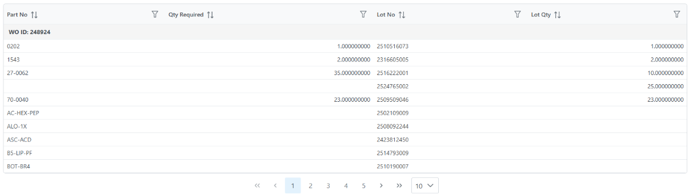
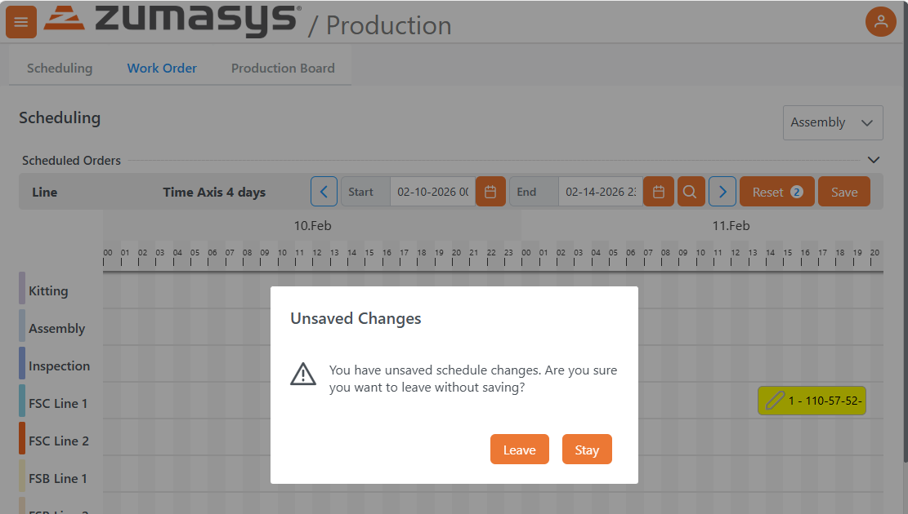
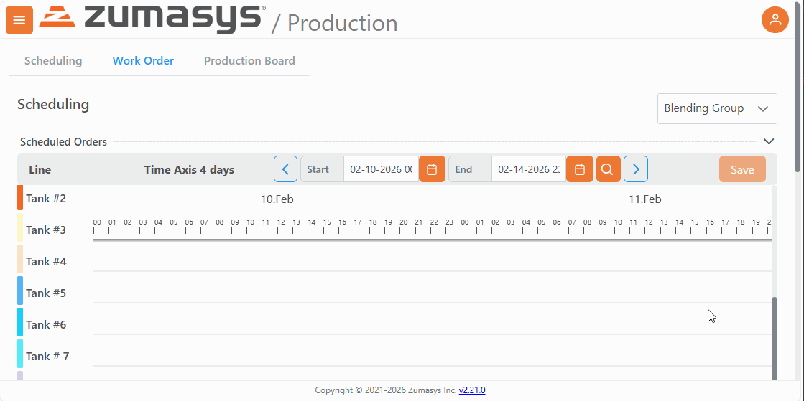

# Rover Web v2.22.0 Release Notes

<badge text= "Version 2.22.0" vertical="middle" />

<PageHeader />

These are the release notes for version 2.22.0 (2/10/2026) of the Rover Web application and can be made available to customers running _Rover ERP_, _IMACS_ and other non-Zumasys owned systems. Contact your _Client Success Manager_, [Sales](mailto:sales@zumasys.com?subject=Rover%20Web%20v2.22.0) or [Support](mailto:help@zumasys.com?subject=Rover%20Web%20v2.22.0) today!

## New Features

### Rover Web

### General

  - Introduced new host define workflow options to allow specific integrations to present custom input forms and/or alter default navigation after specific operations in the web application.
- Lookup based datatables now support nested multi-value data, maintaining proper parent ID grouping when associated columns are sorted or filtered.

### Production

- User is now warned about unsaved changes when navigating away from production scheduling.

- Time axis header is now frozen in the scheduling grid to allow it to be viewed when scrolling through a list of work centers.

## Bug Fixes

### General
 
 - Addressed an issue with filter dialogs on Rover BI embedded dashboards being obscured by the Rover Web copyright footer.

### Point of Sale

 - Removed redundant fetches of control records in the Point of Sale workflow.
 
### Field Services

 - Corrected an issue with inconsistent clearing of a signature before a field service record was saved.

<PageFooter />
