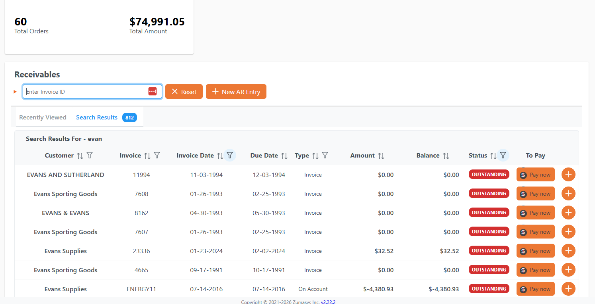
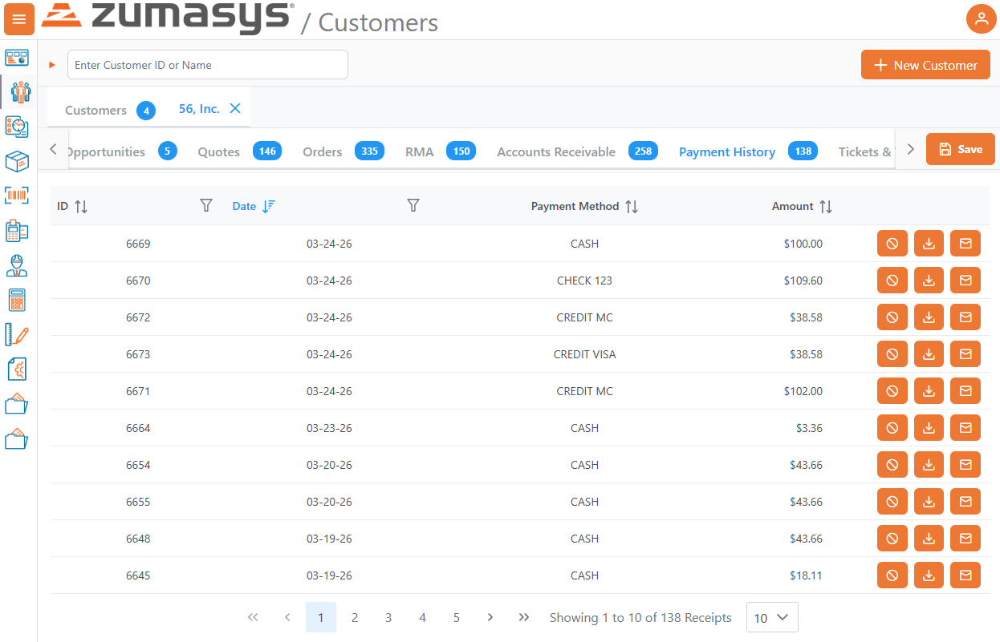
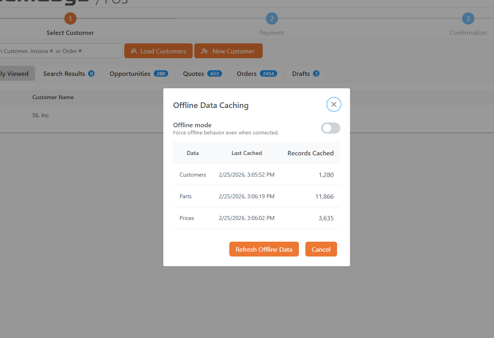
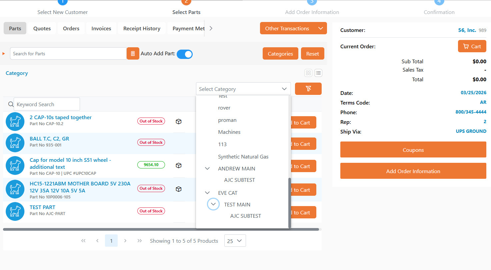
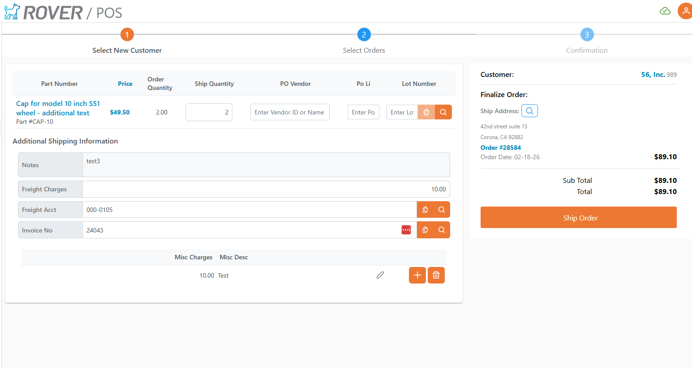
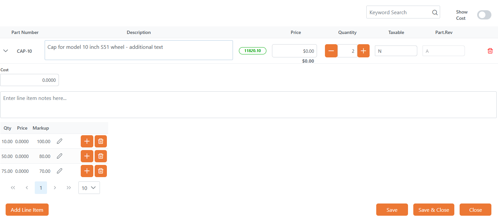
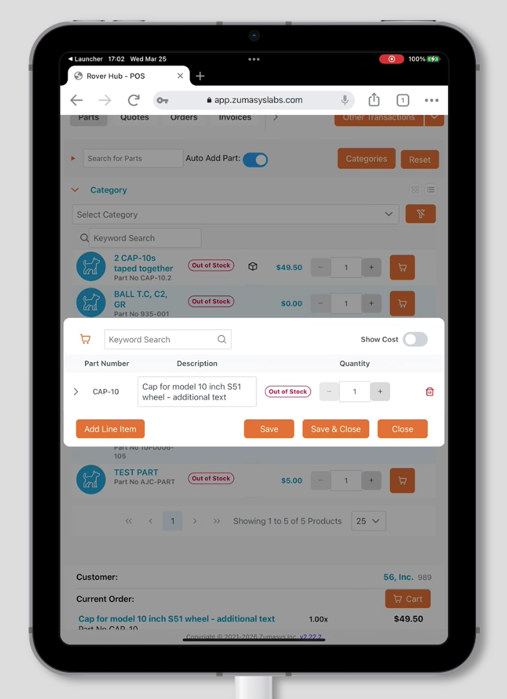
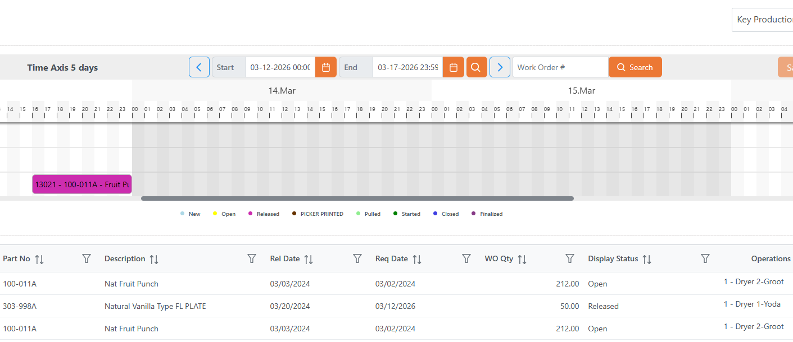
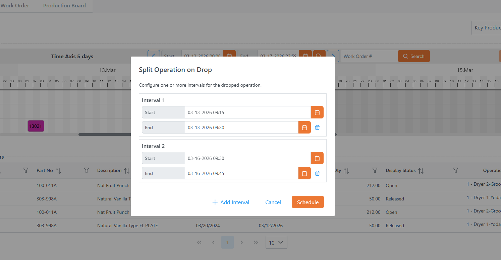

# Rover Web v2.23.0 Release Notes

<badge text= "Version 2.23.0" vertical="middle" />

<PageHeader />

These are the release notes for version 2.23.0 (3/25/2026) of the Rover Web application and can be made available to customers running _Rover ERP_, _IMACS_ and other non-Zumasys owned systems. Contact your _Client Success Manager_, [Sales](mailto:sales@zumasys.com?subject=Rover%20Web%20v2.23.0) or [Support](mailto:help@zumasys.com?subject=Rover%20Web%20v2.23.0) today!

## New Features

### General

- Improved session initialization and post-login navigation for a smoother user experience, allowing for more sharing of links and preventing accidental logouts during the login process.

### Accounting

- Enhanced the AR and AP search experience with a dynamic heading that shows "Search Results for - {term}", a reset button to clear search terms and column filters, and automatic clearing of the search input after each search.

- The accounting dashboard now supports dynamic card lookups rendered from backend configuration, with context-aware form dialogs.

### Customer Inquiry

- Added a new **Payment History** tab to the Customer Inquiry form, providing quick access to receipt history for any customer.

- The search input is now automatically focused when navigating to Customer Inquiry, so users can begin typing immediately.

### Point of Sale

- Added an offline mode toggle, allowing users to switch the application into offline mode directly from the UI.

- Updated support for the new Rover categories structure in application navigation.

- POS shipping now supports dynamic header input fields driven by FORMSDEF configuration, enabling custom shipping forms.

- After order finalization, host systems can now drive navigation behavior, providing better user workflows.

- Added support for additional fields in the cart for sales order quotes with corrected correlative handling.

- Improvements to cart dialog display, specifically addressing layout on smaller tablet screens.

### Production / Scheduling

- The scheduling gantt chart now displays non-working days and holidays sourced from MC control configuration and warns users when rescheduling items to non-working days.

- Work order operations now support multi-valued date and time entries for more detailed operation tracking.

- Users can now scroll the gantt chart horizontally while dragging bars, making it easier to schedule operations across wider time ranges.
- Work order splitting can now be enabled or disabled based on WO control settings.
- Updated work order display to show operation phase information.
- Improved day separation in the production board print preview and export.

### Ticketing

- Filter selections on the ticket datatable are now persisted across navigation.

## Bug Fixes

### General

- Menu items driven by FORMSDEF configuration now properly enforce security settings, ensuring unauthorized items are not displayed.
- Fixed an issue where default navigation links could accumulate when filter operations were called repeatedly.
- Resolved layout issues where page content could be cut off by the application footer.

### Accounting

- Fixed an issue where search state became inconsistent after viewing an AR detail item and returning to the dashboard.
- Resolved inconsistent search behavior on the AP landing page.
- Filter and search state is now properly persisted and restored when navigating between the AR/AP dashboard and detail views, including date range and total record count restoration.

### Inventory

- Corrected URL encoding to support parts with IDs containing special characters.

### Point of Sale

- Addressed an issue where a single cached part search result would not display correctly.

### Production

- Fixed saving of operations that may fail in the scheduling overlay.

### UI / Styling

- Fixed visual inconsistencies with split button components.
- Corrected styling for input switch labels.
- Improved style and class merging logic for input components.
- Enhanced button styling and added consistent action button classes across the application.

<PageFooter />
