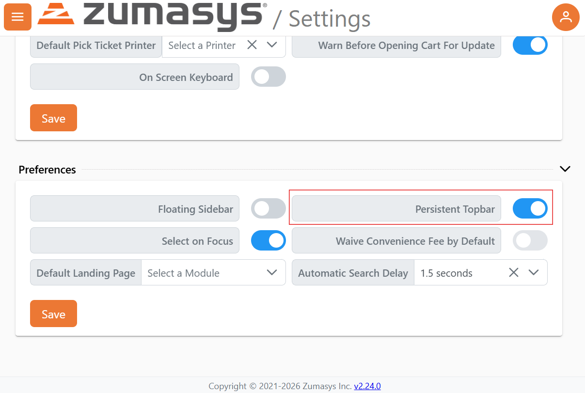
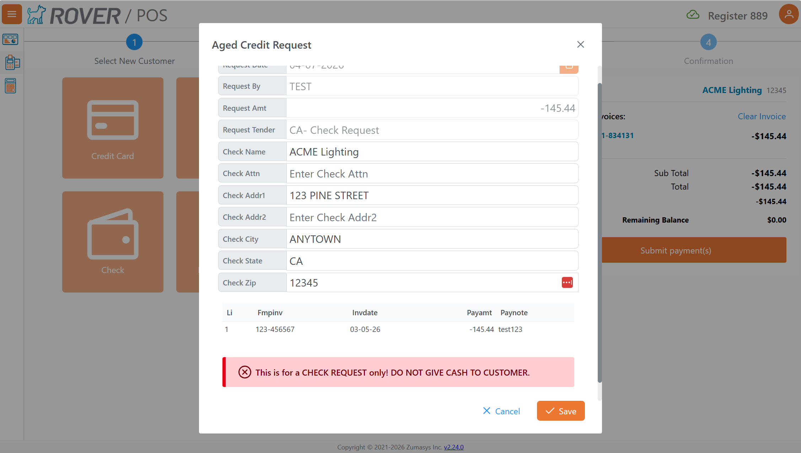
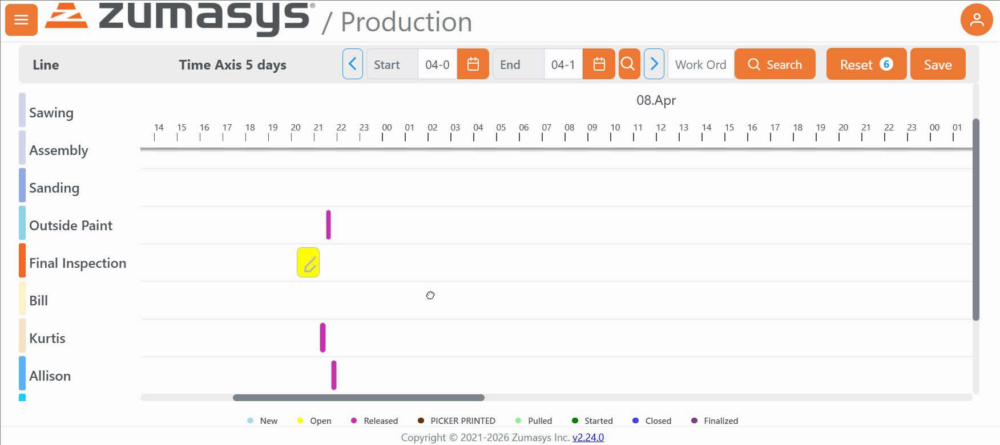
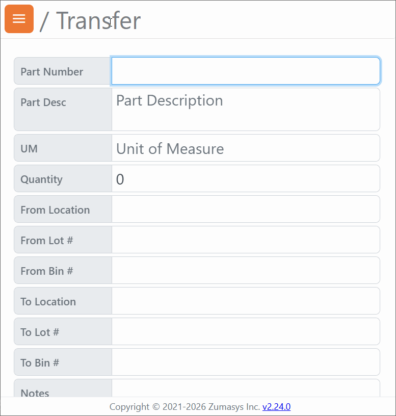

# Rover Web v2.25.0 Release Notes

<badge text= "Version 2.25.0" vertical="middle" />

<PageHeader />

These are the release notes for version 2.25.0 (4/7/2026) of the Rover Web application and can be made available to customers running _Rover ERP_, _IMACS_ and other non-Zumasys owned systems. Contact your _Client Success Manager_, [Sales](mailto:sales@zumasys.com?subject=Rover%20Web%20v2.25.0) or [Support](mailto:help@zumasys.com?subject=Rover%20Web%20v2.25.0) today!

## New Features

### General

- Column selections on print and export dialogs are now persisted across navigation, so users no longer need to re-select columns each time they print or export data.

- The application header bar can now be configured to remain sticky while scrolling, keeping navigation controls always accessible. 

- Support for an inline message with granular severity has been added to dynamic form display.

### Accounting

- Updated the AR/AP landing pages with responsive UI components for a more modern and flexible layout.

### Production / Scheduling

- The scheduling chart now supports click-and-drag panning, allowing users to navigate across the timeline more fluidly without needing to use scroll controls.

- Improved single-day display behavior in the scheduling chart for more accurate time axis representation.

- Timestamps have been removed from start and stop date range parameters in scheduling, resulting in cleaner and more predictable date filtering behavior.

### Scan 
- Scan app names are also now displayed in the header bar for improved usability on scanning workflows.

### Tickets & Time

- Tickets now support **Hours Budgeted** and **Project Task** fields, providing better visibility into project planning and resource allocation.

## Bug Fixes

### General

- Lookup modals now highlight the currently selected row for improved visual clarity. Highlighting is applied contextually (contacts, parts autocomplete, and other relevant lookups).

- Double-click behavior in lookup modals has been corrected to prevent unintended duplicate submissions.

### Accounting

- Fixed form save state issues in accounting forms, improving reliability when saving records.

- Resolved stability issues with new Accounts Payable record creation.

- Removed vendor assignment from the AP record creation flow to prevent incorrect data association during initial record setup.

- The **New AR** and **New AP** buttons are now hidden when the user does not have the required permissions, preventing unauthorized record creation attempts.

### Customer Inquiry

- Fixed TypeScript and runtime errors in Customer Inquiry components, improving stability and preventing potential display issues.

### Point of Sale
- "code" parameters are now suppressed on parts-based product searches, preventing unintended filtering and ensuring more accurate search results.

- Fixed an issue where a cached scan quantity could be incorrectly added to the cart after re-enabling the auto-add-to-cart feature.

### Production / Scheduling

- Fixed operation filtering logic to correctly handle combined date and time criteria.

<PageFooter />