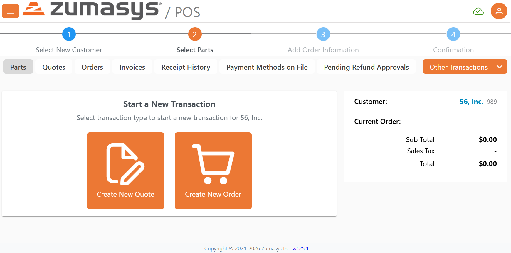
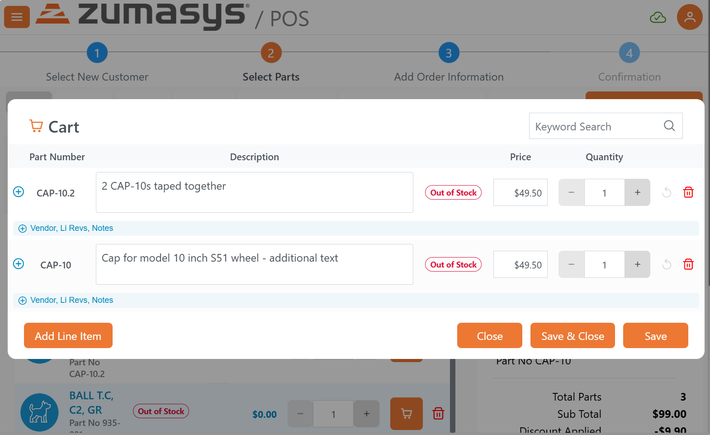

# Rover Web v2.26.0 Release Notes

<badge text= "Version 2.26.0" vertical="middle" />

<PageHeader />

These are the release notes for version 2.26.0 (04/21/2026) of the Rover Web application and can be made available to customers running _Rover ERP_, _IMACS_ and other non-Zumasys owned systems. Contact your _Client Success Manager_, [Sales](mailto:sales@zumasys.com?subject=Rover%20Web%20v2.26.0) or [Support](mailto:help@zumasys.com?subject=Rover%20Web%20v2.26.0) today!

## New Features

### General 

- KPI displays can now be driven dynamically by lookup configuration, enabling more flexible KPI rendering, including improved chart formatting and click interactions.

### Point of Sale

- Added an inline **Order Type** selector to improve usability and reduce workflow friction when selecting/changing order type.  Additionally, a transaction type no longer needs to be selected to navigate to other areas post customer selection.

- Shopping cart usability enhancements including:
  - Expand/collapse icons
  - Badge indicators for hidden-field context
  - Improved click interactions
  - Improved layout/behavior for iPad portrait and smaller form factors
  - POS line items table enhancements to support the updated cart experience (including editability support where applicable)

## Bug Fixes

### Customers

- General cleanup and UI improvements to the Customers experience, including refinements to the **General** and **Ship To Addresses** tabs.

### Point of Sale (Quotes)

- Fixed Sales Order Quote cart field validation by correcting the validation endpoint and data path handling.
- Added base-field validation on blur (including improvements to blur behavior when tabbing vs clicking).
- Improved handling for nested data structures and ensured the appropriate FDICT data is available to support validation (including price blur validation).

### Ticketing

- Recently viewed tickets that are removed are now persisted correctly. This improves reliability when managing recently viewed tickets across navigation and reloads.

### Production

- Fixed the default insertion/handling of the **Production Date** column on the Production Board when results are returned from lookups.

<PageFooter />