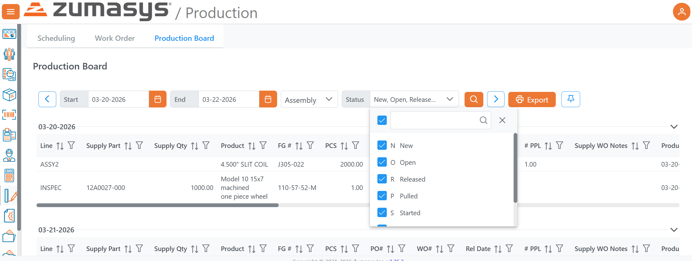
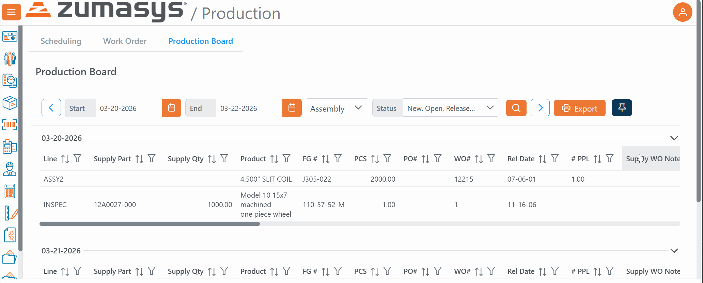
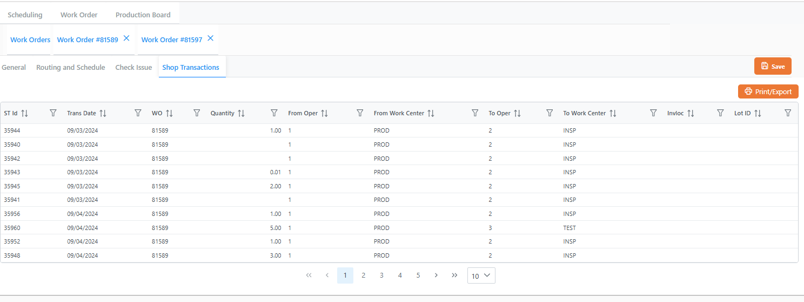

# Rover Web v2.27.0 Release Notes

<badge text= "Version 2.27.0" vertical="middle" />

<PageHeader />

These are the release notes for version 2.27.0 (05/19/2026) of the Rover Web application and can be made available to customers running _Rover ERP_, _IMACS_ and other non-Zumasys owned systems. Contact your _Client Success Manager_, [Sales](mailto:sales@zumasys.com?subject=Rover%20Web%20v2.27.0) or [Support](mailto:help@zumasys.com?subject=Rover%20Web%20v2.27.0) today!

## New Features

### Accounting

- Added support for dynamic KPI cards in the accounting module.  KPI cards are defined with desktop form `KPI.E` and can be included for display in the accounting module via `ACCT.CONTROL`

### Customer Inquiry

- **CUST.Q View-Only Access:** Users with **CUST.Q** permissions can now access the Customer Inquiry module in a read-only mode. All action buttons (New, Save, Delete) and input fields are disabled, allowing users to view customer data without the ability to make changes. **Note** Previously, users with CUST.Q "add" and "edit" access would be able to access and edit customer information. This will require updates from administrators to ensure users that manage customer data can continue to do so.
- **CUST.E Full Edit Access:** Users with **CUST.E** permissions retain full edit access to customer records. When a user has both **CUST.E** and **CUST.Q** permissions, **CUST.E** takes precedence and full edit access is granted.
- **Read-Only Enforcement Across Customer Tabs:** The read-only access control is now enforced consistently across all Customer Inquiry tabs, including General, Ship To Addresses, Contacts, Credit Cards, Contact Logs, and Attachments. Field-level restrictions such as **block_fields** and **hide_fields** are preserved for **CUST.Q** view-only users.
- Refined the **Contacts**, **Contact Log**, **Attachments**, and **Credit Cards** customer inquiry areas for cleaner layout and more consistent interaction patterns.
- Added support to **create a quote directly from a sales opportunity**.
- Improved related opportunity workflows and supporting component behavior for quote creation and follow-up actions.

### Production

- Production Board now supports filtering by **Status**.

- Added a **pin / sticky filter bar** option on the Production Board so filters can stay visible while scrolling.

- Improved operation splitting workflow by moving split configuration into a dedicated dialog flow.
- Cleaned up scheduling overlay behavior and popover positioning in the Gantt / scheduling workflow.
- Custom lookup-driven data tabs (assigned in WO.CONTROL) in the Work Order Details screen now support print + export options.

### Point of Sale

- Improved shopping / quote / cart handling around quote validation and cost method behavior.
- Improved payment flow reliability by preserving **PIN re-auth nonce** through dialog interruptions during payment submission.
- Improved payout / payment flow handling for invoice selections involving credit balances.

## Bug Fixes

### Point of Sale / Payments / Quotes

- Fixed receipt history paging so range requests load incrementally instead of requesting the full result set.
- Fixed Sales Order Quote validation scenarios related to **cost method** handling in opportunity quote workflows.
- Fixed issues with ship posting so V2 requests include the expected record wrapper/payload structure.
- Fixed submit button behavior for invoice flows involving negative/credit balances.

### Production / Scheduling / Scan

- Fixed Production Board filtering/search behavior to avoid duplicate refresh behavior.

<PageFooter />