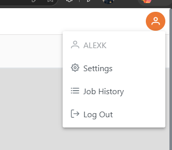
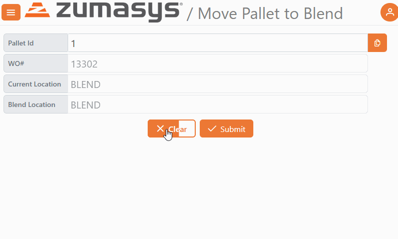

# Rover Web v2.28.1 Release Notes

<badge text= "Version 2.28.1" vertical="middle" />

<PageHeader />

These are the release notes for version 2.28.1 (06/11/2026) of the Rover Web application and can be made available to customers running _Rover ERP_, _IMACS_ and other non-Zumasys owned systems. Contact your _Client Success Manager_, [Sales](mailto:sales@zumasys.com?subject=Rover%20Web%20v2.28.1) or [Support](mailto:help@zumasys.com?subject=Rover%20Web%20v2.28.1) today!

## New Features

### General

- Added user name display in user settings dropdown throughout the app.

### Scan

- Added a "Clear" button to formsdef-driven scan items, click and hold for one second to clear the screen (the delay helps to prevent accidental taps on small touch screen devices)

### Production

- Added support for a distinct command (PRODUCTION.BOARD) to allow access to the Production Board without requiring WO.E permissions.
- Added a WO.CONTROL option to enable moving/rescheduling/editing operations which have no start quantity assigned in scheduling.

<PageFooter />