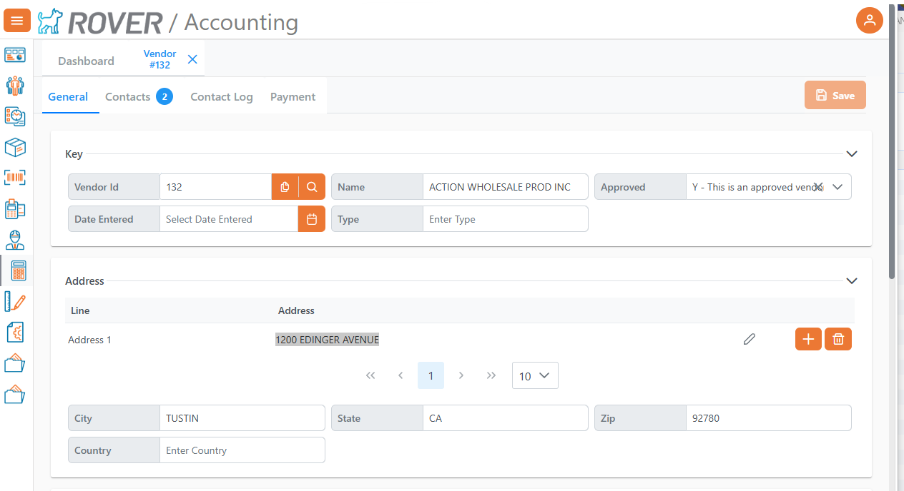
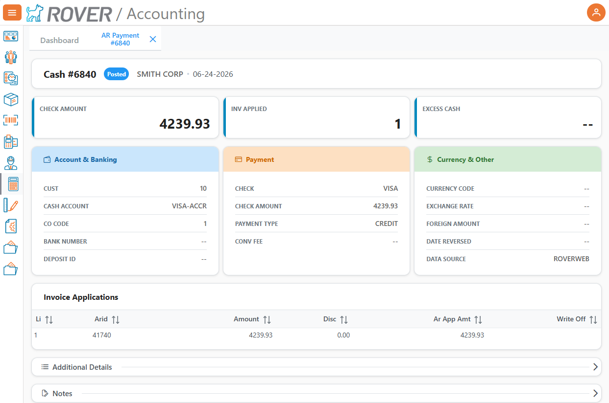
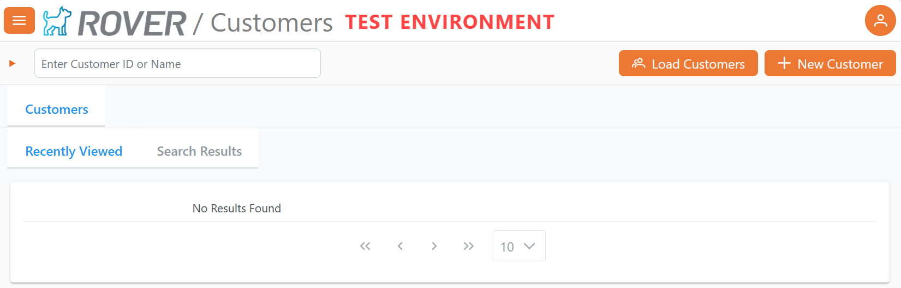
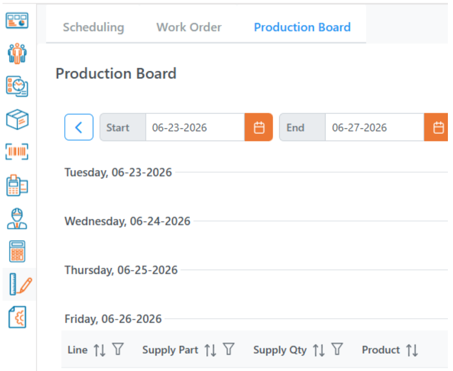

# Rover Web v2.29.0 Release Notes

<badge text= "Version 2.29.0" vertical="middle" />

<PageHeader />

These are the release notes for version 2.29.0 (06/24/2026) of the Rover Web application and can be made available to customers running _Rover ERP_, _IMACS_ and other non-Zumasys owned systems. Contact your _Client Success Manager_, [Sales](mailto:sales@zumasys.com?subject=Rover%20Web%20v2.29.0) or [Support](mailto:help@zumasys.com?subject=Rover%20Web%20v2.29.0) today!

## New Features

### Accounting

- Vendor maintenance is now accessible via proper setup of KPI.E and ACCT.CONTROL.  With appropriate permissions, vendors can be viewed, edited, and created.

- Payment history is now available via proper setup of KPI.E and ACCT.CONTROL.  With appropriate permissions, cash transaction details can be viewed.

### Customer Inquiry

- Improved customer search behavior with support for **manual loading of default customers** and better lookup refresh behavior.
- Added a **Load Customers** action in Customer Inquiry when configured, making it easier to fetch default customer lists on demand.
- Improved customer results counting and badge count behavior to use total record counts where available.
- Improved recently viewed and search-result table responsiveness for customer inquiry workflows.

### General 

- Added a prominent **Test Environment** banner for non-production environments.

### POS

- Improved POS and customer-related data tables for **responsive card-style layouts** on medium-width screens.
- Improved POS part search behavior and shared focus management, especially for scan mode and on-screen keyboard interactions.
- Added a shared search focus composable to make returning focus to active search inputs more reliable across POS dialogs and workflows.
- Improved the on-screen numeric keyboard experience in POS search fields, including overlay behavior, focus restoration, and keyboard button labeling.
- Improved POS dialog behavior so closing inventory dialogs, cart dialogs, and refund dialogs more reliably returns the user to the active search flow.
- Improved POS customer, order, quote, invoice, receipt history, and sales opportunity views for better responsive presentation.
- Improved POS invoices and orders layouts and action flow consistency.

### Production

- Improved production scheduling utilities with clearer operation scheduling helpers and shared interval logic.
- Improved production board and printable production outputs to display **dates with the day of week**.

## Bug Fixes

### Accounting

- Fixed Dynamic Form validation requests so they now include the prior record state where needed.
- Fixed AR date parsing/sorting behavior to use safer date parsing logic.
- Fixed Accounts Form routing/state handling for cash history and active tab synchronization.

### Import/Export

- Fixed import behavior so bulk import is again available outside production rather than being restricted only to customer imports.

### POS / Search / Dialogs

- Fixed POS category dialog, product detail dialog, and cart edit flows so focus returns more consistently after user actions.
- Improved scan-mode behavior to avoid unnecessary autofocus in the wrong contexts.
- Fixed POS cart and line-item inventory dialog close handling so parent dialogs stay in sync.

### Customer Inquiry

- Fixed customer search result refresh behavior when switching tabs or loading customers.
- Fixed customer inquiry route/reactivity handling by using the active route consistently.

### Production Scheduling

- Fixed production scheduling edits so operation interval updates are saved into the authoritative interval structure instead of only legacy scalar fields.
- Fixed operation scheduling logic to better distinguish scheduled vs. unscheduled operations.
- Fixed operation overlay save behavior so non-date edits do not accidentally overwrite scheduled dates/times.
- Fixed work-order persistence so legacy root-level operation date fields are stripped before save when operation-level schedule data exists.
- Improved unscheduled work-order handling and cleanup after work-order updates/removals.

<PageFooter />