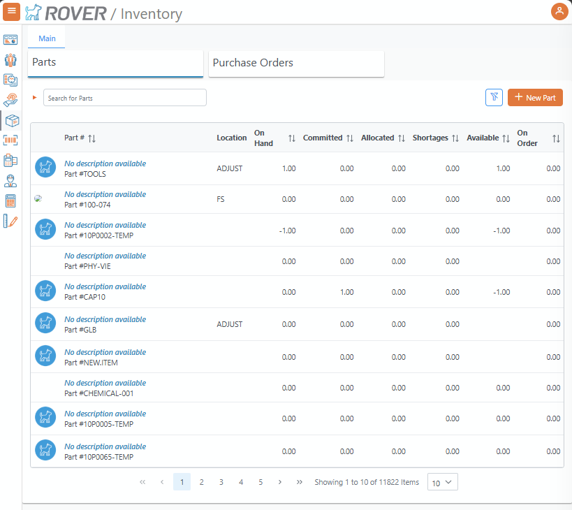
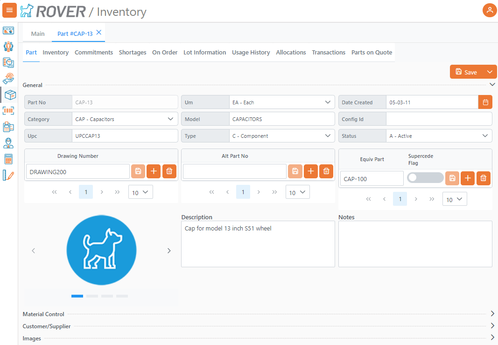
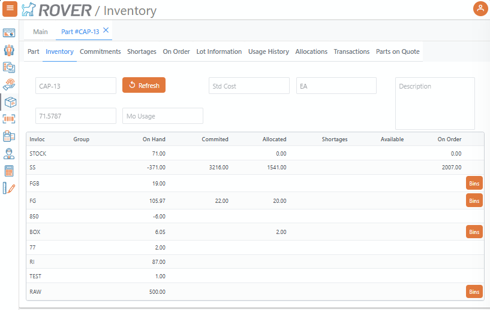
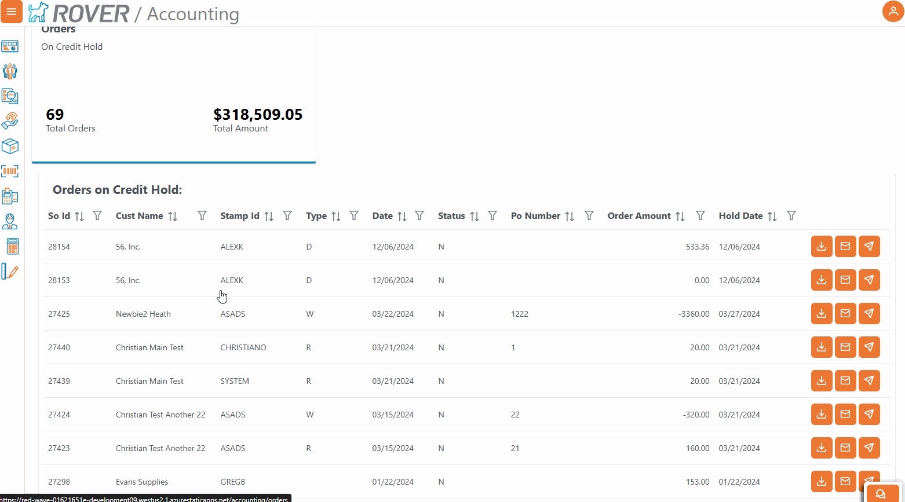

# Rover Web v2.3.0 Release Notes

<badge text= "Version 2.3.0" vertical="middle" />

<PageHeader />

These are the release notes for version 2.3.0 (1/23/2025) of the Rover Web application and can be made available to customers running _Rover ERP_, _IMACS_ and other non-Zumasys owned systems. Contact your _Client Success Manager_, [Sales](mailto:sales@zumasys.com?subject=Rover%20Web%20v2.3.0) or [Support](mailto:help@zumasys.com?subject=Rover%20Web%20v2.3.0) today!

## New Features

- **Rover Web**
  - **Inventory Module**
    - Added Parts information to the Inventory module.
      
    - Added ability to view and edit parts information.
      
    - Added Inventory, Commitments, Shortages, On Order, Lot, Usage, Allocations, and Transactions tabs to the Parts view.
    - 
    - Added ability to add lookup table to the Parts view. Requires update to [INV.CONTROL](../../../../rover/AP-OVERVIEW/AP-ENTRY/AP-E/AP-E-2/INV-CONTROL/INV-CONTROL-2/README.md).
  - **Point of Sale**
    - Add ability to display "New Customer" button on the main POS screen. Requires update to [MRK.CONTROL](../../../../rover/AP-OVERVIEW/AP-ENTRY/AP-E/AP-E-1/CURRENCY-CONTROL/SO-E/MRK-CONTROL/MRK-CONTROL-6/README.md#pos-show-new-customer-button).
    - Added host based print action to Invoice table.
      > Only supported by select ERPs
    - Additional User based register selection options to support environments where registers are not defined by hardware.
      > Only supported by select ERPs
  - **General**
    - Improvements to error message display, including new options for confirmation prompts and the ability to load specific pages when modal errors are closed.
      > Functionality varies based on ERP.
  - **Accounting**
    - The Orders KPI table now supports drill down to display order details including customer details, AR, and receipts history. With some ERP integrations supporting release of orders on hold.
      

## Bug Fixes
  - **Accounting**
    - The Orders on hold KPI will no longer display without user permissions when not yet configured
