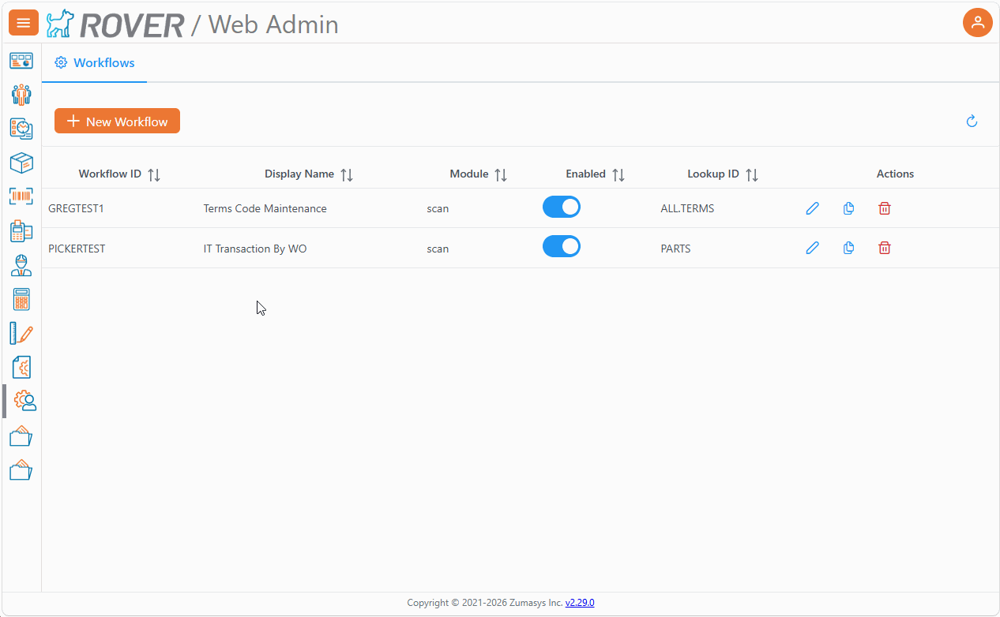
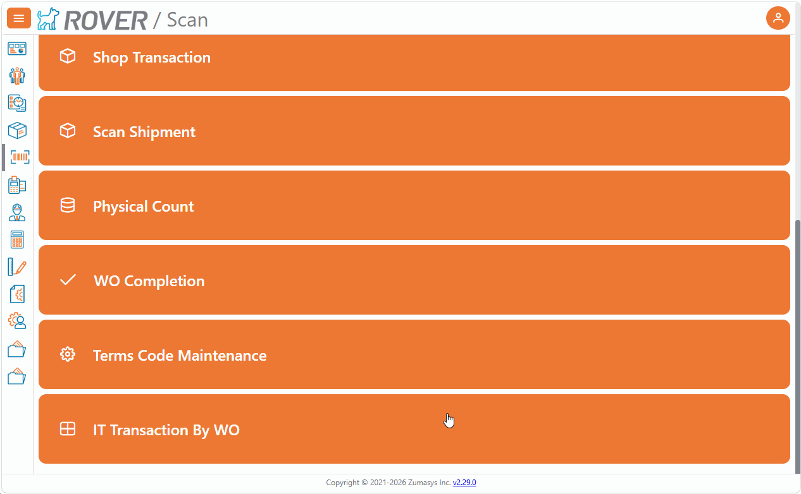

# Rover Web v2.30.0 Release Notes

<badge text= "Version 2.30.0" vertical="middle" />

<PageHeader />

These are the release notes for version 2.30.0 (07/01/2026) of the Rover Web application and can be made available to customers running _Rover ERP_, _IMACS_ and other non-Zumasys owned systems. Contact your _Client Success Manager_, [Sales](mailto:sales@zumasys.com?subject=Rover%20Web%20v2.30.0) or [Support](mailto:help@zumasys.com?subject=Rover%20Web%20v2.30.0) today!

## New Features

### Rover Web 

### Workflow Management

- Added a new **Web Admin** area for maintaining Rover Web workflows.
- Added support for configuring workflows with:
  - lookup-based record selection
  - field mapping into forms
  - optional summary screens
  - row highlighting for submitted or skipped items
  - optional auto-mode processing
  
- Added support for launching configured workflows directly from the **Scan** module when enabled and permitted.

## Bug Fixes

### Customer Inquiry

- Added loading feedback when opening a customer from search results or recently viewed lists, improving responsiveness during customer selection.

### General

- Improved lookup table behavior for workflow-driven screens, including more reliable row styling and reduced unnecessary refreshes during filtering and re-rendering.

<PageFooter />