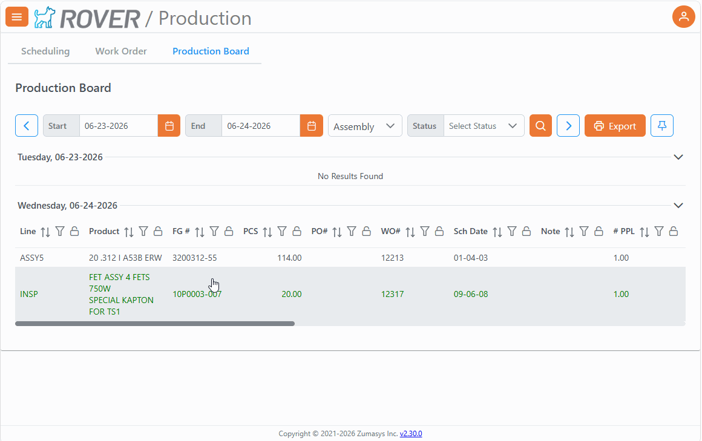

# Rover Web v2.31.0 Release Notes

<badge text= "Version 2.31.0" vertical="middle" />

<PageHeader />

These are the release notes for version 2.31.0 (07/08/2026) of the Rover Web application and can be made available to customers running _Rover ERP_, _IMACS_ and other non-Zumasys owned systems. Contact your _Client Success Manager_, [Sales](mailto:sales@zumasys.com?subject=Rover%20Web%20v2.31.0) or [Support](mailto:help@zumasys.com?subject=Rover%20Web%20v2.31.0) today!

## New Features

### Production

- Added support for **freezing / pinning columns** on the Production Board, making wide table layouts easier to use.

- Improved the user experience on the scheduling chart to reduce accidental dragging when clicking scheduled items to open or interact with the detail dialog.

## Bug Fixes

### Point of Sale

- Fixed duplicate lookup and search requests in several POS workflows, improving reliability and reducing unnecessary background calls.
- Fixed small-screen parts filtering behavior in POS.
- Improved POS dialog rendering for sales and email dialogs so they open more reliably and avoid duplicate mounting behavior.
- Improved POS register-loading and startup flow to better separate loading states and local service checks.
- Improved printer selection loading behavior to avoid unnecessary refreshes.

### Production

- Fixed duplicate results and overlapping requests in lookup-based tables by canceling superseded requests when newer requests are started.
- Improved lookup table refresh behavior so rapid refresh actions are handled more safely.
- Improved grouped and nested lookup table behavior, including filtering, hidden row handling, and refresh stability.

<PageFooter />