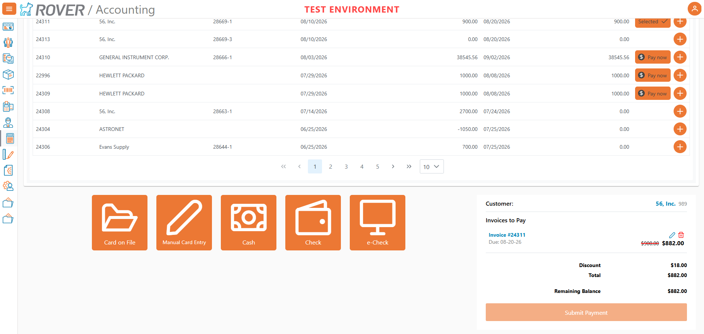
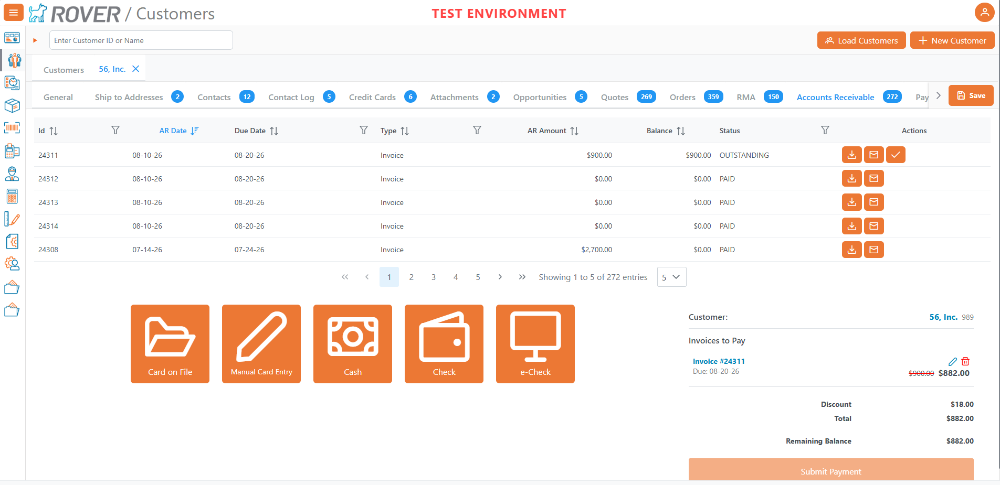
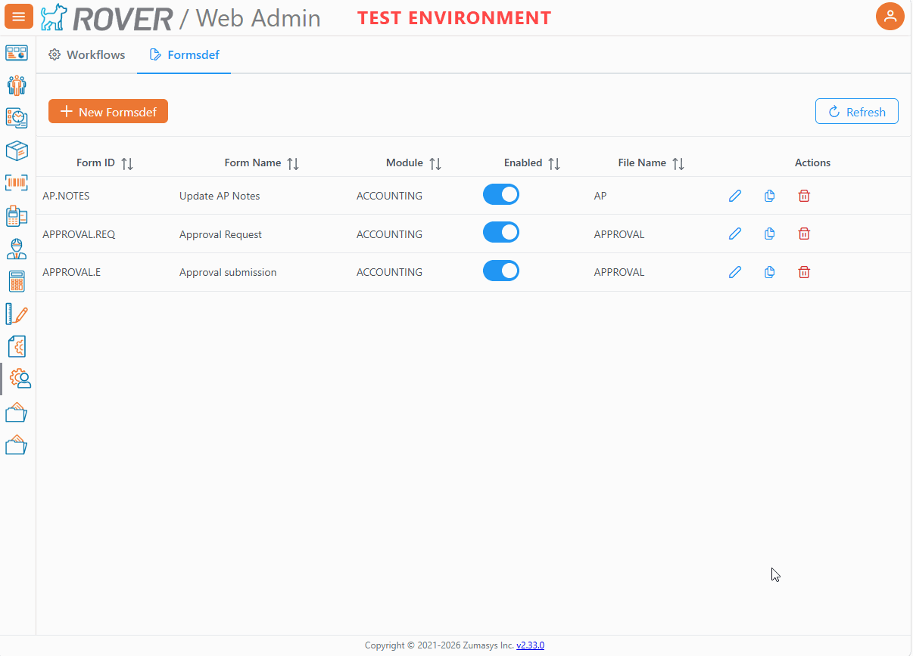

# Rover Web v2.34.0 Release Notes

<badge text= "Version 2.34.0" vertical="middle" />

<PageHeader />

These are the release notes for version 2.34.0 (TBD) of the Rover Web application and can be made available to customers running _Rover ERP_, _IMACS_ and other non-Zumasys owned systems. Contact your _Client Success Manager_, [Sales](mailto:sales@zumasys.com?subject=Rover%20Web%20v2.34.0) or [Support](mailto:help@zumasys.com?subject=Rover%20Web%20v2.34.0) today!

## New Features

### Accounting
- Added a new unified Accounts Receivable payment experience in Accounting.

### Customer Inquiry

- Added the same unified Accounts Receivable payment experience used in Accounting.

- Added improved Accounts Receivable lookup support for invoice workflows.
- Added enhanced invoice actions for download, email, print, and payment-related tasks.
- Added support for managing recently viewed invoice entries directly from results.

### Point of Sale

- Added support for mulitple receipts for a single payment.  Supports split tender scenarios where each tender is a distinct receipt.

### Production

- Added support for configured Formsdef tabs directly within Work Order detail screens.

### Web Admin

- Added a Formsdef administration screen to create, edit, duplicate, enable/disable, and delete Formsdef records.

## Bug Fixes

### Customer Inquiry

- Fixed invoice search/reset behavior for more consistent results across lookup and table views.
- Fixed invoice refresh/count behavior after payment submission.
- Fixed row selection/load inconsistencies in recently viewed and search results.

### Point of Sale

- Fixed tender amount update and payment dialog flow issues.
- Fixed multi-receipt handling across print, download, and email actions.
- Fixed customer/order edge cases caused by missing or partially loaded data.

### Shipping

- Fixed ship-to selection behavior when customer context changes.
- Fixed shipping form behavior when customer data loads after initial render.

### Scan

- Fixed scan menu/form availability behavior for configured forms access.
- Improved dynamic scan form input and dialog consistency.

### Production

- Fixed Work Order tab-loading and dynamic form render timing issues.
- Improved reliability for configured lookup/form loading in Work Order views.
- Fixed production scheduling/overlay dynamic form loading issues.
- Improved consistency when rendering configured production form content.

### Reports / Print / Export

- Fixed print/export output consistency for supported header/context details.
- Fixed formatting issues that could produce blank or inconsistent printable output.

<PageFooter />