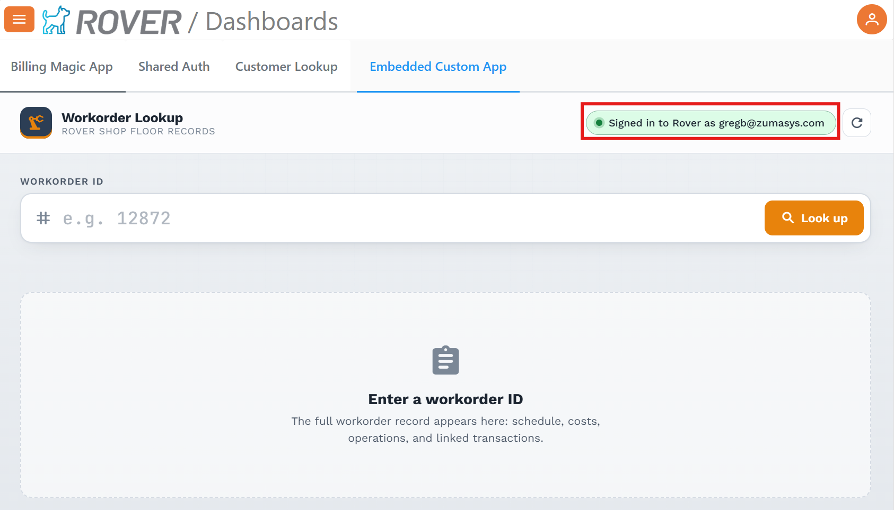
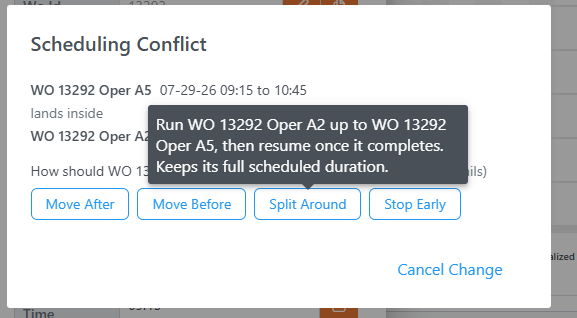
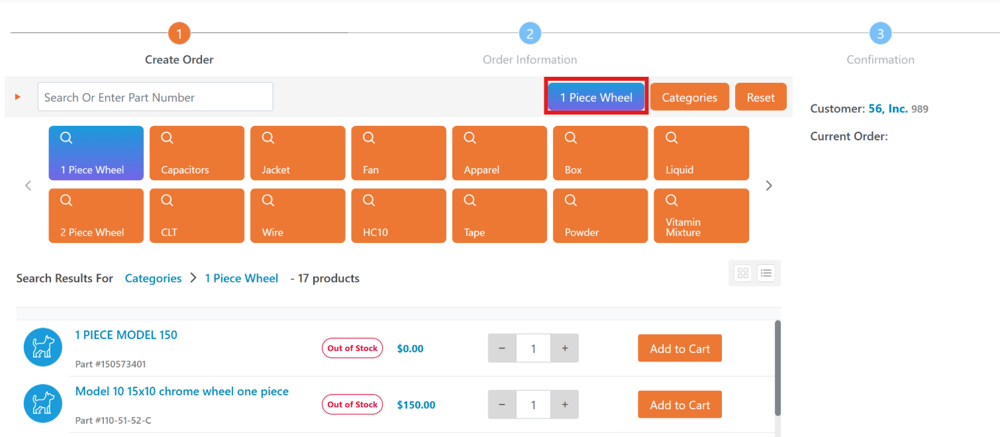

# Rover Web v2.36.0 Release Notes

<badge text="Version 2.36.0" vertical="middle" />

<PageHeader />

These are the release notes for version 2.36.0 (09/27/2026) of the Rover Web application and can be made available to customers running _Rover ERP_, _IMACS_ and other non-Zumasys owned systems. Contact your _Client Success Manager_, [Sales](mailto:sales@zumasys.com?subject=Rover%20Web%20v2.36.0) or [Support](mailto:help@zumasys.com?subject=Rover%20Web%20v2.36.0) today!

## New Features

### Authentication / Integrations

- Added support for authorized first-party embedded applications to use the active Rover Web session without requiring a second sign-in, when enabled for the subscription.

### Production

- Added improved conflict handling when scheduling an operation inside another scheduled operation.
- Added more scheduling resolution choices for significant overlaps, including moving work before or after, splitting around the new operation when supported, ending work early, or canceling the change.

- Improved scheduling summaries so users can more easily review which operations were rescheduled and how their dates or durations changed.
- Expanded split-operation scheduling checks so overlapping work and non-working-day conflicts are validated more consistently.

### Point of Sale

- Added support for customer-specific default part lists in offline results while preserving the configured order.
- Added support for customer-specific part specifications in product details, with automatic fallback to standard specifications when needed.
- Added per-data-group progress updates during offline refresh so users can more clearly track in-progress, completed, and failed steps.
> Offline search only supported by select ERPs

- Improved Point of Sale layout and usability with better order and cart scrolling, sticky summary behavior, mobile action placement, customer action button sizing, parts search spacing, and dialog keyboard shortcut cleanup.

### Rover Portal

- Updated Category navigation in Orders module to match Rover Web.
- Added ability to individually style Category names in dialog UI.
> Only supported by select ERPs
- Added ability to tag a category for display as a distinct button in the header.

> Only supported by select ERPs

## Bug Fixes

### General

- Improved handling for corrupted or unavailable browser storage values to reduce client-side errors.
- Fixed duplicated background timers and listeners that could build up during navigation or repeated module use.
- Improved online and offline status updates so connection changes are reflected more reliably.
- Improved saved column preferences so they stay available for the same user while remaining separated between users and subscribers on shared browsers.

### Production

- Fixed scheduling validation and cancel flows so unsuccessful changes restore the previous schedule instead of leaving partial updates visible.
- Improved behavior when placing an operation near the end of another scheduled operation.
- Fixed split operations so they remain visible and are not hidden behind overlapping scheduled work.
- Improved scheduling validation messages so errors show useful details instead of blank or undefined text.

### Point of Sale

- Fixed offline parts searches that could return no results because of stale or empty filters.
- Fixed offline totals and paging so large cached datasets remain usable without overloading browser storage.
- Fixed customer default-part and product-detail matching issues, including customer-specific specification fallback behavior.
- Fixed campaign-based offline searches so eligible campaign items remain available.
- Fixed repeated stale-cache confirmation prompts during offline workflows.
> Offline search only supported by select ERPs

### Tickets and Time

- Fixed recently viewed ticket history so deep links and session changes do not overwrite or expose prior history.

### Rover Portal

- Fixed an issue with Ticket pagination and lazy loading.  This resolves ticket display being limited to the first 100 tickets.

<PageFooter />
