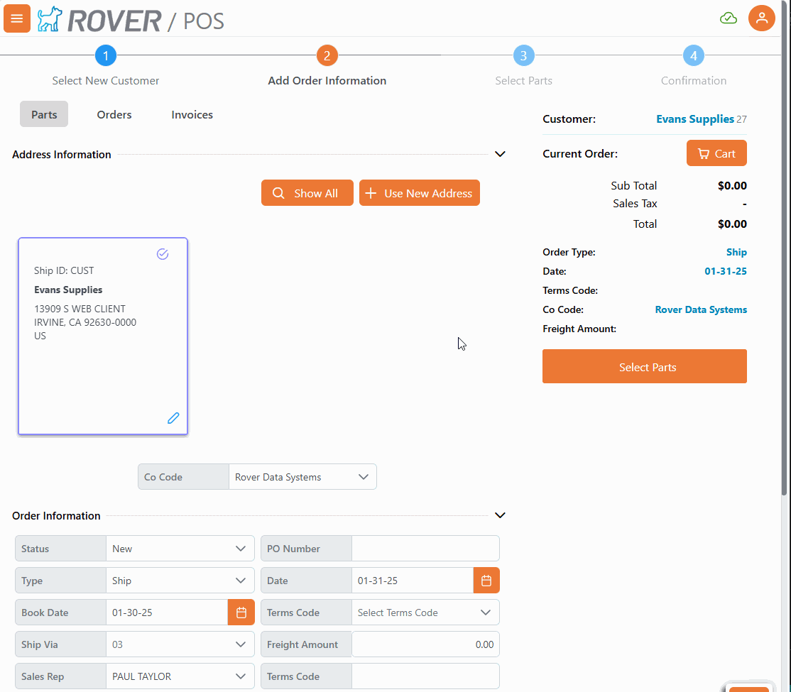

# Rover Web v2.4.0 Release Notes

<badge text= "Version 2.4.0" vertical="middle" />

<PageHeader />

These are the release notes for version 2.4.0 (1/30/2025) of the Rover Web application and can be made available to customers running _Rover ERP_, _IMACS_ and other non-Zumasys owned systems. Contact your _Client Success Manager_, [Sales](mailto:sales@zumasys.com?subject=Rover%20Web%20v2.4.0) or [Support](mailto:help@zumasys.com?subject=Rover%20Web%20v2.4.0) today!

## New Features

- **Rover Web**
  - **General**
    - Added support for custom company logo to display in the header of Rover Web after login.  This logo is distinct from the logo used for the login page.
  - **Point of Sale**
    - Adds ability to add non-stock items to orders. Requires update to [MRK.CONTROL](../../../MRK-OVERVIEW/MRK-ENTRY/MRK-CONTROL/MRK-CONTROL-6/README.md#allow-non-stock-parts).
          

## Bug Fixes

- **Rover Web**
  - **Point of Sale**
    - Addresses an issue with required field validation enforcement in specific Point of Sale workflows.

<PageFooter />
