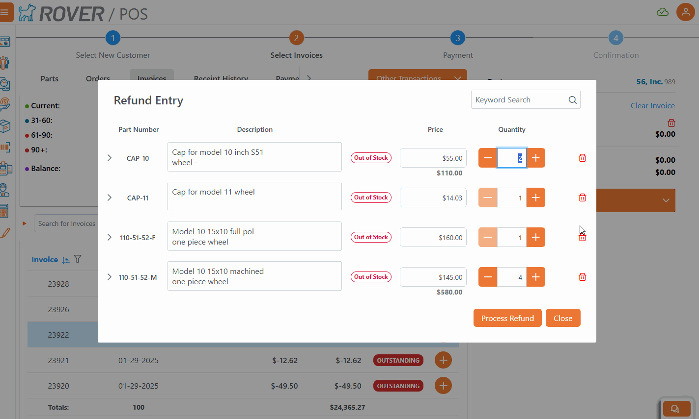
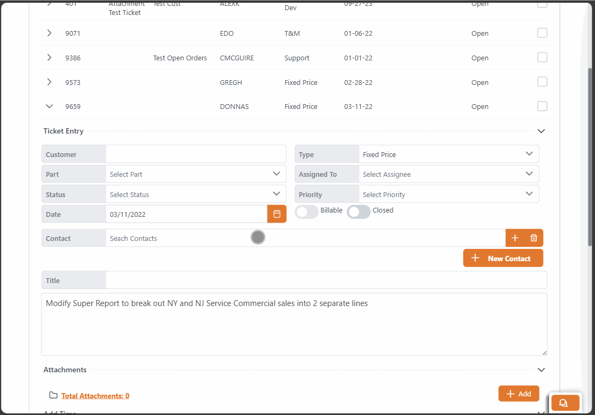

# Rover Web v2.5.0 Draft Release Notes

<badge text= "Version 2.5.0 Draft" vertical="middle" />

<PageHeader />

These are the release notes for version 2.5.0 (TBD) of the Rover Web application and can be made available to customers running _Rover ERP_, _IMACS_ and other non-Zumasys owned systems. Contact your _Client Success Manager_, [Sales](mailto:sales@zumasys.com?subject=Rover%20Web%20v2.5.0) or [Support](mailto:help@zumasys.com?subject=Rover%20Web%20v2.5.0) today!

## New Features

- **Rover Web**
  - **Point of Sale**
    - Add ability to require signature when finalizing orders. Requires update to [MRK.CONTROL](../../../../rover/AP-OVERVIEW/AP-ENTRY/AP-E/AP-E-1/CURRENCY-CONTROL/SO-E/MRK-CONTROL/MRK-CONTROL-6/README.md#pos-require-ship-signature).
    - Added support for processing of RMAs from the Invoices tab. This must be enabled via MRK.CONTROL in the "Enable RMA Refund". Requires update to [MRK.CONTROL](../../../../rover/AP-OVERVIEW/AP-ENTRY/AP-E/AP-E-1/CURRENCY-CONTROL/SO-E/MRK-CONTROL/MRK-CONTROL-2/README.md#enable-rma-refund). 

  - **Tickets and Time**
    - Adding priority, status, and contacts to ticket details.
  - **General**
    - Adding support for lookup for contacts. This is enabled for Tickets, Opportunities, Quotes, Orders, and Customers. Requires update to [CONTACT.CONTROL](../../../../rover/AP-OVERVIEW/AP-ENTRY/CONTACT-CONTROL/CONTACT-CONTROL-1/README.md#contact-lookup).
    

## Bug Fixes

- **Rover Web**
  - **Inventory Parts**
    - Fixed UI issue where Parts and Inventory tabs disappear if no lookup is defined in `INV.CONTROL`
  - **POS**
    - Product Dialog now takes up more space on the screen and full width on mobile devices.
    - Updated customer table header alignment.
    - Fixed issue with deleting duplicate part numbers removing the first instance of the part number.
    - Auto Save orders as draft skips "Transaction in Progress" dialog.
