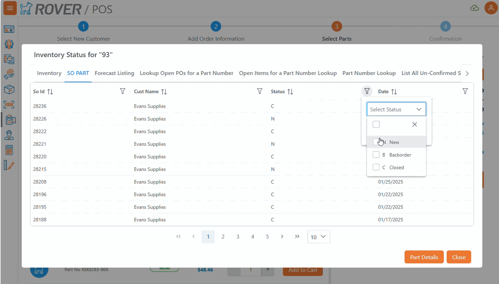

# Rover Web v2.6.0 Release Notes

<badge text= "Version 2.6.0" vertical="middle" />

<PageHeader />

These are the release notes for version 2.6.0 (2/26/25) of the Rover Web application and can be made available to customers running _Rover ERP_, _IMACS_ and other non-Zumasys owned systems. Contact your _Client Success Manager_, [Sales](mailto:sales@zumasys.com?subject=Rover%20Web%20v2.6.0) or [Support](mailto:help@zumasys.com?subject=Rover%20Web%20v2.6.0) today!

## New Features

### Rover Web

### General

- Lookup based datatables now support multi-select filters for columns with defined valid values.

> Only supported by select ERPs  

#### Point of Sale

- Added to use lookup table for customer search. Requires update to [MRK.CONTROL](../../../MRK-OVERVIEW/MRK-ENTRY/MRK-CONTROL/MRK-CONTROL-7/README.md#customer-lookup).

> Only supported by select ERPs

## Bug Fixes

### Rover Web

#### Point of Sale

- Resolved issues with part search failures occurring when search parameter length limits were exceeded.
- Partial Ship button is now disabled when processing the shipment.
- Ship Via filter within the order information section now filters correctly.
- Errors when validating customer selected now navigate back to the customer search screen.
- When creating a new order, POS correctly defaults the order's terms to the terms of the customer selected.

#### Inventory

- Fixed the display of vendor and manufacturer information in part details.

#### Tickets and Time

- Improved handling of contact entry to ensure the field always shows the correct name.
- Improved support for multiple contacts when saving a new ticket.

<PageFooter />
