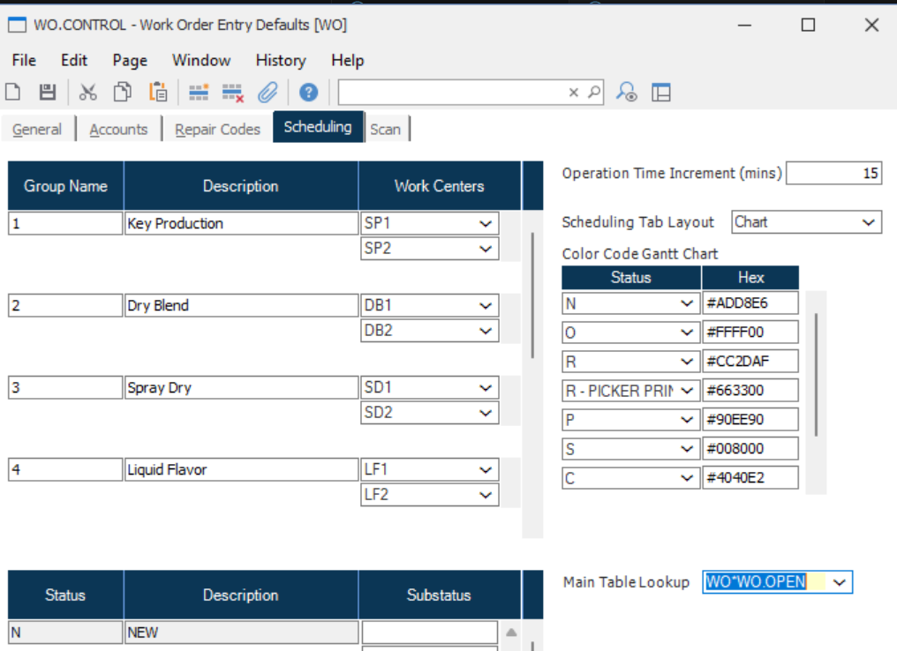
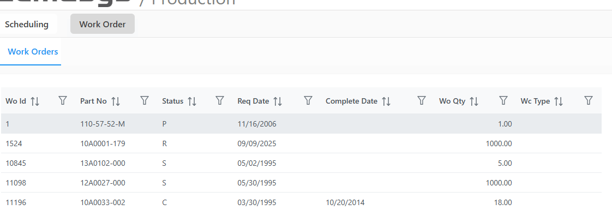

# Rover Web v2.9.0 Release Notes

<badge text= "Version 2.9.0" vertical="middle" />

<PageHeader />

These are the release notes for version 2.9.0 (TBD) of the Rover Web application and can be made available to customers running _Rover ERP_, _IMACS_ and other non-Zumasys owned systems. Contact your _Client Success Manager_, [Sales](mailto:sales@zumasys.com?subject=Rover%20Web%20v2.9.0) or [Support](mailto:help@zumasys.com?subject=Rover%20Web%20v2.9.0) today!

## New Features

### Rover Web

#### General 

- Users can now press the "Enter" to apply filters in data tables instead of clicking the "Apply" button.

#### Production Scheduling

- The main work order listing table can now be controlled via a lookup, selected in WO.CONTROL.

## Bug Fixes

