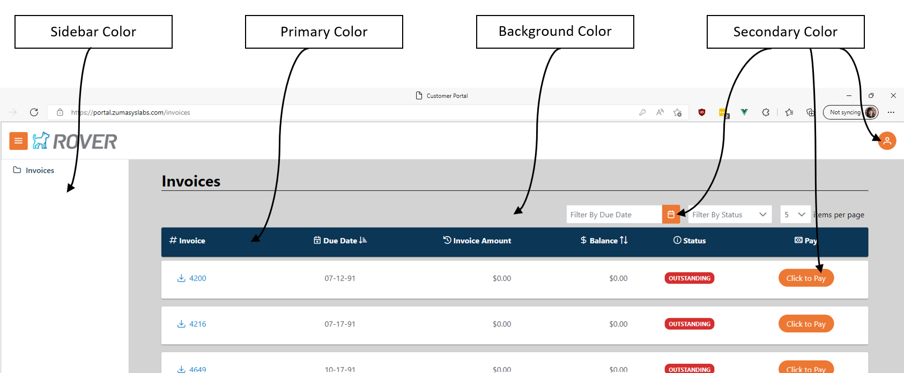
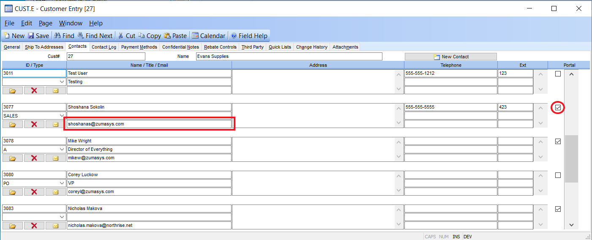

# Rover Business Suite Onboarding

<PageHeader />

This document covers the setup and configuration steps for use of the Rover Business Suite web applications.

## Theme Setup

Your site can be configured to have your colors and logos. We can take a look at your current sites and base the color scheme on what we find. If you have something specific in mind, send the following specifications to your implementation point of contact or [help@zumasys.com](mailto:help@zumasys.com).

1. Background Color
2. Primary Color
3. Secondary Color
4. Sidebar Color

We will also need your logo and favicon logo (the icon displayed in the browser tab).

## ACH Capabilities

If you would like to take advantage of ACH payments, you will need to verify that your bank can accept ACH files (NACHA files) or sign up for Rover Pay.

## Credit Card Capabilities

If you would like to take advantage of integrated Credit Card payments you will need to sign up for Rover Pay.

## Contact Configuration

To allow a contact to Register, you will need to ensure that:

1. The contact has a valid associated email.
2. The contact has been enabled for use of the Portal.

A contact will need to register with their associated email address as their username.

<PageFooter />
