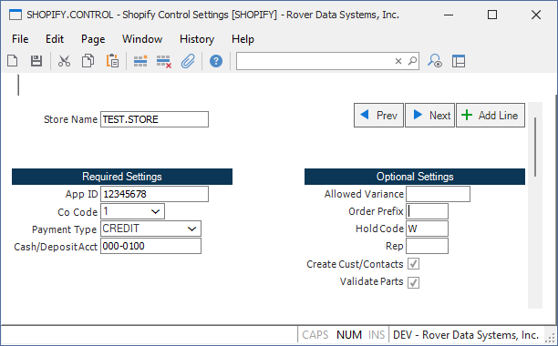

# Shopify Integration Setup

<PageHeader />

Use **SHOPIFY.CONTROL** to connect your Shopify store with Rover ERP. Rover currently supports **importing orders** from Shopify.

## Steps

1. In Shopify, create a webhook for the `Order Creation` event. Shopify Documentation Here: [Create a webhook](https://help.shopify.com/en/manual/fulfillment/setup/notifications/webhooks).
2. When prompted for the URL, use:
   > https://prod-api.rovererp.com/ShopifyOrderWebhook?OcpApimSubscriptionKey=<YOUR_SUBSCRIPTION_KEY>
3. Run **SHOPIFY.CONTROL** in Rover ERP and enter your configuration options. You can define multiple Shopify stores in Rover, each with its own configuration.
   - App Id: The app ID from your Shopify app. **This is unique to each store.**
   - Co Code: The company code for your Rover ERP instance.
   - Payment Type: The payment type to use for imported orders as defined in AR.CONTROL.
   - Cash/Deposit Account: The cash or deposit GL account to use for imported orders.
   - Allowed Variance: Enter an allowed variance amount. If the total collected from Shopify differs from Rover and the difference is plus or minus this amount, it will not be flagged.
   - Order Prefix: The prefix to use for imported orders. This is useful for identifying orders from Shopify in Rover.
   - Hold Code: The hold code to use for imported orders. Leaving this blank will not put the order on hold.
   - Rep: The sales representative to assign to imported orders.
   - Create Cust/Contact: Check this box to create a customer and/or contact in Rover for each imported order if not found.
   - Validate Parts: Check this box to only allow orders to be imported if all of the parts in the cart exist in Rover.

## Useful Tools

1. `SHOPIFY.R1` - Report to view successful and failed Shopify orders imported into Rover.
2. `SHOPIFY.P1` - Allows for reprocessing of failed Shopify orders and maintenance of the Shopify queue.

<PageFooter />
