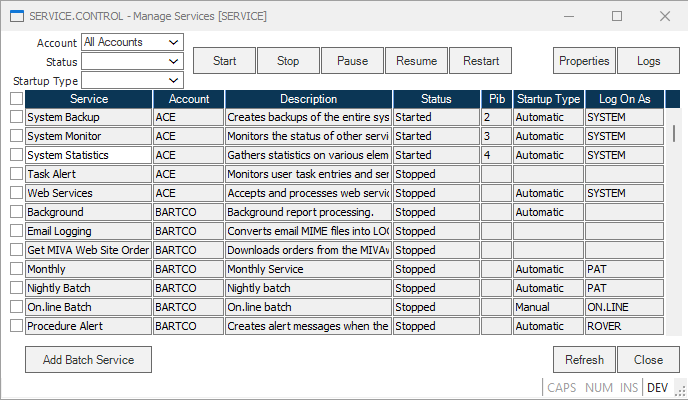
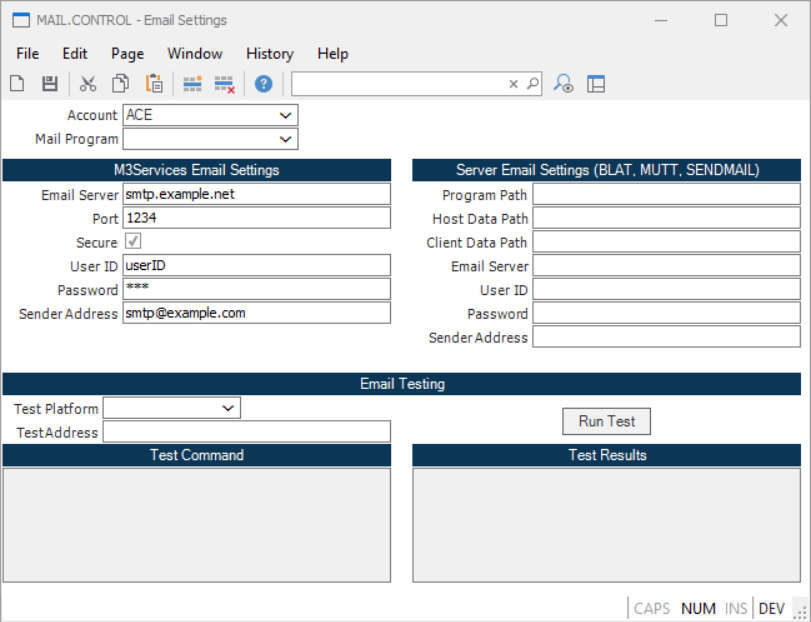
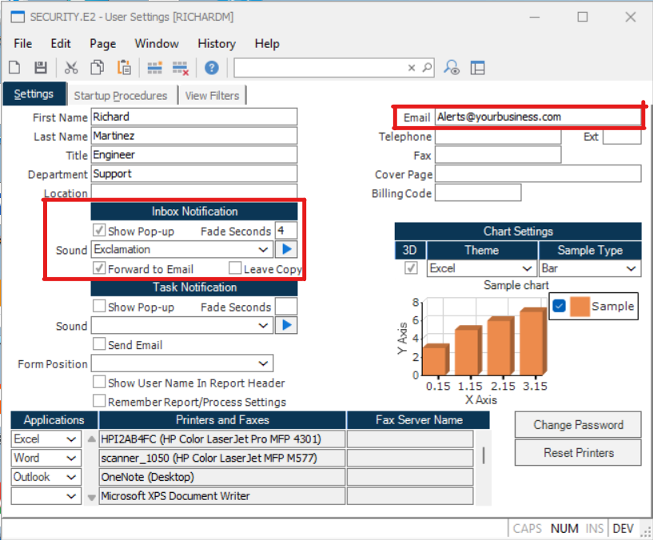
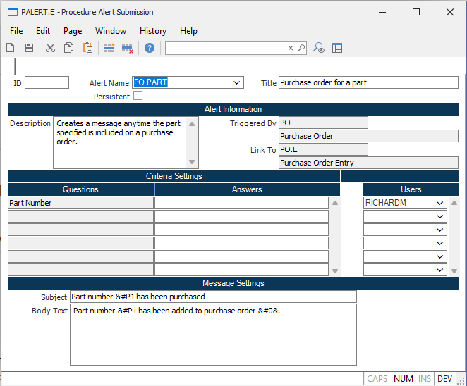

# Workflow Management

Workflow Management module provides the infrastructure required to provide real time feedback and notification based on user defined events.
- Events are defined to notify one or more users of specific events which have occurred.
	- For example, an event is setup to notify a specific user anytime an inventory item falls below its safety stock level.

The following article outlines the steps to activate event alerts. 

## Activating Procedure Alerts (SERVICE.CONTROL)

SERVICE.CONTROL is the transaction used to 
- Start/Stop phantom processes.
- Defines parameters for launching phantom process'
  This provides control over how accounts will or will not use Alerts. Procedure Alert must be manually started in each data account the first time.

To learn more about SERVICE.CONTROL please read our [Manage Services (SERVICE.CONTROL)](./../ACE-OVERVIEW/ACE-ENTRY/SERVICE-CONTROL/SERVICE-CONTROL-1/README.md) page.

## Set Host Mail Parameters (MAIL.CONTROL)
If the ability to forward messages to external email is required, the MAIL.CONTROL procedure must be setup.

MAIL.CONTROL is used to: 
- Define the parameters to send system generated messages to standard email. 
- The phantom process launched by MAIL.CONTROL uses this information to generate the email messages and send it.

In MAIL.CONTROL two different ways of setting up the procedure exist. On the left side SMTP settings can be saved. 
On the right side there are alternative server email settings such as BLAT, MUTT, and SENDMAIL. 
At the bottom of the screen there exists an Email Testing tool to troubleshoot connectivity issues. 

## Define Where Alerts Are Received (SECURITY.E2)
SECURITY.E2 procedure is used to: 
- Enable the receiving of alerts to the M3inbox and/or email. 

SECURITY.E2 shows the security profile of the account that is currently logged on. To enable/disable alerts it is important set that up in this screen. 
- Email must be added in order for alerts to be sent to an email.
- The Inbox Notification part of this page must be customized for alerts to appear.
	- Forward to Email would forward alerts straight to the email provided on this page.
	- Leave Copy would create a copy of that message and leave it in the M3Inbox on Rover.

## Process Alert Definition (PADEF.E)
Process Alert Definition procedure is used to: 
- Define templates for alerts that can be monitored by the system.
- Templates define the criteria used to determining if an event has occurred.
	- They can be setup to prompt the user for specific information when utilized by the Process Alert Submission procedure.
- These alerts are data account specific 

## Process Alert Submission (PALERT.E)
PALERT.E is the transaction used to:
- Setup an alert for monitoring by the system.
- User selects an alert (defined with PADEF.E) from a predefined template and supplies information requested.
- Criteria section:
	- User completes answers to questions listed.
	- Specifies which users are notified
- Events may be defined as: 
	- Persistent - they remain in effect until specifically removed
	- One-time event
NOTE: These alerts are data account specific. They must be turned on for each data account. 

