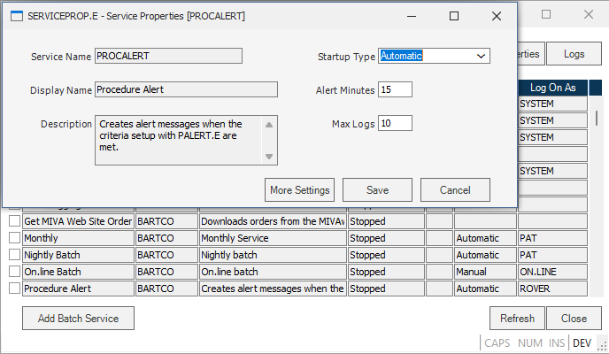
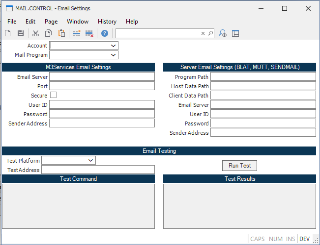
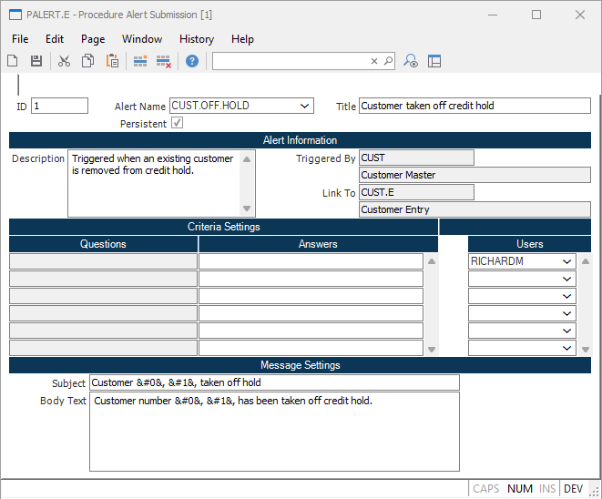

# Workflow Management
<PageHeader />

## Define/Launch Alert Event Monitor (SERVICE.CONTROL) Task alert

SERVICE.CONTROL is the transaction used to 
- Start/Stop phantom and non-phantom processes. 
- Define parameters for phantom process launch (start)
- Monitor events that match criteria of all active Alerts
Note: This provides control over how accounts will or will not use Alerts

## Define / Launch Message Monitor (SERVICE.CONTROL)
SERVICE.CONTROL is used to:
- Define parameters for launching the phantom process
- System and User generated messages

## Set Host Mail Parameters (MAIL.CONTROL)
If the ability to forward messages to external email is required, the MAIL.CONTROL procedure must be setup.

MAIL.CONTROL is used to: 
- Define the parameters to send system generated messages to standard email. 
- The phantom process launched by MAIL.CONTROL uses this information to generate the email messages and send it.

In MAIL.CONTROL two different ways of setting up the procedure exist. On the left side SMTP settings can be saved. 
On the right side there are alternative server email settings such as BLAT, MUTT, and SENDMAIL. 
At the bottom of the screen there exists an Email Testing tool to troubleshoot connectivity issues. 

## Process Alert Definition (PADEF.E)
Process Alert Definition procedure is used to: 
- Define templates for alerts that can be monitored by the system.
- Templates define the criteria used to determining if an event has occurred.
	- They can be setup to prompt the user for specific information when utilized by the Process Alert Submission procedure.
- These alerts are data account specific 

Workflow Management module provides the infrastructure required to provide real time feedback and notification based on user defined events.
- Events are defined to notify one or more users of specific events which have occurred.
	- For example, an event is setup to notify a specific user anytime an inventory item falls below its safety stock level.
- Events may be defined as: 
	- Persistent - they remain in effect until specifically removed
	- One-time event

## Process Alert Submission (PALERT.E)
PALERT.E is the transaction used to:
- Setup an alert for monitoring by the system.
- User selects an alert (defined with PADEF.E) from a predefined template and supplies information requested.
- Defined as: 
	- One-time events which are deleted after triggered persistent events which continue to report on recurring events.
- Criteria section:
	- User completes answers to questions listed.
	- Specifies which users are notified
NOTE: These alerts are data account specific.

<PageFooter />
