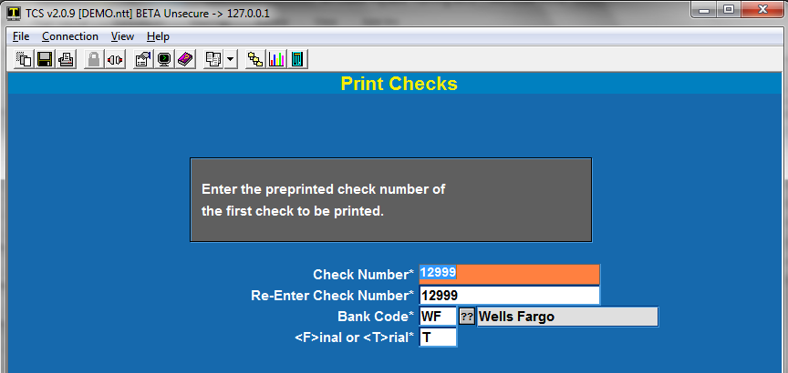
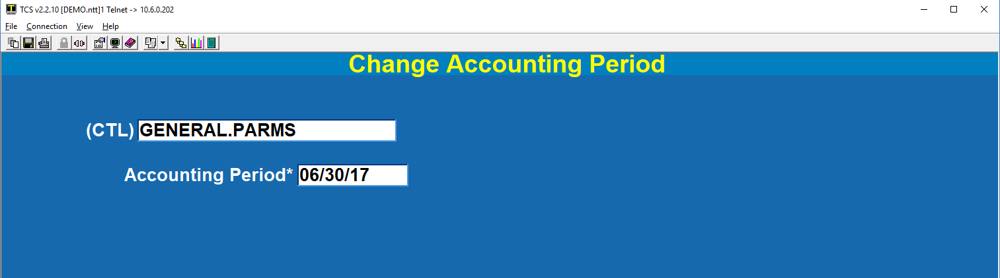

# Accounts Payable Training

<PageHeader />

<!-- TOC -->

- [Accounts Payable Training](#accounts-payable-training)
  - [Getting Started](#getting-started)
    - [Utilities and A/P System Parameters](#utilities-and-ap-system-parameters)
  - [General Parameters](#general-parameters)
  - [Maintain Ledger Accounts](#maintain-ledger-accounts)
  - [Payment Terms](#payment-terms)
  - [Rebuild Vendor Cross Reference](#rebuild-vendor-cross-reference)
  - [Check Formatting](#check-formatting)
  - [Merge Two Vendors](#merge-two-vendors)
- [Day-to-Day Functions](#day-to-day-functions)
  - [Vendor Maintenance](#vendor-maintenance)
  - [Invoices and Credits](#invoices-and-credits)
- [Check Processing](#check-processing)
  - [Quick Checks](#quick-checks)
  - [Batch Checks](#batch-checks)
    - [Check Preview Edit](#check-preview-edit)
    - [Print Checks](#print-checks)
  - [Void a Check](#void-a-check)
  - [Manual Check Entry and Vendor Payments](#manual-check-entry-and-vendor-payments)
  - [Check Inquiry](#check-inquiry)
  - [Reprint Checks](#reprint-checks)
- [Posting Transactions to General Ledger](#posting-transactions-to-general-ledger)
  - [Pre-Posting Report](#pre-posting-report)
  - [Create Journal Entry](#create-journal-entry)
  - [Change Accounting Period (Optional)](#change-accounting-period-optional)
  - [Remove Posting Flag](#remove-posting-flag)
  - [Frequently Asked Questions](#frequently-asked-questions)

<!-- /TOC -->

## Getting Started

### Utilities and A/P System Parameters

The Utilities/Setup menu allows you to establish basic static data about your organization. Generally this data is rarely changed. It also contains rarely used functions that are not part of normal daily or periodic processes.

As with all menus the Global Menu appears at the bottom allowing you to easily switch to common functions if necessary.

## General Parameters

This is where you enter basic information about your organization.

1. **Business Name**
2. **Address**
3. The **Federal Tax ID** is used when printing 1099 forms. If you will not be printing 1099 forms then this field is optional.
4. The **Current Account Period** is the month that invoices that are being entered will be posted to. You may set this here or from Main Menu > 3. End of Month > 3. Change Accounting Period.
5. The **A/P Ledger Account Number** is the “offset” account for all A/P transactions. This is the liability account that you set up in the G/L module.
6. **Show PM Menu**. If you will be printing checks or spooling reports to hold files then enter a Y here. This will cause the Printer Mgmt menu to appear on the Main Menu.
7. Some organizations set a **minimum check amount** to limit the number of checks that are sent for “insignificant” amounts. Usually a zero check would not be printed. Zero checks, or checks less than zero could occur if you have credits that offset or exceed invoice amounts.
8. The check preview process lets you view the invoices and credits for each vendor prior to printing checks. (Or where implemented, prior to preparing payment vouchers.) This report can be **sorted by** Vendor Number of Vendor Name. Enter a "V” for Vendor Number, an “N” for Vendor Name.
9. If you take **Purchase Discounts** then enter the appropriate G/L number.

## Maintain Ledger Accounts

_**\*\*\* If you are using the SmartSuite G/L Module you should manage your G/L accounts in the G/L Module and not use this menu option.**_

1. G/L **Account Number**.
2. Enter a brief **description** of the account.
3. **Status**. Enter “A” for active or “I” for inactive. Inactive accounts cannot be used when entering a new invoice. The description for invoices and reports come from this file. You can delete accounts if they will no longer be used for any reports.

To delete an account enter a “D” at the Options prompt.

1. Indicate if the balance of this account is usually a **Debit or a Credit** balance by entering a “D” or a “C”.
2. Indicate the general category of the account by entering “A” for asset, “L” for liability, “OE” for owner equity, “E” for expense or “I” for income.

## Payment Terms

AP-UT-03

This table is used to automatically calculate due dates and discounts during invoice entry.

1. Enter a brief code – no spaces allowed – that will represent your **payment term**s.
2. Enter a brief **description**. There is limited space on the invoice enter screen for this description so make it as concise as possible.
3. Indicate what date will be used for determining the age of an invoice. Use “I” for Invoice date or “R” for Received date.
4. **Discount Percent** is the percentage (with two decimals) that will be applied for timely payments.
5. **Days for Discount** is how many days after the Invoice or Receiving date that discounts are allowed.
6. Specify the number of days following the Invoice or Receiving date that the invoice total is due for payment.

## Rebuild Vendor Cross Reference

AP-UT-21 Select this option if you want to rebuild the vendor cross reference. This is a process that usually is only used after importing a vendor database.

When the process is complete simple press Enter or click on the “Done” button.

## Check Formatting

AP-UT-22

Formatting checks to fit various check forms is accomplished by using this table. The system supports most standard check formats. It also allows for printing “supplemental” forms in the event that there are more invoices than what can be displayed on the check stub. Or, you can use up checks if the form limit is reached.

1. Enter the **printer** number where this form will print. Use F6 for printer/form 6. You can also enter #of copies or HS, etc. If you are printing through Print Wizard then enter Wn where n is the printer number. Print Wizard is used whenever there is a need to print logos or signatures on the check stock.
    1. Options:
        1.  An.  The literal "A" followed by the "Auxport" printer sequence.  The printer sequence is based on the sequence in GUI Properties, Other, Printer Settings.  Most users use the same printer that is used for reports by just changing the paper in the printer to check stock.  Default printer settings are as follows:
            1. GUI Interfaces:
                1. Printer 1 is the **Receipt** Printer.
                2. Printer 2 is the **Report** Printer.
                3. Printer 3 is the **Barcode** Printer.
                4. Printer 4 is the **Customer Display** Pole.
                5. Printer 5-9 are **Alternate**  Printers.
                6. Printer 0 is for testing and sends the check "image" to the GUI viewer.
            2. Accuterm interfaces:
                1. Sends the check to the Auxport Printer.
        2. Wn.  The literal "W" followed by:
            1. '('printer filepath on the server')'
            2. PDF.  Saves image to c:\\spool\\pdf\\CheckNumber.pdf
            3. blank... Saves to NT:C:\\SPOOL
2. The **Print Sequence** specifies the order of printing the check stock. The system supports two and three section check stock. S=Stub, B=Body. Valid formats include “SB”, “SSB”, “BS”, “BSS”, “SBS”.
3. If you wish to print a **Form Feed** after the last check (to eject the last form) then enter a “Y” otherwise enter “N”.
4. The number of physical **Lines on Body** is how many total print lines are available on the Body of the form.
5. The number of physical **Lines on stub** is how many total print lines are available on the Stub portion of the form.
6. **Lines on Supplemental** is the number of lines that can be printed on a supplemental form before a new page starts.

**Stub Factors**

1. Specify which **row** number on the stub you are referencing. If the number of Lines on Stub is 12 then this number should not exceed 12.
2. **Column** is the physical column number on the stub where printing will begin.
3. **Attribute:** This is a multi-function field. There are key words or free-form text. If what is entered here is not a keyword then the text will be printed. Key words and what they do include:
    1. **“0” or “INVOICE”** prints the invoice number
    2. “DATE” prints the invoice date
    3. “GROSS” prints the gross amount of the invoice
    4. “DISCOUNT” prints the discount taken on the invoice
    5. “NET” prints the net amount of the invoice (gross – discount)
    6. “Vnnn” prints field “nnn” of the vendor file
    7. “Cnnn” prints field “nnn” of the check file
    8. “Pnnn” prints field “nnn” of the check parameters file
    9. “COMMENTS” or “DESCxxx” prints the invoice check comments field
    10. “CHECK.GROSS” prints the check gross amount
    11. “CHECK.DISC” prints the check discount amount
    12. “CHECK.NET” prints the check net amount (check gross – check discount)
    13. “CK.ID” prints the check number
    14. “NAME” prints the vendor name
    15. “VENDOR” prints the vendor number
    16. “CHECK.DATE” prints the date of the check
    17. “nnn" prints field nnn of the check file
    18. Anything else prints what is typed in.
4. **Conversion** is any valid “Pick” conversion code. Common codes include:
    1. D2/ - Date in mm/dd/yy format
    2. D4/ - Date in mm/dd/yyyy format
    3. MD2 - numbers with two decimals
    4. MD2 - numbers two decimals and commas where appropriate
5. The **Mask** column is used the specify the justification and width of the field being printed.
    1. “L” indicates Left-justifed
    2. “R” indicates Right-justifed
    3. The symbol following the “L” or the “R” is fill character to use to complete fill up the width of the field.
        1. Use “#” to fill up the area with spaces.
        2. Use “%” to fill up the area with zeros.
    4. The number following “#” or “%” is how wide the field will be.
6. **TBM** specifies Top, Middle or Bottom. On a check stub there are three areas 1) the Top row or heading, 2) the Bottom row or footing, and 3) the space between the top and bottom – the middle.
7. **Comments:** This is free form text for you to note anything unique about the row of data.

**Body Factors**

1. Specify which **row** number on the body you are referencing. If the number of Lines on body is 12 then this number should not exceed 12.
2. **Column** is the physical column number on the body where printing will begin.
3. **Attribute:** This is a multi-function field. There are key words or free-form text. If what is entered here is not a keyword then the text will be printed. Key words and what they do include:
    1. 0 or “CK.ID” prints the check number
    2. “DATE” prints the check date
    3. “NET” prints the check net amount
    4. “WORDS” prints the word representation of the check amount
    5. “VENDOR” prints the vendor number
    6. “NAME” prints the vendor name
    7. “ADDRESS” prints the vendor name, three lines of address, and one line with city, state, and zip code (blank lines are removed)
    8. “ADDRESS1” prints vendor address line1
    9. “ADDRESS2” prints vendor address line2
    10. “ADDRESS3” prints vendor address line3
    11. “CSZ” prints the city, state, and zip code
    12. “Vnnn” prints field “nnn” of the vendor file
    13. “Cnnn” prints field “nnn” of the check file
    14. “Pnnn” prints field “nnn” of the check parameters file
    15. “nnn” prints field nnn of the check recordd
    16. “SIG” prints a stored signature (only valid with Print Wizard)
    17. Anything else prints what is typed in.
4. **Conversion** is any valid “Pick” conversion code. Common codes include:
    1. D2/ - Date in mm/dd/yy format
    2. D4/ - Date in mm/dd/yyyy format
    3. MD2 - numbers with two decimals
    4. MD2, - numbers two decimals and commas where appropriate
5. The **Mask** column is used the specify the justification, fill character, and the width of the field being printed.
    1. “L” indicates Left-justified, usually used for words
    2. “R” indicates Right-justified, usually used for amounts
    3. The symbol following the “L” or the “R” is the fill character to use to completely fill up the width of the field that is not being used for data.
        1. Use “#” to fill up the area with spaces.
        2. Use “%” to fill up the area with zeros.
    4. The number following “#” or “%” is how wide the field will be.
6. **Comments:** This is free form text for you to note anything unique about the row of data.

## Merge Two Vendors

AP-UT-22

If you create two vendor records for the same vendor and there are invoices and payments made on both of them you can combine them into one vendor. This process also deletes the “Transfer From:” vendor.

You may use the cross reference in either Vendor field to search for the vendor by name.

After entering both vendors the following box appears:

If you select “Yes” then you will see the following box, with the appropriate information.

Press Enter or click on the “Continue” button to return to the menu.

# Day-to-Day Functions

The day-to-day functions are accessed from the A/P Master Menu.

## Vendor Maintenance

This menu option is at the bottom center of the screen and is accessed by click on the “hot spot” beginning with “VM” and ending somewhere after the words “Vendor Maintenance”.

1. Vendor ID: This field functions to look up and existing vendor or to add a new vendor. To add a new customer you can enter a numeric value for the vendor or simple enter a period (“.”) and then press enter. If you typed in a number and the vendor record does not exist you will be prompted to add the customer or exit. If you used the period then can start to enter the information immediately.

To look up and exiting vendor simply type 3 or more letters of their name or the Sort Code. If there are more than on matches you will see a list to choose from. Here’s an example:

If there is more than one page of names then you can use the navigation at the bottom of the screen to move forward, back, etc., and to select a vendor. You can use your mouse and click on the row that their name is on to select the vendor.

1. If it will be easier to look up a customer by a common abbreviation then enter that abbreviation in the **Sort Code** field. It may be easier to reference Prentice Hall by PH.
2. **Name, Address, etc. …..**
3. Valid **Status** codes include “A” for active, “I” for Inactive, “D” for delete.
    1. Active accounts allow you to enter invoices and process payments.
    2. Inactive accounts cannot have new invoices entered but they can receive payment s.
    3. Delete accounts are the same as Inactive.
4. Enter the default payment **Terms** that will be used for this vendor. This can be overwritten during invoice entry.
5. If you want to limit the maximum amount of checks for any given vendor then enter that amount in the **Check Limit** field. The check preparation/preview process use this limit as the maximum amount of the check that can be calculated. If an invoice will take the check over the limit then that invoice will be dropped from the calculation. No partial payments on an invoice will be made.
6. **Account Number** is the vendor’s account number for you.
7. If there is a default **G/L account** that will be used for most of the invoices from this vendor then enter it here. This account number will automatically populate the first G/L field during invoice entry.
8. If this customer should receive a 1099 each year then put their federal tax id in the **1099 Code** field. The amount that will appear on the 1099 is in the **1099 Amount** field. This can be overwritten prior to preparing 1099’s
9. The **Priority** field is used for reports to display the open invoices based on payment priority. It is seldom used but may be helpful for those vendors that must always be paid in a timely manner.
10. Each invoice, when entered is required to have a description entered. You can set a default description in the **Default Invoice Description** field.
11. You may enter any amount of miscellaneous information about the vendor in the are labeled **Miscellaneous**.

## Invoices and Credits

AP-01

Invoices and credits are entered in the same screen. Credits are entered with negative amounts.

1. **Vendor:** Enter the vendor number our enter 3 or more letters of the vendor name or sort code to access the vendor.
    1. If the vendor you want to use you can enter a period “.” in the Vendor field to add a new vendor. This will take you to the vendor maintenance screen.
2. Enter an **Invoice Number.**
    1. If you enter an existing invoice number then the screen will be filled with the data pertaining to that invoice.
    2. If you want to get a list of invoices for this vendor simply enter “??”.  You will be presented with a small prompt for Invoice Status.  You can enter the invoice status that you want to see or you can enter "??" again and get a list of Invoice Status choices.  The Choices include:  
       - 
    3.  You can then select an invoice from the list.
    4. If the invoice is not on file then you can begin filling out the invoice information.
3. Enter the **Status** of this invoice. The valid codes include:
    1. “O” – Open for Payment.
    2. “H” – Hold for Payment, do not pay until the status changes to “O”.
    3. “U” – Unreconciled. Same as “H” but it cannot be paid until the status changes to “O”. It cannot be journalized.
4. Goods/Services, Taxes, Freight, Purchase Order, and Receiving ID are filled automatically from the receiving modules. These fields are not required for any processing but are informational so that you can research the original documents.
5. **Check Comments** appear on checks, if part of the check template.
6. **Misc Comments** do not appear on checks, unless you add it to your check template.
7. If you want to see what check(s) paid this invoice you may enter “Y” in the View Payments field or you may enter a “P” at the Options prompt.
8. After entering **Terms** the **Due Date**, **Pay Date,** and **Discount**, if any, is calculated and displayed. You may override this fields as needed.
9. Enter a “Y” in **Sub Ledger** to entered detailed invoice information. This is especially helpful for credit card payments or similar items that have a lot of detail that you want to summarize by G/L account. After entering Sub Ledger data the account summaries and amounts are displayed in the G/L Account and Amount fields.
10. If the **G/L Account** you enter is flagged for payment tracking then the **Project** field is required.
11. To delete a transaction enter "D" at "Options prompt".  If the transaction has been journalized or paid you will need to select the "V"=Void option.

# Check Processing

Check and voucher processing is done in either Batches of one or more vendors or by Quick Checks of just one invoice on the check.

**All check processes write to the local A/P check file.  If you have the SmartSuite General Ledger system then the check data is also written to the G/L Cash Disbursements file. The  G/L Cash Disbursements file is what is used to create the Disbursements Journal Entry.  There is no process in A/P to post a Journal Entry for any check processing.**

## Quick Checks

Use this method to print a check for a **single invoice**.

1. Enter a new invoice or access an existing invoice from menu AP-02.
    1. Status should be “O” (open for payment).
    2. Credit memos will not print. Only a positive invoice will print.
2. At the “Options” prompt choose “Q=Quick Check”.

1. Get the physical check that will be printed

1. Enter the check number twice.
2. Enter the bank code the check belongs to.
3. Select “F” for final run.
4. Place the check (properly oriented) in the printer.
5. Select “R=Run Process”
6. The check will now print on the printer.

## Batch Checks

Use this method to print **one or more checks** for **one or more vendors**.

1. Enter all of your invoices using menu AP-01.
2. Select Menu AP-02. (Check Processing Menu)
3. Select option 1 – Create Check Preview. This creates pre-checks that can be edited, modified, or printed.

- 1. Enter a payment cutoff date for invoices to include in the check preview.
    2. Enter the date that will be printed on the checks.
    3. Enter “Y” or “N” to clear the check preview file. Usually this is “Y”, but if you need to rerun this process and include more vendors than were automatically included on the previous run then enter “N”.
    4. Enter a “Y” or “N” for Recurring Payments
    5. Optional. Enter the vendor numbers that you want to include on this check preview. Leaving the vendors blank will select all vendors.
    6. Optional. You may use the cross reference of 3 or more characters of one or more words of the vendor name to get the customer number.
    7. Select “R=Run Process”. This will create the check preview records.

1. Optional. Select option 3 to print a report of the pre-checks.
2. Optional. Select option 2 to view, modify, or delete a pre-check.

You should do at least one of the above to ensure that the invoices you are processing are the correct ones.

### Check Preview Edit

AP-02-03

1. To delete an entire pre-check enter a “D” at the “Options” prompt.
2. To delete an invoice from the check enter “M” at the “Options” prompt, then enter a space (or press the delete key) over the invoice number to be deleted from the pre-check.
3. You can also modify the Gross Amount and the Discount.
4. Repeat as often as necessary.

### Print Checks

1. Select option 4 to print the checks.
2. Get the physical checks that will be printed.

1. Enter the first check number twice.
2. Enter the bank code the checks belong to.
3. Select “F” for final run.
    1. (“T”rial printing is used for testing your check format and should be printed on plain paper to reduce the cost of wasting check stock.)
4. Place the checks (properly oriented) in the printer.
5. Select “R=Run Process”
6. The checks will now print on the printer.

## Void a Check

AP-02-21

Use this feature to void a check that has been printed. **All invoices on the check will return to their open, ready to print, status.** The invoices then are ready to be included on another check run. If you want to void/cancel the invoices then you will have to remove them in invoice maintenance.

1. Enter the system **Check Number**. This may not be the physical check number.
2. Enter the **Bank Code** associated with the check number.
3. The date of the voided check will be today's date.

The basic information about the check is displayed and then you can choose to void the check or to cancel the process.

## Manual Check Entry and Vendor Payments

AP-02-22

If you manually prepared a check for a vendor then use this process to record the check and to update the invoices. This is also where you enter payments from vendors who send you a check for any credits.

1. Enter a valid **Vendor #**. You may use the cross reference lookup here.
2. Enter the physical **Check Number** that was used to pay the vendor.
3. Enter the **Bank Code** associated with the check number.
4. Enter the **Check Date**.
5. You can next enter the invoices that were on the check. If you the invoice numbers then enter each one. You can use “??” to get a list of the open invoices for this vendor.
6. After each **Transaction #** is entered you can override the gross and net amounts being paid for the invoice.

You cannot manually pay a transaction with an "H" status.

Note that a running total is being displayed in the upper right hand area of the screen as you add the invoices.

## Check Inquiry

AP-02-23

Use the Check Inquiry process to look at checks that have been created. This is very useful when a vendor calls and wants to know information regarding a payment.

1. Enter **Vendor** number (or name).
2. Enter the check number and the bank code in the format of checknumber\*bankcode.
    1. It is easiest to use the “??” here. It will give you a complete list of checks for the vendor with the most current check listed first.

## Reprint Checks

AP-02-24

1. Enter the **First Check Number** that you want to reprint. This is the actual system generate number.
2. Enter the **Last Check Number** that you want to reprint. It you are just reprinting one check then use the same number as the First Check Number.
3. Select “R” to run the procedure.

# Posting Transactions to General Ledger

This is for customers who have the SmartSuite General Ledger module installed.  It posts ONLY A/P transactions (invoices and credits), it does not post checks.  Checks are posted in the G/L module.

## Pre-Posting Report

AP-03-01

You may run this report repeatedly. It is just a report.

1. Enter the **Invoice Cutoff Date**.  The process will select ALL A/P transactions that have not been journalized with a date older than or equal to this date.  This way all transactions will eventually be journalized.
2. Enter a letter to indicate what kind of data you want to see on this report. **S** is for Summary, **D** is for Detail, and **E** is for transactions with invalid G/L account numbers (this could be a result of settings in your distributions codes).
3. Select “R” to run the procedure.

## Create Journal Entry

AP-03-02

1. Enter the **Invoice Cutoff Date**. To keep things straight you should use the same date that you used in the Pre-Posting Report, although this is not mandatory.  Only one date for selecting the transactions is required.  All transactions that have not be journalized with this date or older will be included.
2. Enter the **Accounting Period to Post**.  When the Journal Entry is created and written to the G/L module it will use this accounting period. Use a valid period.

## Change Accounting Period (Optional)

AP-03-03

This process is optional.  The accounting period will be updated with the Accounting Period to Post from AP-03-02.

1. Enter the current **Accounting Period.**

## Remove Posting Flag

This process allows you to re-post transactions that have already been journalized.  Please make sure that you have reversed or deleted the Journal Entry from the G/L account or you will have a double posting.

AP-03-06

PICTURE

1. **Enter the Journal Code**: This is generally in the format of AP\*nnnn, where nnnn is the number portion of the original journal entry.

* * *

## Frequently Asked Questions

**Q. When does receiving update the invoice file?**

A. Invoices are updated when the receiving is posted.

**Q. What happens if the database vendor does not have an A/P vendor linked to it?**

A. The invoice is still created but the vendor number that is used is 99999. When this happens you will want to do two things, 1) correct the database vendor. This is done in GM-VM in the Additional Ordering screen. 2) Transfer the invoice to the correct A/P vendor. This is done in AP-04 (Change Vendor or Invoice).

You can stay ahead of the game by entering vendor 99999 in invoice entry and then enter ?? to get a list of any unlinked invoices. You can also run the report AP-RP-02-01. Leave all fields blank except for the vendor field. Put 99999 in the vendor field. You will see specific details about the inventory vendor in the Misc. Comments field.

The A/P Master Menu will display a message whenever there are Suspense transactions to be reconciled.  It will look similar to this.

_**The invoice information will tell you what to do.**_

Q. **How to write off a Credit Memo?**

A. If a vendor sends you a check for their credit memo then instead of voiding the memo invoice simply do a manual payment against the invoice(s).

<PageFooter />
