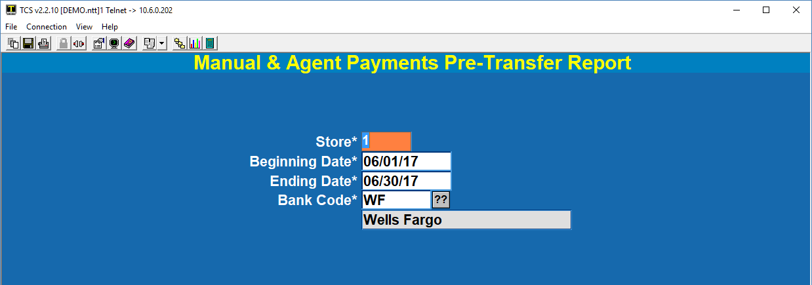

# A/R General Ledger Interface

<PageHeader />

This document describes the posting of **Manually Entered** Invoices and Payments within the A/R module.  (Invoices and Payments at the cash register are processed with the POS transactions.)

Select Option 6 from the A/R Master Menu.

 

After selecting Option 6 you will see the following menu.

Options 1 and 2 are for Invoices entered in the A/R module.

Options 3 and 4 are for Payments entered in the A/R module.

## Invoices

**Option 1.  Invoice Pre-Posting Report** Use this report to see what, if any, invoices are eligible for posting.

Select the date range that fits the period that you are working with.  The Ending Date should match your fiscal end-of-month date.  If it does not then you will need to adjust the Journal Entry in GL-01-01 to have the correct accounting period before the JE will post.

Here is a sample report.  It has two invoices on it.  One invoice has the G/L account entered in the invoice.  The second invoice does not use the G/L field on the invoice screen.

With the 1st invoice the posting process will assume that the TCODEs are Class Codes and will use the Sales G/L Account specified in the corresponding Distribution Code for these classes.

The 2nd invoice has the G/L account specified and only that G/L account will be posted to.

**Option 2. Create JE for Manual Invoices** This will create an un-posted Journal Entry in the G/L module.  You will need to review and post the Journal Entry.  See GL-01-01.

Both options use the same entry screen.

When the Journal Entry is created you will see a box in the middle of the screen with the pertinent information.

## Payments

**Option 3. Manual & Agent Payments Pre-Transfer Report** Use this report to see what, if any, payments can be moved to the G/L Receipts file. This will show Payments that have been manually entered and not previously transferred to the G/L.  The report is sorted by store, date, and batch flag (Manual or Agent).

 

**Option 4. Transfer Manual & Agent Payments to G/L**

If you use the same values as you did for the report then you will post as many items as there are on the report.

Above is the result of posting a single payment to the G/L Cash Disbursements file.

One disbursement record is created for each date. For example, if your report had 50 line items but only 10 days on it there would be 10 entries in the G/L Disbursements file.

**General Ledger Options include:**

1.  GL-04.  Inquiry.
2. GL-RP-04. Report.
3. GL-22-02. Post Misc. Receipts.  This will create a Journal Entry that you can post.
4. GL-01-01.  Post the Journal Entry.

_**Don't forget to do 3 and 4.**_

<PageFooter />
