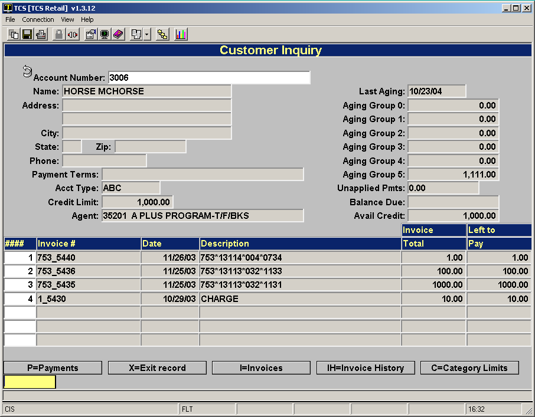

# AR History

<PageHeader />

This document describes the history process for:

1. Removing old invoices and payments from the active lookup and placing them into an index for each year.
2. Purging old invoices and payments from the system to never be accessed again.
3. Looking up inactive invoices and payments.

### Setup

Prior to running the history process you should enter your history preferences in the General Parameters screen found in AR-SU-03 (General Parameters).

There are two fields.

1. Months to keep on-line. This is to designate how many months of data will be in the active index. This should probably be about a year although it can be as small as 1 month.
2. Months in history files. This is the maximum number of months to keep the invoices and payments on your system. Anything older than this is purged and no longer available. This could be for as many years as necessary, perhaps somewhere between 3 and 5 years depending on your needs.

There are 12 months in a year. So for 5 years enter 60 for the value.

### The Process

(Main Menu # 6)

When you want to move invoices & payments to the annual indexes then choose this menu option. Also, when you want to purge invoices and payments completely from your system this is where you do it. You can run this option as often as desired.

After you make your selections you will see the following screen.Range of Process and Purge

The range is based on the data you entered in the General Parameters setup screen.As the process runs and is completed you will see the follow screen.

### Accessing the History Data

Customer Inquiry (Main Menu #2 and CI), select IH for Invoice History.

You will then be prompted for the year to search.

If there are any invoices in the year you selected they will appear at the bottom of the screen.

You can then access the invoice by choosing clicking on the line number or entering it in the entry box.

### Accessing Payment History

From the main inquiry screen choose “P” for payments then choose “PH” for payment history. You will be prompted for the year to use after which the Payment history screen will appear.

 You may choose a payment line number to look at the payment detail.

<PageFooter />
