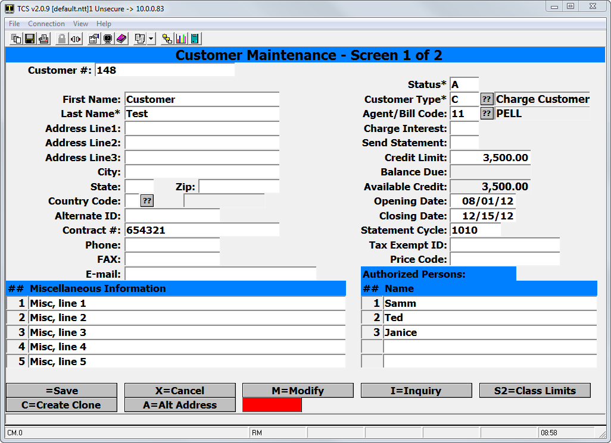

# AR Training

<PageHeader />

## Introduction

The AR (Accounts Receivable) system tracks customer accounts, charges, and payments for three general account types: sponsored (financial aid) accounts, debit accounts, and open accounts. Open accounts may be either Balance-Forward or Open-Item depending on whether you want payments to be applied against the oldest charges first or against the invoices you specify.

You can set up as many different customer types as you want, setting each one of these general types and setting other control parameters as explained in Customer (Account) Types on page 21. Each individual account is then assigned to one of these customer types. Sponsored accounts are those where the billing and payments are handled by an agent (sponsor) rather than by the customer. These accounts must be linked to the sponsor's agent so agent invoices can be prepared for all charges to individuals of that agent. Agents can be grouped into agencies for breaking out the printing of agent invoices, statements, and various other reports. Agent invoices are created for current charges, statements for past due amounts. Overdue charges are aged according to five aging periods and finance charges may be assessed to the overdue amounts. Each account has a unique numeric ID, assigned when the account is created. This ID is often referred to as the customer ID. You can access a given account with this ID number or by entering the customer's name, SSN (Social Security Number), contract number, or the name of someone you list as authorized to use the account. If more than one match is found, you are presented with a list of accounts to select from. Since the A/R functions are selectable from menus, the menu selection sequence to access a particular function will be included as part of the function identifier. For example, to prepare current customer statements you select menu 4, then menu 1. This is designated as AR-4-1. Similarly, AR-SU-3 takes you to the General Parameters screen. In addition to its integrated interface with the TCS POS system, this AR allows custom interfacing with other A/R systems.

## Initializing your A/R

Several items of information need to be available before individual A/R accounts can be set up. Most data fields have helpful information about the field which can be accessed by entering a question mark (?) in the field before entering your data. The following items are listed in the approximate order in which they should be considered.

### General Parameters (AR-SU-3)

This includes some general parameter values that usually only need to be set once. Enter '?' for help with any field.


1. You can add a one-line customized message to all monthly statements, customer and agent, by entering the text at the Global Statements Msg.
2. For now, you can ignore the Current Accounting Period and the Current Statement Cycle.
3. Bal Fwd or Open Item lets you specify the default payment type for credit accounts. This is overridden by the Payment Type flag set for each customer type (AR-SU-4).
4. The Finance Charge Rate sets the percent charged on unpaid balances when the monthly statements are run if:
    1. the unpaid balances are older than the Days Until Finance Charges for this customer type (AR-SU-4) and
    2. charge Interest is set to 'Y'es for the customer (AR-CM).
        1. Enter the rate as hundredths percent; 150 for a 1.5% rate. It will display as 1.50.
5. The Minimum Finance Charge sets the minimum amount charged on any overdue amounts described above. Enter the amount as dollars and cents with no decimal; 1200 for $12.00.
6. Default Terms prints out on the invoices.
7. The Statement Override Sort allows you to select the definition code that you wish to sort by.
8. Set Standalone A/R to 'N'o, since you're running it integrated with the POS module.
9. The POS Tender Code for A/R is usually 'AR'. If you name it something else in POS-2-4, the new name must be entered here.
10. Similarly, you need to set the transaction code (POS-02-05) for payments on account (Return on Account) at POS Trans Code for ROA.
11. Set the Use Unapplied Payments to Y if you do not allow overpayments on invoices.
12. The History: Months to Keep On-Line and the History: Months in History Files lets you set the number months to keep history information.
13. A/R calculates past-due amounts based on five specified Aging Groups or aging periods. For individuals these aging periods are one through five months, designated as 30, 60, 90, 120, and 150 days. For agents these five periods may be set to any 30-day multiples, such as 90, 120, 150, 180, and 360 days. Overdue charges are aged when you create statements (AR-4-1 and AR-5-21) and the latest aging reference date is displayed in Customer Inquiry (AR-CI).
14. Individual invoices are identified as sss\_nnnnn where sss is the store # and nnnnn is an invoice number. Cust Invoice Prefix lets you add a special prefix to each invoice number on the statements and invoices. It doesn't actually change the invoice numbers.
15. Agent invoices are identified as aaa\*nnnnn where aaa is the agent id and nnnnn is an invoice number. Some outside systems that log this invoice number can't handle the '\*' in the id, so Agent Invoice # Delimiter allows you to substitute an acceptable character for the '\*'.
16. The default Invoice Program is 'INVOICE'. If you have a custom invoice program created, you would enter its name here.
17. If you export your invoices then you can enter a Y at the Realtime Invoice Export to export the invoices in real time.

### Agencies and Agents (AR-5-22 and AR-5-21)

Accounts may be paid by a sponsor rather than the customer making the charges. These sponsors are called agents and are grouped into agencies. Customers belonging to a customer type that requires an agent code (AR-SU-4, Require Agent Code = Y) must be linked to an agent so their charges can be grouped together on an agent invoice to be sent to the agent for payment. Agencies must be set up (AR-5-22) so the agents can be linked to them, and agents (AR-5-21) must be set up so customers can be linked to them.

To set up an agency (group of agents)... (AR-5-22)

Agencies are no longer used…Please skip this step.

1. Enter a dot(.) for the next sequential number. This is the Agency's Code number for linking agents to it.
2. Enter in an agency Description to identify the name of the group.

To set up an agent (sponsor)... (AR-5-21)

1. Agent #: This is the agent's ID number. Enter a dot (.) for the next sequential number.
2. If you want a brief one-line message to print on all statements for this agent, enter it as the agent Statement Msg. It can be changed each time before statements are run.
3. Enter the agent's Last Name (or the name of the organization if the agent is a company) and First Name (or the name of the organizations contact if this is a company) as you want it printed on the invoices and statements.
4. Optionally, enter the Address Lines, City, State, Zip, Phone number, and Extension.
5. Enter the agent's Status: 'A' for active, and 'I' for inactive.
6. If you want to link this agent to a group, enter the group's Agency Code. (This option is no longer used.)
7. If you want to close this agent out on a certain date, enter the Closing Date.
8. Enter GEN as the Invoice Code unless you have a special code created by TCS.
9. Enter GENERIC for the Statement Fmt unless you've created a special statement format (AR-SU-22) that you want to use instead.
10. If you plan to charge the agent a processing fee, enter the Process Fee % and/or the Minimum Fee you'll be charging.

### Class Categories (AR-SU-6 and AR-SU-5)

If a sponsor wants to restrict the amount the sponsored customer can charge for certain types of merchandise, the merchandise classes to be so restricted must be organized into class categories. You have to first create the Category codes and their Descriptions in Class Category Maintenance (AR-SU-6) so you can link each class to the appropriate Class Category (AR-SU-5). As each sponsored customer to be given category limits is set up (AR-CM), the categories and their limits are set in screen 2 as explained under Adding Customer Accounts on page 11.

### Customer (account) Types (AR-SU-4)

This is where you define all the different types of customer accounts you want, based on the different combinations of payment type, sponsorship, finance charges, taxing, and ways the customer transactions are handled at the register. As you create new customer accounts you can link them to the appropriate customer type which gives the account the characteristics for that type. Enter '?' for help with any field.


1. Each different type is identified by a Customer Type Code which may be any combination of letters and numbers. Short one or two character codes are usually easier to use and remember.
2. Enter a Description for the type, sufficient to remember why you created it.
3. The Payment Type may be 'D'ebit, 'O'pen-Item, or 'B'al-Fwd. O and B overrides the General Parameters default setting (AR-SU-3, Open Item or Bal Fwd).
4. Aging Type (Sequence) is a code you can set to group different types together on the aging report (AR-SU-5).
5. The Require Agent Code is what determines if accounts of this type are sponsored (have agents) or not. Only accounts belonging to a type which has this set to 'Y'es can be included in agent invoices.
6. If you want to require a credit limit to be set on all accounts of this type set Require Credit Limit to 'Y'es.
7. You can allow customers of this type to charge over their credit limit by setting 'Y'es in Allow Over limit Charges.
8. If you don't allow over limit charges, you can let them pay for any charges beyond their limit with cash by setting 'Y'es in Allow Cash Purchase if Over Limit.
9. You can set an Opening Date and a Closing Date on each customer to limit when they can charge their account. Setting 'Y'es to Allow Purchase Before Start Date lets accounts of this time to begin charging before the opening date. 'Y'es in Allow Purchase After End Date lets them charge after the closing date.
10. Limit Purchs to Class Category = 'Y' means they can only charge items belonging to the classes that are included in the specified class categories for the account and only up to the limit for that class category unless the overall credit limit for the account is reached first.
11. Each account has provision for a list of authorized persons. Setting Restrict Purch to Auth Persons to 'Y'es only allows charges to the account when either the owner's name or one of the names on the list is given.
12. Require Name of Person Charging = 'Y'es requires a name to be entered at the register on all transactions on this type of account.
13. Set the Require GL Account to ‘Y’es if an account number is required for this customer type.
14. Set Use Purchase Tracking to 'Y'es if you want to monitor the items being charged to accounts of this type. A special purchases file lists each SKU, and warns the cashier if the item has already been purchased before or if a return is attempted on a SKU that hasn't been purchased. Good for tracking textbook purchases by sponsored students.
15. The POS Discount Code is used when you want customers of this type to get a special discount. The discount is set up in POS, either as a 'TDM'-type modifier (see POS-2-2) or as the name of a discount matrix (see POS-2-6).
16. Set the Statement Format Code to GENERIC unless you have created a special format in Statement Formats (AR-SU-22).
17. The Process ID for additional input is only set if TCS has written a custom program to request additional information from the cashier for this type of customer account.
18. If you will be charging finance charges on overdue accounts, set the number of Days Until Finance Charges, if you will **NOT** be charging finance charges then enter ‘999’. Only unpaid charges older than this number of days will be used to calculate finance charges.
19. Once overdue charges become older than the Max Days Past Due for Charges, the customer will not be allowed to make further charges until they are paid. Set to 999 if you don't want the days past due to be checked.
20. When unpaid amounts get too old, you can stop any customer discounts until they are paid by entering the Max Days Past Due for Discounts. Entering 999 indicates you don't want this check to be made.
21. If charges for customers of this type are to be taxed, enter 'Y'es in Tax Charge Sales.
22. If cash payments made after the credit limit or a category limit is reached are to be taxed, enter 'Y'es in Tax Cash Sales.
23. If you wish the allow the system to automatically make payments with the mass payment option then set Allow Autopay field to ‘Y’es.
24. If you set Limit Purchs to Class Category to 'Y'es, enter the category Code for the Default Class Categories you want customers of this type to be limited to. You'll enter the category codes and their limits in screen 2 of the Customer Maintenance screen.

### Dunning Letters (AR-4-22-21 and AR-5-6-21)

If you want to send dunning letters to customers and/or agents who have overdue accounts, you can set up one to three different form letters for customers (AR-4-22-21) and three for agents (AR-5-6-21).

1. Enter the Letter # (1, 2, or 3) you want to edit.
2. Enter the number of blank lines at the top of each letter, the Top Margin Adjust.
3. Enter the Left Margin Adjust, the number of spaces on the left of the letter.
4. Enter the Text to appear on letter. You can include the following variables (with the preceding |) to designate where you want data from the system included in each letter. As you include these variables in your letter, allocate enough space on the line for the variable's value.

>|PHONE The store’s customer services phone #, maintained in General Parameters.  
>|NAME The customer's first and last name.  
>|ADDRESS All lines of the customerfs address, including City, State and Zip.  
>|DL1DATE The last date the customer received the 1st dunning letter.  
>|DL2DATE The last time the customer received the 2nd dunning letter.  
>|DL3DATE The last time the customer received the 3rd dunning letter.  
>|PREBAL The outstanding amount due on the customer's account.  
>|DAYSOLD The number of days the amount is past due.  
>|LASTSTMT The date the last statement was sent.  
>|DATE Today's date.  
>| (A single carat in column 1 of an otherwise blank line, prints a blank line.)  


### Dunning Letter Report (AR-4-22-1 & AR-5-6-1)

This report provides a list of customers that will get dunning letters based on criteria you set. Specify the age groups for which you want letters sent. The report lists the customers who have an unpaid balance in any of the selected groups. It includes the amount of the unpaid balance in each selected aging group and the last date the customer received any of the dunning letters. This lets you make any necessary adjustments before you print the actual letters. Enter 'Y'es for each aging group for which you want dunning letters printed.

### Print Dunning Letters (AR-4-22-2 & AR-5-6-2)

This is an expansion of the previous report. In addition to specifying which groups are to be checked for this set of dunning letters, you specify which letter is sent to each aging group. You can print a letter for a single customer by specifying the customer fs ID. You can also have the letters print in either name or zip code order.


1. If you only want dunning letters for certain customers, enter their account IDs in Customer Ids to Print. If more than one, separate them with commas.
2. Set to 'Y'es the same Age Groups you used in the dunning letter report.
3. Print the Dun Letter # (1, 2, or 3) you want sent to each age group you set to 'Y'es.
4. Enter N or Z to indicate the order in which you want the letters printed, By <N>ame or <Z>ip.

### Non-merchandise Transaction Codes (AR-SU-1)

Some accounts need to be charged for such non-merchandise items as freight, service charges, special interest charges, beginning balances, etc.. These charges can be made with a manual invoice. The codes for such charges need to be set up before the invoice can be created (p. 15).


1. Enter a Transaction Code to represent the special charge.
2. Enter a Description of the special charge
3. Enter the Type description for the code, such as NEW, USED, SOFTWARE, OTHER, TAX, INSTALLATION, FREIGHT, TRAVEL, EXPENSES. Enter a ? for a list of current types.
4. If you have the General Ledger module, enter the G/L Account number for this code.
5. Factor is for future use. Leave it blank.

## Adding Customer Accounts

Each A/R account is identified by a unique customer code. The customers may be students whose parents have put in money for them to draw on (debit account), students sponsored by a company or a scholarship fund (sponsored account), or bookstore employees or college departments (balance-forward or open-item credit accounts).

The First Name, Last Name, Soc Sec Num, Contract #, and Authorized Persons values are automatically entered into a customer cross-reference when the account is created. This lets you access the account by entering in any of these values in addition to the account number.

A student account is usually set up for only one school term, with a new account being opened for each succeeding term. The old account will have an ending date sometime around the end of the term, after which the customer can no longer charge to it. For the new term, you create a new account for the customer to start charging against the sponsored amounts for the new term. You still want to access the old account using the customer's name so you can complete the payments and answer any queries you may get. At the same time when the cashier enters the name, you only want them to see the new account. You achieve this by rebuilding the customer cross reference (AR-SU-23) so the older accounts, as specified by a closing date cutoff and customer type(s) go into a 'H'idden cross-reference which can only be accessed by entering H; ('H' and semicolon) before the name. Then when the cashier enters the name Johnny Jones, the 'hidden' accounts don't show up on the cross reference. But if you need to access all the accounts for Johnny Jones, you just enter H;Johnny Jones to see both the current and the hidden accounts.

Accounts may be created or edited via the customer maintenance menu (AR-CM).



1. At Customer #, for a new account enter a dot (.). For an existing customer enter the customer's ID, either the Customer #, Last and/or First Names, Alternate ID #, .Contract #, or a name from the Authorized Persons list. If more than one match is found, you get a list of matching accounts from which you can select the one you want.
2. Enter the customer's First Name and Last Name; they'll be included in the cross reference so you can use them to locate the account.
3. Enter the customer's Address Lines, City, State, and Zip.
4. The Country Code may be left blank for now.
5. If you enter the Alternate ID it too is entered in the cross reference.
6. The Contract # refers to sponsored accounts, but can be used for any special ID that you want to be included in the cross reference.
7. Tax Exempt ID is for accounts that are tax exempt.
8. You can enter the customer's Phone number if desired.
9. You can enter the customer's Fax number if desired.
10. You can enter the customer's E-mail address if desired.
11. Customer accounts may be controlled through the Status flag. Charges can only be made against 'A'ctive accounts, or 'H'old accounts with a supervisor's authorization. To temporarily stop charges to an account, set status 'I'nactive. If you subsequently want to allow charges, simply set status back to 'A'ctive or 'H'old.
12. As explained under Customer (account) Types on page 21, set the Customer Type code that contains the characteristics you want this account to exhibit.
13. In the Customer Type Maintenance (AR-SU 4) if the customer type's “Require Agent Code” is set to 'Y'es then enter the Agent/Bill Code of the agent to which this account is assigned.
14. If you want to charge interest on overdue amounts for this customer, set Charge Interest to 'Y'es. The amount of interest charged depends on the Days Until Finance Charges for this customer type and the Finance Charge Rate and Minimum Finance Charge in general parameters.
15. Set the Send Statement field to 'Y'es if you want this account to receive monthly statements.
16. Enter the maximum amount that can be charged to this account in Credit Limit. This value also determines the default Category Limits for screen 2.
17. The Balance Due and Available Credit are calculated values.
18. Use primarily for sponsored accounts, the Opening Date and Closing Date lets you limit when charges may be made against the account. Note that this may be overridden by the Customer Type Maintenance ‘Allow Purchase Before Start Date’ and ‘Allow Purchase After End Date’ flags. Leave them blank if you don't want any date limits set.
19. You can set up Statement Cycle codes for sponsored accounts to identify groups of customers to include in different agent invoice runs; see Creating Agent Invoices on page 21.
20. Enter the Tax Exempt ID for customers that are tax exempt.
21. Price Code
22. The first three lines of Miscellaneous Information are displayed at the register, a good place for special notes and instructions for the cashiers. Additional lines are only available from this screen. The first six characters of the first line also displays in the cross reference selection list at the register. This can be useful for special codes when a customer has more than one sponsored account.
23. If you set Restrict Purch to Auth Persons for this customer's type, enter the names of the Authorized Persons. The purchaser's name is checked against this list for any charges to this account.

For accounts using category limits, screen 2 manages and displays the category information.


The category limits are initialized to the Credit Limit when it's entered. If the sponsor places lower limits on any category, enter the actual Category Limit. If you later change the credit limit, any category limits equal to the old credit limit will be updated to the new limit by the system. No matter what is entered for the category limits, the customer's total charges cannot exceed the credit limit.

## Adding Charges to Accounts

Charges can be made either through the cash register or through a back office manual invoice entry. Register charges show up on the register reports, back office charges do not. They are usually used for non-merchandise charges and adjustments. In either case the account may be selected by the account number, customer name, SSN, or contract number.

These payments are applied to oldest invoices first, even on Open-Item accounts.

### Register Charges (POS-1, AR/ARRT)

A/R register transactions are usually coded as AR for charges and ARRT for returns. The cashier is asked for a customer contract or name. Any cross reference entry is valid. If more than one match is found, a list of matches pops up, showing the Customer #, Last and First Names, the first six characters from the first line of the customer's Miscellaneous Information (useful for special codes), any Primary Customer link, the Soc Sec Num, the account's Closing Date, and the current Balance Due.

Upon selection of an account, a screen pops up with the customer's First and Last Names, Contract Number, Customer #, Opening and Closing Dates, Credit Limit, Balance Due, Available Credit, and the first three lines of Miscellaneous Information. The cashier can accept it as the correct account or make another request. Some of the actions at the register depend on the settings for the account's customer type (AR-SU-4). The transaction is paid with an A/R tender code (usually 'AR'), up to the account's credit limit and/or category limits. Depending on the customer type's Allow Cash Purchase if Over Limit setting, the customer may be able to pay any excess amount with cash.

Note: For now, debit account charges do not link to the account payments, so they may not show up correctly until you Prepare Current Statements (AR-4-1) where a special utility links them before preparing the statements.

### Back Office Charges (AR-3-1)

Back office charges are made directly in AR (AR-3-1). You can create new invoices or review, modify, post-void, or print existing invoices. This is designed not only for occasional corrections, but for batch entry of invoices from another POS system. Batch entries can be reported and posted for quality control.


1. To create a new invoice, enter a dot (.) for the next sequential Inv # or enter any unique invoice number as long as it begins with the store number and an underscore (\_).
2. Enter the Cust # by number, name, Alternate ID #, or contract number. If your entry finds more than one match in the cross reference, select the one you want from the pop-up list. The customer's information is filled in from the account information.
3. You can enter any date for the Inv Date, it doesn't have to be today's date. Remember aging calculations are made from this date.
4. The Store, Date, and Reg are filled in automatically, but you can change them if needed.
5. The Tran#, Clerk and other fields are optional, mostly useful when copying transactions from another system. Enter ? on any fields you have questions on.
6. Enter CHARGE or ADJUSTMENT for the Inv Desc.
7. The invoice line items, Prod/Tran/GL, may be either merchandise class codes or one of the transaction codes set up in AR-SU-1 (p. 10). Complete the information for each line and press the Enter key when done.

A customer invoice is created and linked to the customer account.

Note: Be careful about changing an invoice created at a register; a subsequent cleanup utility may restore it to its original values. It's better to make a compensating invoice so the original remains unaltered.

## Adding Payments to Accounts

Like charges, payments may be made either through the POS register or through the back office. Their IDs consist of cust\*paymentID, where cust is the customer ID (account number) and paymentID is a unique ID. In the case of ROA payments the paymentID is the transaction ID (STORE\*DATE\*REG\*TRAN#). For back office payments, the paymentID can be almost anything.

Note that just as you can't directly apply a negative-balance invoice (a Return) against a positive-balance invoice; you can't apply one payment against another. Charges can only be resolved by linking to a payment and payments can only be used up by linking to an invoice.

### Register Payments (POS-2, ROA)

ROA (Received On Account) is the usual register transaction type for A/R payments. The transaction type is linked to a fee code which belongs to a class and department so the tenders are included in the register reports.

ROA payments are treated as Balance-Forward even if the customer payment type is Open-Item.

### Back Office Individual Payments (AR-3-21)

This powerful function offers you many fields to enter data and several options to select. Enter '?' in any field for which you have questions.

1. Enter the Cust # (as account #, name, SSN, etc.). The payment type (Open Item or Balance Forward) and name and address are automatically filled in.
2. Enter the payment Type; A, CK, CA, V, MC, or AX for Adjustment, Check, Cash, Visa, MasterCard, or American Express.
3. For Chk/Doc, enter the check number if payment is by check. Otherwise enter a dot (.) for a unique payment number, or enter a number of your choice. Try to avoid any spaces in the Chk/Doc ID; they can be confusing and sometimes harder to handle. The account invoices and their balances display at the bottom of the screen.
4. Enter the Store, Date, Reg, and Tran#. The date is preloaded with the current date, but can be overridden. Enter anything you want for the register and transaction number.
5. Enter the Payment Amount.
6. Balance-Forward payments: Any invoices with a negative balance are automatically paid off and their amounts are added to the payment amount. The payment amount is then automatically applied against the invoices, oldest first, until the payment is used up or all invoices are paid off.
7. Open-Item payments: You must designate how much to apply to which invoice until the payment amount is used up or all invoices are satisfied. Applying the payment to a negative-balance invoice, increases the payment amount.
8. You can designate the invoice(s) to be paid off in several ways: by entering an invoice's line number, a range of line numbers (nn-nn), or entering the letter I and an invoice number.
9. If there are more invoices than will fit on the screen you can go to the Next screen, the Previous screen, the Top of the list, or the Bottom of the list.
10. If the payment is larger than the outstanding charges when you exit, a special unapplied-payment invoice (store\_UPnnn) is created for the difference. Keep in mind that these are temporary invoices and their values are only accurate at the time they're created. For the most part you can ignore them.

### Back Office Agent (sponsor) Payments (AR-3-22)

Agent payments work like the customer payments described above, except that you enter the agent code instead of the customer code and the 'Cycle' code, the agent billing cycle you specified when you created the agent invoices (p. 21). The payments are applied to the individual customer invoices that make up the agent invoice for that agent and cycle. It's a very fast and easy way to pay off large numbers of individual charges.

## Checking Account Status

The Customer Inquiry (AR-CI) function shows you the credit limit, balance due, and available credit. It also shows the aging buckets and the amount past due for each aging period for the cutoff date of the last aging run. It's convenient for quick answers to any questions a customer might have about their account. It starts with a list of customer invoices, most recent first, with their date, description, total, and balance.

From this screen you can select a Payments list, from which you can pull up the details of an individual payment. You can similarly select an Invoices list, from which you can pull up the details of an individual invoice. You can look at the customer's Category Limits and the secondary and primary Customer Links for linked accounts.

## Making Account Corrections

Use Customer Maintenance (AR-CM, see Adding Customer Accounts on page 11) to make corrections to the general account information. Corrections to account charges and payments can readily be done through adjustment Invoices (AR-3-1, p. 15) and Payments (AR-3-21).

### Creating Account Credits and Adjustments

Usage scenario: An account has an invoice of $1000.00 that needs to be backed off of the account. If you are still in the same accounting period then the back office invoice can be post voided in AR-3-1. An invoice charged at the register would need to be post voided at the register. For this scenario the original invoice was posted months ago and a post void is not an option.

1. An offset invoice must be created to reduce the balance on the account, this is performed in AR-3-1
    1. Enter a . to create a new invoice number. Enter the account number and change the Date or Reg as necessary. The Tran# is optional.
    2. Populate additional fields as desired until you reach the Invoice Desc field.
    3. Enter an accurate invoice description. An example would be "Charge Reversal for Invoice ###".
    4. Enter a SKU, Class Code, GL Distribution or Tran Code in the Prod/Tran/GL field. A ?? can be used to get a list of transaction codes.
    5. Enter a description if necessary for the line item.
    6. Enter a negative qty if this is offsetting a positive amount invoice, or a positive qty if offsetting a negative amount invoice.
    7. Specify the price. NEVER enter a negative price amount. A negative amount can be obtained by entering a negative qty.
    8. Fill out any additional line items if needed. In this scenario the Invoice total would read -1000.00 after all of the line items have been entered.
    9. Press enter until the record has been saved.
2. The offset invoice will appear on the account and reduce the account balance by $1000.00. However the "Left to Pay" column will still have the original 1000.00 and the new -1000.00 amounts. This is taken care of by doing an adjustment payment on the account in AR-3-21
    1. Enter the customer number.
    2. Enter a . for the Doc# field or enter a specific document number.
    3. Enter an A for adjustment.
    4. Enter the Store Date and Reg as needed, Tran# is optional.
    5. All adjustments will have 0 in the Payment Amount field.
    6. Enter the amount to apply. In this scenario we're going to apply payment of -1000.00 to the new -1000.00 invoice.
        - A second run through will take care of the original 1000.00 invoice. This can be done in the same document.
    7. Enter the line number in the table for the new -1000.00 invoice. The most recent invoice should show up on line 1 so 1 would be entered.
        - The system may suggest a line number to apply the amount to.
        - After applying the -1000.00 amount the invoice Balance column in the table should change to 0.
    8. The cursor will reset to the Amt to Apply field. To apply payment to the original 1000.00 invoice, enter 1000.00.
    9. Enter the line number for the orignal invoice in the "Apply to" field.
    10. Further adjustments can be entered if desired. Otherwise leave the Amt to Apply field as 0.00 and press enter until the record has been saved.
        1. Payments can be lumped into an "Amt to Apply" total and applied to multiple invoices in one document.
        2. Positive amounts and negative amounts would be totaled together and applied separately.
            1. If there were multiple negative invoices totaling -5480.87 and multiple positive invoice totaling 5000.00:
            2. One "Amt to Apply" of -5480.87 would be entered. The "Apply to" field would be used multiple times against the negative invoices that make up the -5480.87 total.
            3. One "Amt to Apply" of 5000.00 would be entered and applied to the invoices that make up the 5000.00 total.
    11. The account should now have the corrected balance from the offset invoice with Left to Pay balances of 0 for the original and offset invoice.

## Removing Obsolete Accounts (AR-6)

Data can be kept in one of three places: in the current files, in history files, or on backup media. The first two are on the system, the last is offline. The usual procedure is to keep data used in regular reports and functions in the current files. As they age to the point where you may only need to access them once in a while for some special situation, they can be moved to history files. They're still accessible, but not as readily as in the current files. And it keeps the current files from getting so big they become too inefficient.

You set the controls for the history operations in History Parameter Maintenance (AR-6-1). The data are only moved in packets of a full month's data; partial months are left alone.

1. Enter the # months to keep in active file. When you run history, all data older than the specified number of months are moved to the history file.
2. Enter the # additional months to keep in history file. When you run history, any data older than the active file months plus the history file months is purged from the system, leaving only the specified number of months in the history file.
3. You can set history to run automatically after the end of each month or on specified months. Leave Month(s) on which to run history blank to run each month. To run at the end of each quarter, enter '3,6,9,12'.
4. If you don't care to see the results of the history run, leave Send History Report blank. You can send the results to the display by entering RD or send it to a printer by entering Rn, where n is the number of the printer you want it sent to. You can also run the history report later via menu AR-6-2.

For example, you might want to keep no less than six months of data on the active file and at least two years of data available on the system at all times. And you only want to move data to history at the end of each quarter. Set the active months to 6, the history months to 18, and the months to run history to 3,6,9,12. At the end of each quarter you'll have 9 months of current data and 21 additional months in the history files. Following the backup at the end of each quarter, the history process will move the oldest three months of data from current to history and purge the oldest three months from history. Then if you archive the backup tape you create at the end of each year, you'll always have two copies of all your data saved on tape. You can also force a history run at any time via menu AR-6-3. It will save the data for the specified number of full months plus any partial months. Note: not all history functions are completed at this time.

## Running Monthly Statements

### Agent (sponsored) Accounts

Agent invoices include all new charges up to an ending date you give, for all individuals linked to that agent. Each invoice is identified by the agent's ID number and an agent billing cycle code you also specify.

The cycle code needs to be unique for each billing cycle or the new invoices will be added to an old agent invoice. A useful convention might be to use YYMM, where YY is the last two digits of the year and MM is the current month. The cycle code is not only used to identify the agent invoice, but also to link the individual customer invoices to the agent invoice so they'll only be included on one agent invoice.

After the invoices are created (AR-5-1), they may be checked with a preliminary invoice report (AR-5-2) and then printed (AR-5-3), either all at once or in various groupings. When payment is received (AR-3-22, page 18), it's entered against the agent invoice (agent ID and cycle code). When payments are overdue, you can print agent statements (AR-5-4) to send out as a reminder. You can even add finance charges if you wish.

You can also create individual statements for sponsored customers to review their charges if you wish, but their invoices are still included in the agent invoices.

#### Creating Agent Invoices (AR-5-1)

This function picks up all A/R invoices with 1) agent billing cycle codes that are blank or match the Agent Cycle you enter, 2) dates no later than any specified Ending Date for Charges, 3) a customer Statement Cycle code that matches any specified Customer Statement Cycle, and 4) a customer agent code that matches any specified Agent Code(s). It combines these invoices into an agent invoice for each included agent.


1. Enter the Ending Date for Charges, the cutoff date for charges to be included in the agent invoice.
2. If you've assigned Statement Cycles (p. 13) to your sponsored accounts, you can limit the invoice to those with a certain code by entering it in Customer Statement Cycle.
3. If you only want to create invoices for certain agents, enter their Agent Code(s); otherwise, leave it blank.
4. This is where you assign the Agent Billing Cycle. The two-digit year and month (0104 for April 2001) is a useful code and easy to remember.
5. Enter the Date for Invoice, the date you want printed on each invoice.
6. If you wish to exclude payments from the invoices then enter ‘N’o in the Include Payments field.
7. You can use the Optional Invoice Heading to have a brief message printed on each invoice, just below the address. This is in addition to the note you can include at the bottom of each invoice summary sheet (AR-5-23).

#### Printing the Preliminary Invoice Report (AR-5-2)

This report is useful for checking things out before you print the actual invoices. You can see the data that will be included on each invoice. It can be used on any agent invoice you've created. Just enter the agent billing Cycle code. If you only want to look at invoices for a particular agency or agent, enter their Agency Code(s) and/or Agent Code(s).

#### Printing the Agent Invoices (AR-5-3)

Using the same controls as the preliminary invoice report, this function lets you print the actual invoices to send. You can print them in sets by agency or agent if you want.

Each invoice consists of a summary page showing the totals for each transaction code, in order of largest amount to smallest, and the grand total for the invoice. With the default GEN invoice code set in agent maintenance (p. 5), you also get a sheet listing the totals for each transaction code of each individual included in the agent invoice. Contact TCS for custom creation of other invoice formats.

#### Processing Agent Statements (AR-5-4)

This lets you create statements for any agents with outstanding balances from their agent invoices. When you enter an agent payment, it pays off the individual invoices that make up the agent invoice as far as the payment amount will go. The agent invoice balance is reduced by the total amount of the agent payment.


1. Enter a Statement Aging Cutoff Date. This is used to calculate the amount overdue for each aging period as specified in the AGENT Aging Groups in general parameters (p. 4).
2. Enter the Statement Date to be printed on each statement.
3. You can specify a brief Statement Heading message to be printed below the address on each statement. If a Global Statements Msg is set in general parameters (AR-SU-3) it will also be printed at the bottom of each statement. If an Agent Stmt Msg is set in the agent setup (AR-5-21), it too will be printed at the bottom of each statement.
4. You can specify if you want to Use Agent Name or Code for sorting the statements.
5. You can run statements for only certain agent(s) by setting Agent Code(s) or Name(s). If you're sorting by 'N'ame, enter the agent name(s); if by 'C'ode, enter the agent code(s).
6. If Invoice Details or Summary only is 'D' you get a line for each customer invoice making up the agent's statement total. Otherwise, you only get the agent total on each statement.
7. If you want to include customer invoices that have been paid off, enter 'Y'es for Include Zero-Balance Invoices. Otherwise, only the unpaid invoices are included.

#### Reprinting Agent Statements (AR-5-5)

From this menu option you can reprint agent statements for any agent/billing cycle combination available. You have the same Summary/Detail option and printing options you have with Process Agent Statements above.

### Individual (non-sponsored) Accounts

At the end of each calendar month you can create statements (AR-4-1) for any customer type you wish. You can make a trial run until you feel they're correct and then make the final run where finance charges invoices will be created as needed. You can also re-create statements for any previous month (AR-4-2). You can print the most recently generated statements in various groupings and options (AR-4-3).


A standard GENERIC statement comes with the system or you can create custom statements (AR-SU-22).

#### Preparing Current Statements (AR-4-1)

You can create account statements showing account balances for each aging period, the previous month's balance, charges and payments for this month, and the current account balance. You can make a trial run until the results look ok, then make the final run when the finance charge invoices will be created and added to the accounts. If you want to print a brief message at the end of each statement (agent and customer), enter it into the general parameters (SU-3, Global Statements Msg). If you only want statements for certain customer types, enter the customer type codes separated with commas (such as S,NP,EMP). Normally you won't include agent customers. The cutoff date excludes charges and payments after that date; you can enter '.' to autoload the current end-of-month date. The Payment Due date is used in custom statements.

Select the 'T'rial run until you're assured that the statements are correct. Interest will not be calculated on overdue amounts. You can only make the 'F'inal run once for the selected customer types. You must enter 'Y'es for Calculate Interest if you want finance charges calculated. The interest rate and minimum charge values come from the general parameters (AR-SU-3). If you generate finance charges by mistake, you can create offsetting invoices with Back Out Finance Charges (AR-4-23). You can either print statements at the end of the run or do it later from the Print Prepared Statements menu. The selected accounts are aged according to the aging values from the general parameters (AR-SU-3). The aging values and their effective date are included in the Customer Inquiry screen (AR-CI). The Rebuild Customer Aging (AR-SU-2) and Customer Aging Report (AR-4-27) functions also recalculate aging.

```md
INTEGRIS DEVELOPMENT TEST STORE

CUSTOMER AGING - Summary

AR-90-02-05 Alphabetical Order by Customer

Printed 16:41:58 02 Jan 2001 Page 1

AGE RUNNING CURRENT OVER OVER OVER OVER OVER CURRENT CURRENT

SEQ ...BALANCE ...BALANCE ........30 ........60 ........90 .......120 .......150 ...CHARGES ..PAYMENTS

\---------- ---------- ---------- ---------- ---------- ---------- ---------- ---------- ----------

Sub -95,530.10-129,072.00 0.00 74.10 245.10 0.00 21,900.87 9,205.29 61.79

\---------- ---------- ---------- ---------- ---------- ---------- ---------- ---------- ----------

Sub Tota110.08 -15.01 0.00 0.00 0.00 24.95 0.00 0.00 0.00

\---------- ---------- ---------- ---------- ---------- ---------- ---------- ---------- ----------

Sub To1,298.68 -10.00 13.28 18.74 100.05 0.00 285.63 0.00 0.00

\---------- ---------- ---------- ---------- ---------- ---------- ---------- ---------- ----------

Sub Tota878.70 0.00 0.00 0.00 0.00 0.00 883.79 117.00 75.00

\========== ========== ========== ========== ========== ========== ========== ========== ==========

, -93242.64-129,097.01 13.28 92.84 345.15 24.95 23,070.29 9,322.29 136.79
```

#### Preparing Previous Statements (AR-4-2)

You can reprint a statement from any previous month in which you created statements with the Prepare Current Statements function. Enter the month-end date for the month you want to re-create that month's statements and use Print Prepared Statements to print the one(s) you want. Note that this recalculates the aging as of that previous month, so the Customer Inquiry aging date and values will change. After you've printed the old statements you want, rerun this function with the latest statement date to restore the statements file and aging values.

#### Printing Prepared Statements (AR-4-3)

From here you can print any or all statements for the last month you prepared statements, either current or previous. The selection options let you print a single statement or various groups of statements. Enter ? in any field for details of that field's operation. Printer Assignment lets you send it directly to a printer OR send it to a spooler hold file from which you can later print or view it through the Printer Management menu (PM-1 or PM-2). If you're using the GENERIC statement (as specified in Customer Type's Statement Format Code), you have two other options. You can sort the statements by the Ship-To name, the customer's name from the AR transaction and you can select the level of detail you want included in the generic statements. 'I'tem includes a line for each customer invoice, 'C'lass summarizes the invoices for a class into one line, and 'S'um summarizes all the invoices into a single total. The use of these two options will vary with custom statements.

#### Department Statements (AR-4-21)

This prints a simple summary of charges for each selected customer, useful for department billing. You can use any date range you want and can specify the date and a one-line message you want to appear at the top of each form.

The trial run statements are labeled with '\*\*\* TRIAL \*\*\*' and let you check things out before running the final statement. If you include HS in the Printer Assignment you can view them on the screen (PM-9-2, job#) without wasting paper. On the 'F'inal run, each invoice selected for this billing is tagged so it won't be included in a subsequent department billing.

## Printing A/R Reports

The following reports are available. The menu path to each report is listed before the report. Customers... RP-1-1 Customer Information RP-1-2 Customers with Balances RP-1-3 Customer Activity RP-1-4 Mailing Labels RP-1-5 Phone List RP-1-21 Over Limit Report RP-1-22 Customer Audit RP-1-23 Invoice Audit RP-1-24 Payment Audit Charges and Sales... RP-2-1 Invoice Total Sorted by Agent Code by Customer Name RP-2-2 Invoice Total Sorted by Customer Name RP-2-3 Invoice Total Sorted by Customer Name with Purchases RP-2-4 Processing Fees RP-2-5 Daily Charges by Acct Type RP-2-6 Customer Balances RP-2-7 Agent Sales by Dept Receipts & Deposits... RP-3-1 Daily Receipts RP-3-2 Accounting Period Summary RP-3-3 Unapplied Payments Agents... RP-5-1 Name Listing RP-5-2 Aging Recalculations RP-5-3 Agency Client Listing Miscellaneous... RP-6-1 Invoice/Charges RP-6-2 Class Summary by Cust Type RP-6-3 Sales/Charges by Accounting Period RP-6-4 Invoice/Charges Total Detail RP-6-5 Aging Report - Alphabetical/Numerical RP-6-6 TCode Summary by TCode Type RP-6-7 Summary By Account RP-6-22 By Account with Invoice Detail RP-6-23 Invoices by Acctg Period RP-6-24 Paid Invoice Summary RP-6-25 Invoice Class Category Totals RP-6-27 Account Balances Customer-unique... QB (ad-hoc reports)

## Miscellaneous Account Maintenance

### Rebuilding the Cross Reference (AR-SU-23)

As mentioned in various places above, the A/R system maintains cross references whereby you can access an account by the name of the account owner, their SSN, a contract number, or a name included in a list of those authorized to use the account. Normally new accounts are automatically added when an account is created and old ones removed when an account is sent to history. Rarely, the cross reference may become corrupted, necessitating a rebuild.

However with sponsored accounts where a new account is generated for the customer for each term to coincide with the sponsor's new contract, you may not want the old account to pop up when the cashier enters the customer name or SSN for charges on the new account. Rebuilding the customer cross reference with a closing date cutoff and customer type(s) will remove any accounts matching the selections from the current cross reference. They will be included in a 'hidden' cross reference from which they may be brought up by entering 'H;' before the name or SSN. This keeps the cashier cross references simple and current while still giving those receiving payments or answering account queries easy access to all the accounts for the customer.

1. For with Customer Type, enter any customer types that include accounts you don't want to show up in the current cross reference.
2. For and with Closing Date prior to, enter the oldest date for which you do want accounts for the customer type(s) you selected to remain in the current cross reference.
3. Enter 'Y'es for unless Running Balance isn't zero, if you want all accounts with a non-zero running balance to remain in the current cross reference, even if they have the above customer type and are older than the above closing date.

## Example

An example might help explain it. Let's assume you've set up two account types, SST for sponsored students taxable, and SSNT for sponsored students non-taxable. In the fall of 2000, Susie Smith has two sources of financial aid.

The first is for $500 for books only, non-taxable, and expires on 9/30/00. Say you opened an account, numbered 2413 on 8/25/00 with credit limit of 50000, type SSNT, opening date of 8/25/00, closing date of 9/30/00, and category 'B' with a limit of 500.00.

The second is for $300 for either books or supplies, taxable, and expires on 10/31/00. You opened that account, number 2437 on 8/28/00 with credit limit of 300.00, type SST, opening date of 8/28/00, closing date of 10/31/00, and category 'B' with a limit of 300.00 and category 'S' with a limit of 300.00.

Up through 9/30/00 she can charge books to either account and supplies to 2437. When the cashier enters her name at the register, all Susie Smith accounts will be listed for the proper selection to be made. Entering her SSN will only her two accounts. After 9/30/00, charges will not be allowed on account 2413 and after 10/31/00, charges will not be allowed on either account. A/R customer maintenance, customer inquiry, and customer payments will still operate normally for both accounts.

Now on 1/3/01 both financial aid sources are renewed for winter term, to expire on 1/31/01 and 2/28/01 respectively. Say you open both accounts at the same time, now numbered 2593 and 2594 with the same information as the Fall accounts, except with the new closing dates. Now if you enter her SSN at the register, you see all four accounts, but only the last two are relevant.

This is where you want to Rebuild the Cross Reference. Enter SST, SSNT for the Customer Type, 11/1/00 for the Closing Date prior to, and N for Running Balance isn't zero. This removes all accounts of SST or SSNT type with a closing date prior to 11/1/00 from the active cross reference, so when you enter her SSN at the register, only accounts 2593 and 2594 are listed.

However for customer maintenance, customer inquiry, or customer payments, you may still want to access the older accounts. Simply enter H; ('H' followed by a semicolon) before the SSN (or name or contract number...) and all four accounts will show up, allowing you to select the one you want.

## Training Checklist

- Initializing your A/R
- Adding Customer Accounts
- Adding Charges to Accounts
- Adding Payments to Accounts
- Checking Account Status
- Making Account Corrections
- Removing Obsolete Accounts
- Running Monthly Statements

Agent (sponsored) Accounts

Individual (non-sponsored) Accounts

- Printing A/R Reports
- Miscellaneous Account Maintenance

Rebuilding the Cross Reference (AR-SU-23)

<PageFooter />
