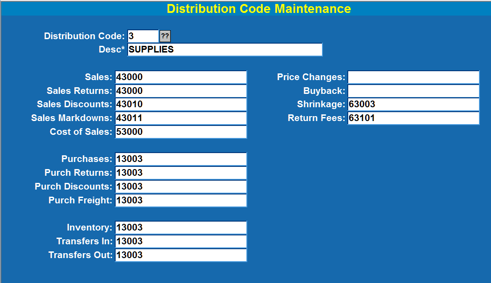
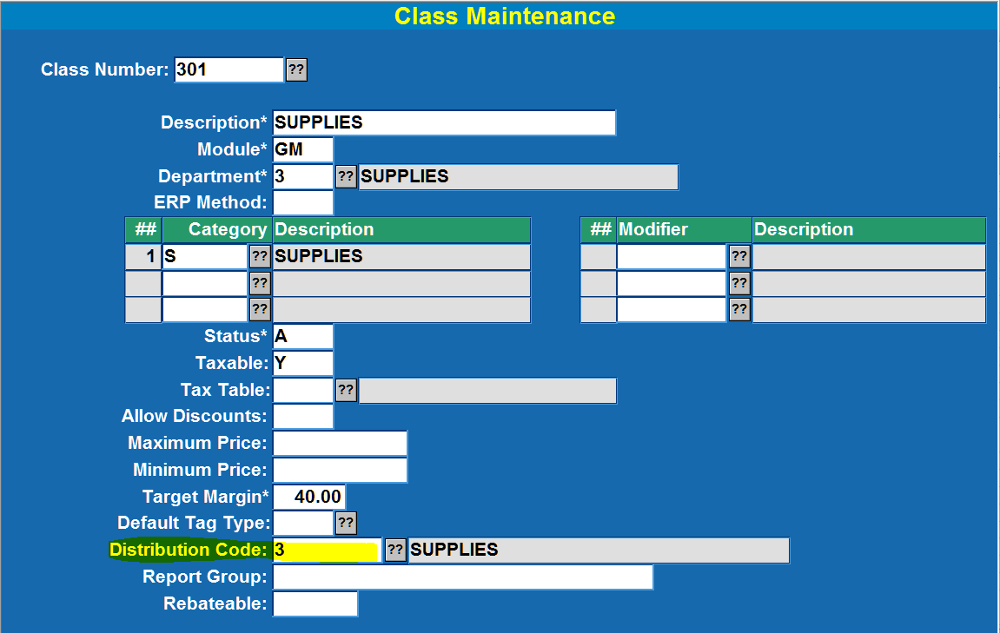
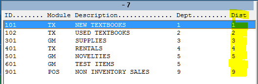
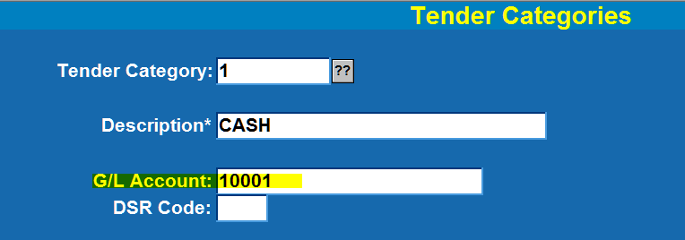
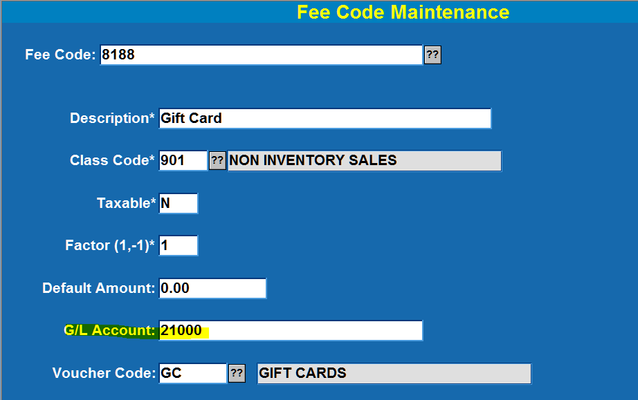
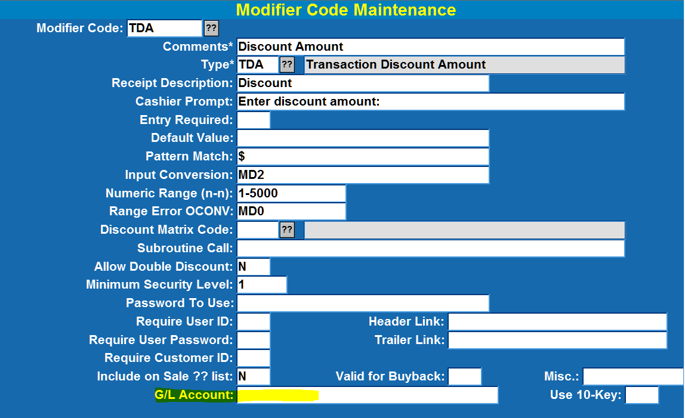
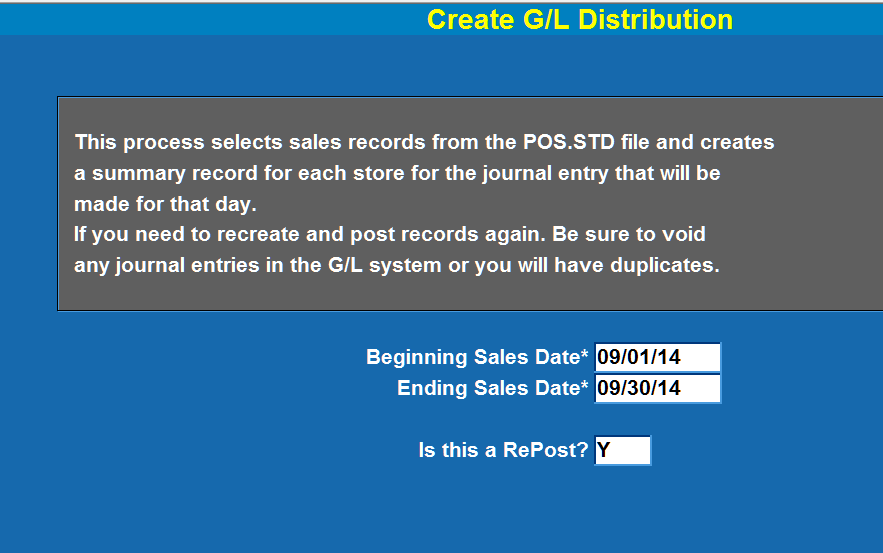
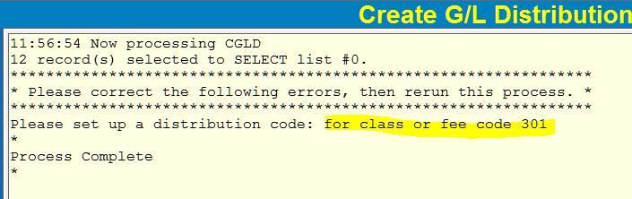
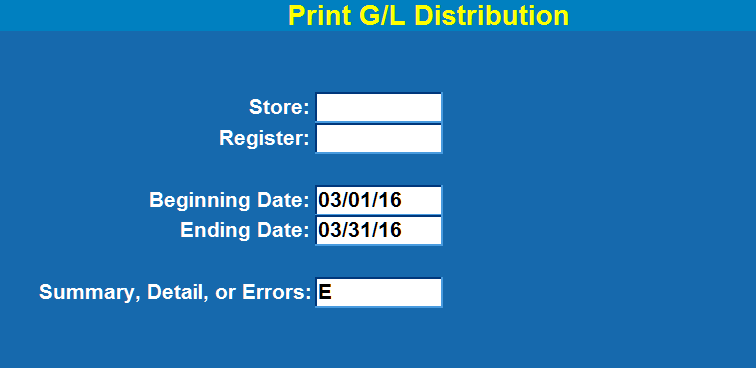
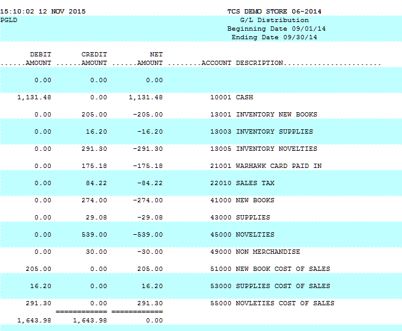

# General Ledger - POS Setup

<PageHeader />

## Overview

By setting up the General Ledger interface you will be able to create the detailed information necessary to either post journal entries directly into the TCS General Ledger system or create a report of the debits and credits and account numbers to use for posting into your corporate system.

If you are using the TCS General Ledger system then refer to that documentation to set up your chart of accounts, define accounting periods, and etc.

There are six types of data records that require some form of setup. This includes:

1. Distribution Codes Assign G/L account numbers for inventory classes or departments.
2. Class Codes Distribution codes are assigned to one or more class codes.
3. Tax Codes Assign G/L account numbers.
4. Tender Categories Assign G/L account numbers.
5. Fees and Credits Assign G/L account numbers.
6. Modifiers Discounts and Markdowns or other codes that have a financial effect on inventory, or income, or expenses.

## Setup

Account numbers are free-form and do not have any specific format although it is important to use the account numbers that will correspond to your G/L system. These account numbers are for both debits and credits – the reporting system will figure this out for you.

## Distribution Codes

_This setup is accessed through menu path POS-22-03-04._

Generally there is one distribution code per inventory department, you will never have more than the number of your inventory classes. The Code that you use can be alphanumeric but most often is the same as the department number. Enter the G/L account number for each activity specified on the screen. Any blank accounts may result in an error later.

Here is an example of a distribution code. (It corresponds to department 3.)

If you are not using the TCS General Ledger module you may want to change up the accounts a little by entering something at the end of the account number. For example: “43000 Supply Sales”. With the TCS General Ledger the account description will be filled in automatically when you run the G/L Distribution Report described later in this document. Without the TCS General Ledger you will only see what you have entered.

## Class Codes

All that is required here is to assign the Distribution Code to each class number.

The  list (after the Class Number prompt) will show you the classes and their Distribution Code.

 

## Tax Tables

All tax tables need to have the G/L Account field completed.

## Tender Categories

All tender categories need to have the G/L Account field completed.

## Fee Codes

All fee codes need to have the G/L Account field completed.

## Modifies

It is very rare that you would have a modifier with a G/L Account associated with it. If the need arises then add it to the modifier. It is generally easiest to not assign any accounts and then look for modifier “errors” on the G/L Distribution report (POS-23-29-02).

This completes the setup portion of this document. You may need to refer back to it if there are any errors on the G/L Distribution report (POS-23-29-02).

## Running Reports

The first step to viewing a report is to create the data for the report. This is done from menu POS-23-29-01 (Create G/L Distribution).

1. Enter the _Beginning Sales Date_ for the period that you want to create your journal entry.
2. Enter the _Ending Sales Date_.
3. Always enter “Y” in the prompt for “_Is this a RePost?”_
4. At the Options Prompt enter an “R” or click on _Run Procedure_.

If there are errors then a report is generated with a list of all of the errors. Here’s an example of an error when class 301 does not have a Distribution Code assigned to it.

You need to correct all errors before the G/L Distribution report will be valid. If there are errors then make the appropriate corrections (in the setup above). You can run this “Running Reports” section as often as needed until all errors are corrected.

Once the data for the journal entry is created without any errors you can run the G/L Distribution Report. This is option 2 on the same menu where you created the data.

There are three report options, Summary, Detail, and Errors.

**Summary:** Gives you a report with one line per G/L account.

**Detail:** Shows every sales transaction and all of the G/L accounts for each transaction. This report is very long with anywhere from 4 to many lines per transaction.

**Errors:** This report will show you just the invalid G/L account numbers. You will then need to correct the appropriate control records in the database. If the error is just a number it is most likely from a distribution table or a fee code. Other errors are fairly self-explanatory with codes like TAX.CODE:6.5 or TNDR.CODE:CC.

Even though the data you enter here will be the same that you used when creating the data it will be used in the heading of the report. Make sure that the data you entered in both screens is the same.

At the Options Prompt enter an “R” or click on _Run Procedure_.

The report below is a sample summary report.

The 1st thing to do with this report is to review it for any “errors”. An “error” would generally be an invalid G/L Account in the “ACCOUNT DESCRIPTION” column. The invalid account will give you a clue as to what record in the setup procedures was not completed.

If there are errors then run this “Running Reports” section as often as need until all errors are corrected.

## Posting to the General Ledger

**If you are not using the TCS General Ledger module then you can use this information to create a manual entry into your corporate system.**

If you are using the TCS General Ledger then select option 3, Create G/L Journal Entry. This step will create a journal entry in the G/L database. You will need to post the journal entry by logging into the G/L system and posting the entry in menu GL-01-01. The Journal Code that is created will be in the format of POS\*_nnnn_ where _nnnn_ is a sequential control number.

<PageFooter />
