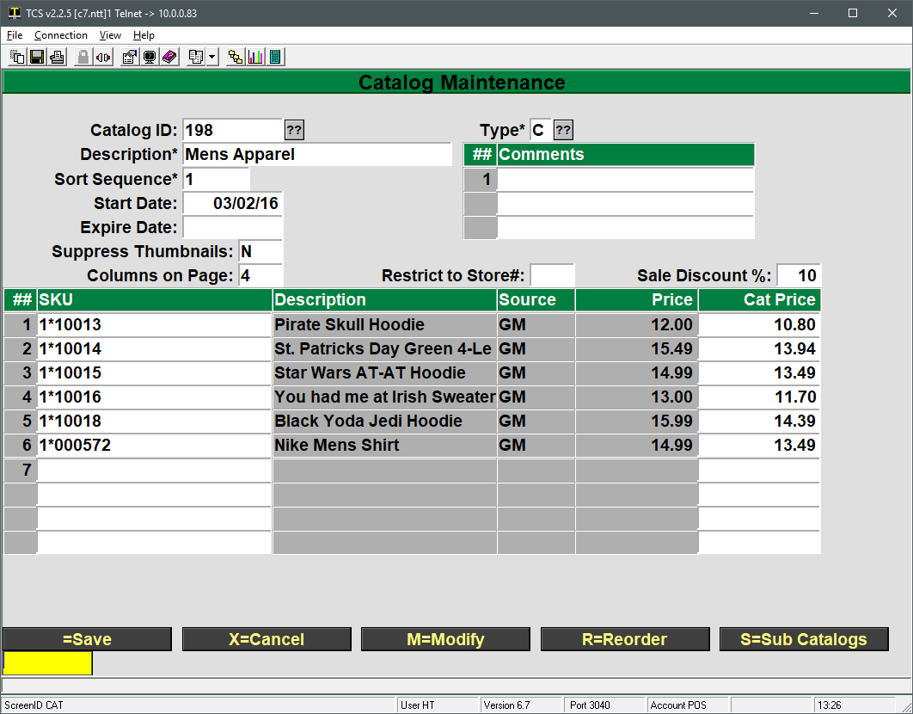
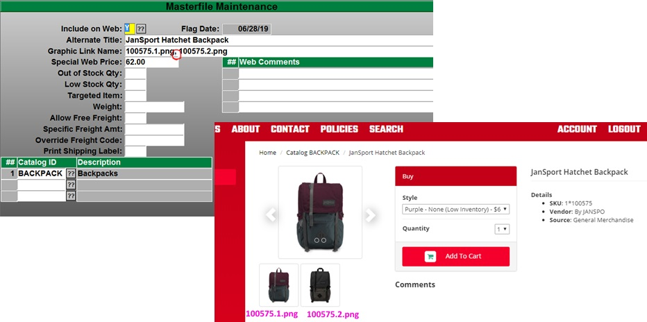
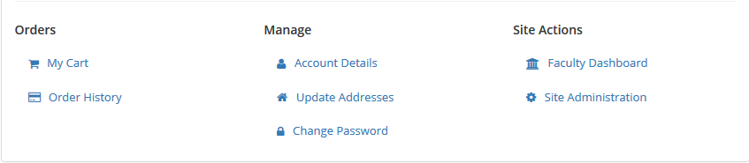
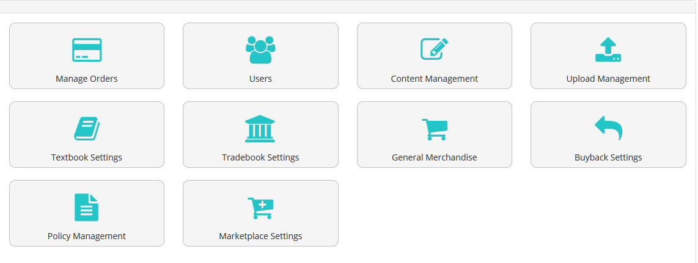
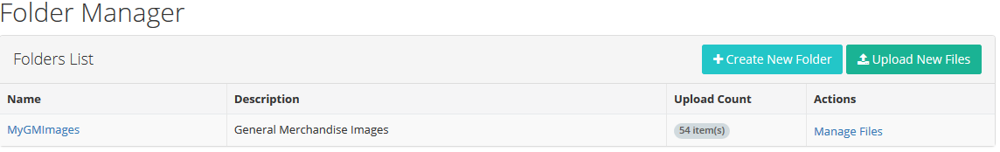
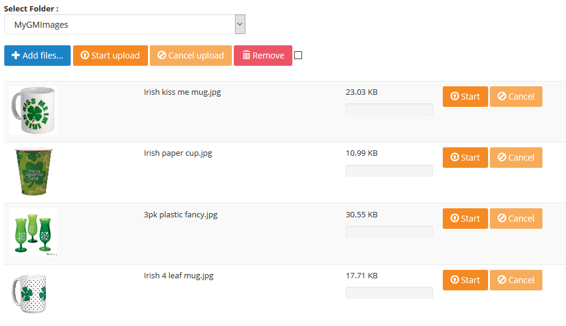
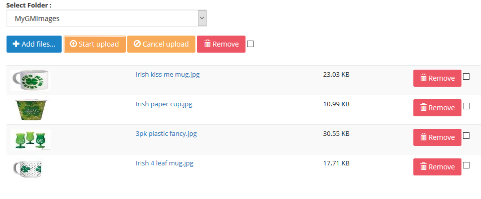
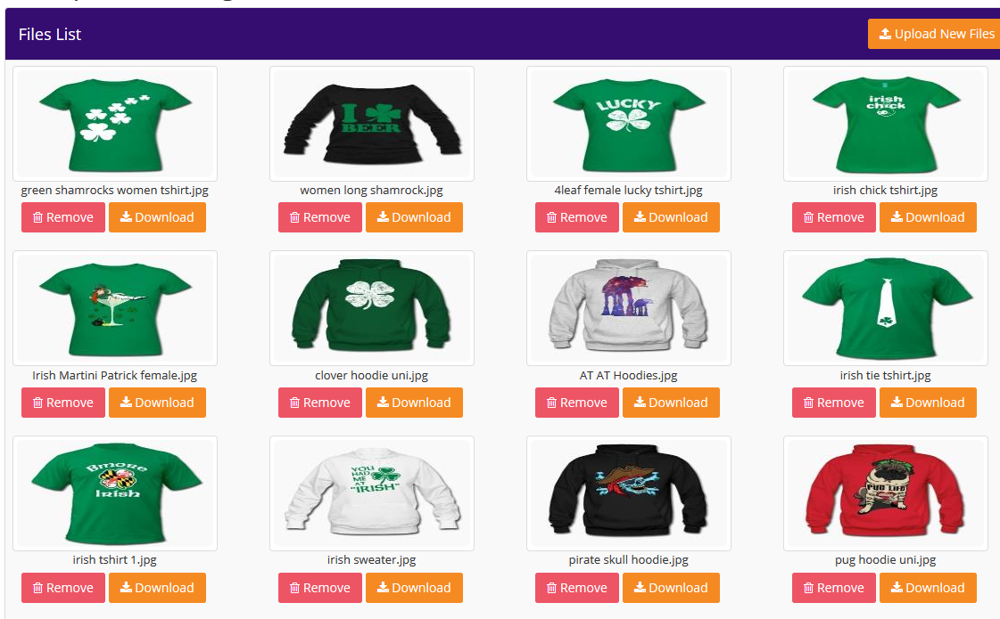

# Adding GM Items to the Web

<PageHeader />

The following are instructions on how to add GM items to the website, create catalogs and assign images to an item.

## Adding Items to Web

The primary way to display items is via a catalog. An example of some catalogs could be Electronics, Mens Apparel, Women’s Apparel, Prints and Frames, etc. all containing items that pertain to that theme.

An item can be assigned to as many catalogs as you would like. For example a Nike men’s t-shirt could belong to a Nike catalog, a t-shirt catalog and Men’s Apparel.

The only other way for items to appear on the website is via a search. If an item is flagged to show on the web, but does not appear on a catalog, then a search is the only way for that item to be accessible to your customers.

The recommended process is to first create your catalogs and then go to each item that will appear on the web and assign their image, alternate titles, special web pricing, etc.

## Creating Catalogs

Catalogs are maintained in POS-26-2. Please note that many of the fields on the screen and their functions are under development and may not be functional or require a specific value. 

1. The Catalog ID is the record ID for the catalog
2. Description is what will appear on the menu bar of the website
    1. Catalogs will automatically show up on the website once they are created.
3. Sort sequence is the order in which catalogs are listed on the site menu
    1. A catalog with Sort Sequence 1 will appear first, sequence 2 will be second, etc.
    2. If two catalogs have the same sort sequence then the site will list them alphabetically
4. Start and Expire Date allow you to specify when the catalog should or should not appear on the site.
    1. If you don’t want a catalog to appear on the site, but would like to keep it for reference or future use, then give it an expire date of -1 and it will no longer appear on the site.
5. Suppress Thumbnails is currently under development and should be left blank.
6. Columns on Page allows you to set the number of columns displayed when showing the catalog items.
    1. This may be overwritten by site themes which will render it unusable.
7. Type is for features currently under development and should be set to C default. Other types will be usable once development has finished.
    1. R=Recommend
    2. C=Catalog
8. Restrict to Store is for multi store environments and allows you to restrict the catalog to the store number you enter.
9. Sale Discount allows you to apply a percentage discount to every item listed in the catalog.
    1. It only applies to items current on the catalog. If you add items later then you will need to go back to the Sale Discount field, enter the percentage and press Enter to update the newly added items.

## Adding Items to a Catalog

If items are already flagged to appear on the web then they can be added to the catalog through Catalog Maintenance by typing their SKU into the SKU field. This would be the process if the web product has been in use for some time and most items are already setup to display on the website.

New customers will need to change their GM items to appear on the web. By default all or no items are flagged to appear on the web (POS-26-4-1, GM, Use Web Flag field), so the next step is to flag the specific items you want to be available on the website. If there is a large group of items, such as all items in a particular class, then TCS staff can flag those in mass to appear on the web.

Adding an item, assigning images, customizing item page information and descriptions are all done through the GM, MF record of the item.

To get started log to the GM module and then enter MF at the menu, look up an item you would like to add and make note of the W=Web option. By choosing that we can get to the web maintenance part of the item record and add it to the website.

1. The include on Web field must be set to a Y or an A to flag it to appear on the website.
    1. Y will have it appear as long as it meets the low and out of stock requirements. If it drops below the out of stock threshold then it will no longer appear.
    2. A marks the item as always available for purchase, regardless of stock levels. This can be used for special orders and other scenarios.
    3. N for Never would be used if, by default, all GM items are web enabled
    4. NQ for No Zero QOH is under development and should not be used
2. Alternate Title: provides the option to specify a description other than the main description of the MF item. Whatever is entered here will override the GM description for the item when it displays on the web.
3. Graphic Link Name: maps the GM item to the image uploaded (image uploading covered below). The name entered _must be exact including case_ and include the image file’s extension (common file types are .jpg, gif and .png)
    1. Additional images may be added using a comma to separate the image names. The first image is the default image for the item, additional images will be in the order that they are arranged in the field but must all be separated with a comma.
4. Special Web Price: is an override price for the item if it is sold on the web vs. rung up at the register.
5. Out of Stock Qty and Low Stock Qty: are item specific overrides to the low and out of stock levels specified in the web general parameters (POS-26-4-1)
6. Targeted Item: allows you to weight the item more heavily in search results on the site.
7. Weight: can be used to specify a shipping weight.
8. Allow Free Freight: flag as Y for free freight.
9. Specific Freight Amt: will set a shipping cost for the item.
10. Override Freight Code: can be used to ship the item a specific way regardless of what is chosen by the customer at checkout.
11. Print Shipping Label: is for live fright customers only and is currently under development.
12. Web Comments: is used for additional product info and appear at the bottom of the page. HTML markup can be used for formatting as well.
13. Catalog ID: is a listing of catalogs that the item is currently assigned to. You can also assign the item to a catalog by entering the catalog ID in this field.

Save the record once all desired fields have been filled out. Please note that while changes are made live immediately, your browser session may have cached the catalog information and may take up to 10 minutes to update. You can typically force an update by pressing CTRL+F5 to request a non-cached version of the page.

# Managing Images

Images must be uploaded for each item and the image name, including the file extension, must be included in the GM, MF, web screen shown above.

### Points of Interest for Images

1. Supported image formats:
    1. .jpg and .gif are supported on all versions of the website. .png is supported in version 3.x
2. Image sizes
    1. When uploading an image the site will automatically generate scaled down medium and small versions for thumbnails and other views.
    2. Images should not be much larger than 1024 pixels in width. Images that are too large may not upload or will take a considerable amount of time to load for your customers.
3. Use human friendly naming conventions.
    1. Many cameras will name images with something like 01012017\_0001.jpg which is a month, day, year and counter format. Rename your images to something more meaningful to make them easier to work with.
    2. Avoid special characters in image names. A dash (-) or underscore (\_\_) are the only special characters that should be used.

### Uploading Images

1. Log into the site with an administrative account
    1. Accounts can be elevated to admin status by going to POS-26-21, bring up the account and change the Account Type to A.
    2. The user will need to log out and back in on the website to apply that change.
2. Go to Site Administration on the landing page.
3. Click on the Upload Management icon
4.  Here you can either select the option to Upload New Files or Manage Files in the table beneath.
    1. Upload New Files 
        1. Click on the Add files... button which will display a window to browse to and select your images.
        2. Multiple images can be uploaded by holding shift or ctrl when selecting images.
            - Click on the Open button once all items are selected.
        3. A list of images will appear similar to the image above.
            - Take a look at the size of each image. Anything in the KB range or low MB range (e.g. 1.05 MB) is fine. Anything over 10MB you will want to consider resizing to a smaller size.
            - All images can be uploaded by clicking on the Start upload button beneath the drop down.
            - Individual images can be uploaded by clicking on the Start button on their line.
        4. A progress bar will display for the entire upload along with a progress bar for each image being uploaded. Once each item is done uploading it will then have a Remove option in case you want to back out. 

### Manage Images

Images that have already been uploaded can be viewed by going to Account, Site Administration, Upload Management and then clicking on the Manage Files on the right hand side of the table.

Here you can view the image names, remove an image, download a copy or continue on to upload more images by using the Upload New Files on the top right.

<PageFooter />
