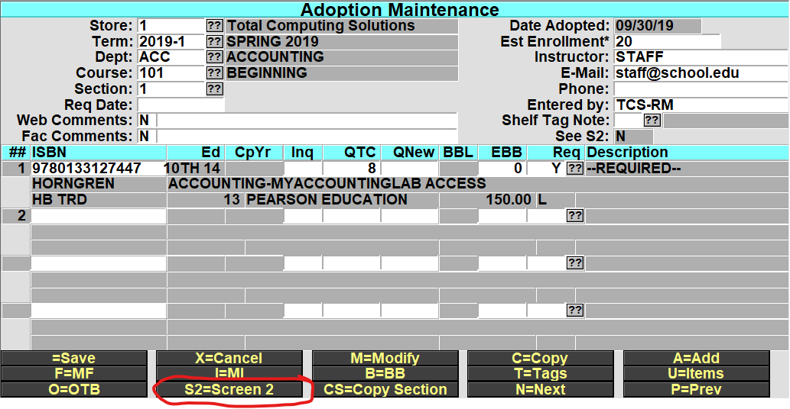
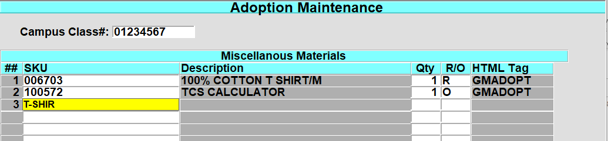
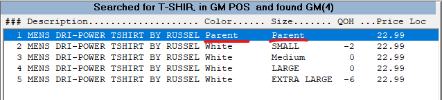
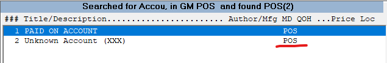
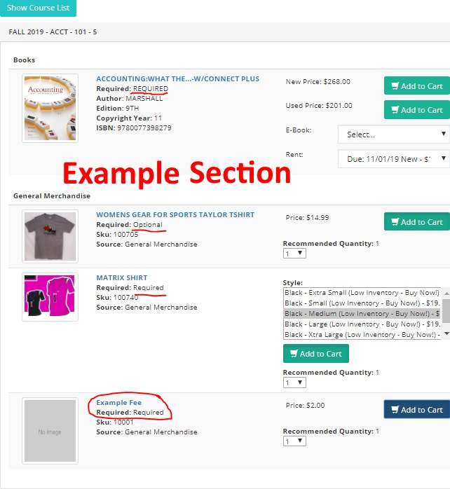
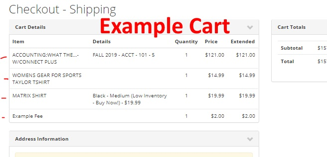
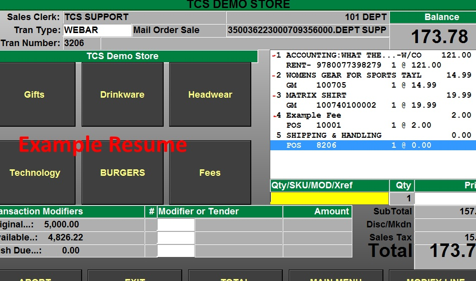

# Adopt GM Items

<PageHeader />

## Adopting GM Items

Enter or Modify your adoption TX.1.1,  select the DEPT/CRS/SECT in Adoption Maintenance you wish to add your GM item (s) to.

At the bottom-line prompt select S2=Screen 2.

In the new S2=Screen, if your campus is using a specific CRN number that identifies the DEPT/COURSE/SECT . then you can enter that here, once entered you can enter the Campus Class#, preceded by a semi colon (;) in the Dept, Course or Section fields to look up the section (i.e. ;01234567). _\*Campus Class is not a required field not all users use this feature. You can navigate past this field by pressing enter or click on the SKU field._

In the SKU field, enter the SKU or you may do the normal GM item lookup to find the item. If you are selecting a Matrix GM item then select the Parent SKU, This way when its displays on the web the customer will see the Color and Size drop down selectors to choose from.

Enter the QTY that the student should purchase for the section and enter R/O to indicate if the item is Required or Optional.

## Adding Fee(s) Adoptions

You can add POS Fee Code(s) the same way that you would add a sku in the S2=Screen 2. The fee will then be displayed along with the GM and Textbook information in the Adoption/Course search on your website.

You can also enter in Fee Code(s), this allows you to collect any additional fees that may be required for the course that has been set by the Instructor or Staff. _\*for details on setting up Fees Codes, reference [POS Training](http://tcs-training-wp.azurewebsites.net/dwkb/pos-training/)_

_Example web cart _ 

### Resume Web Order

Resume Orders that have been placed will look the exact same as other Web Orders. _\*note you will have to verify the rental item and price when resuming the order. It is best that you have a copy of the order to verify the type or rental and length of rental._ _Example Web Order Resume _

<PageFooter />
