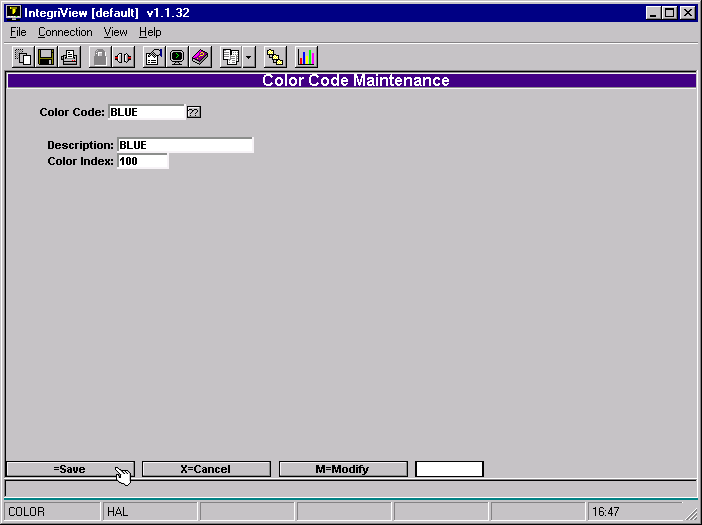
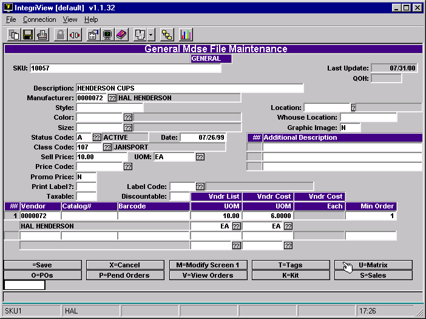
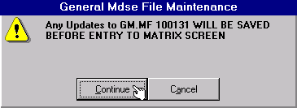
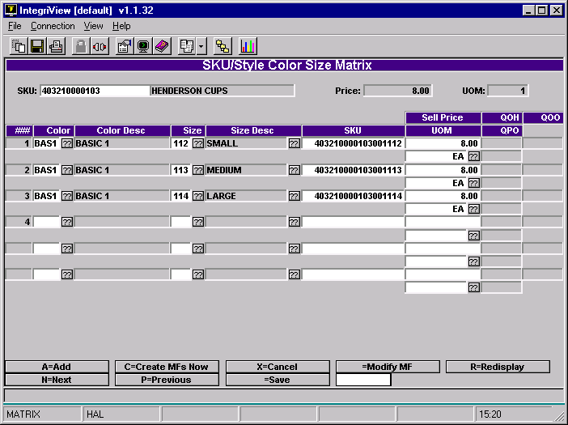
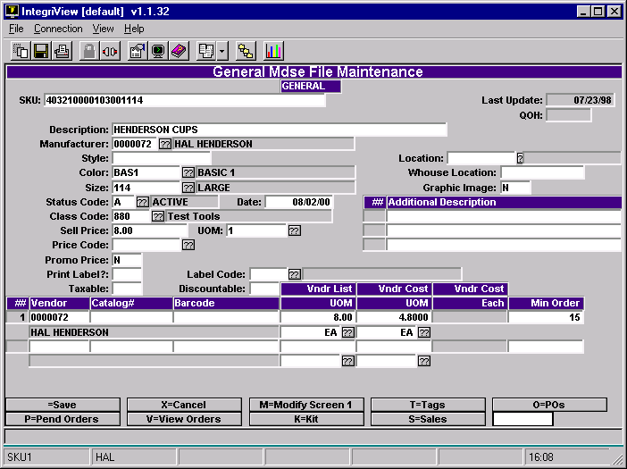
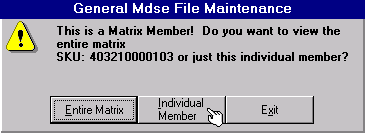

# Create Matrix Items

This document explains how to create and modify GM Matrix items. The Matrix is for items that come in different sizes and colors. It allows you to link these items together—maintaining, ordering, and receiving them as a group. Yet it also allows you the flexibility to do those things with individual matrix items as well. Here are the steps to making a matrix item.

1. **Set Up Color Codes**
2. **Set Up Size Codes**
3. **Create “Mother” SKU in MF**
4. **Add Matrix Items**
5. **Modify Matrix Items**

The way the matrix works is that you create a “Mother” SKU in Masterfile Maintenance. This is a master SKU that will be used to link the matrix items together. Then you choose the Matrix option on the masterfile screen and enter a size and color combination for each matrix member you wish to have included. A new SKU is generated, or if the individual SKU is already on the Masterfile, you would enter it’s existing SKU. These steps are explained in detail in this document.

The Color Index and Size Index are used, with the Parent SKU, to generate a SKU for a matrix item

- **Set Up Color Codes**

Go to the Color Code Maintenance Screen (menu path SU-3-3).

- Type in either a “.” for a numeric code or type your own short alphanumeric code.
- Enter a description of the color.
- Enter in a number for the index. If the code is alphanumeric, then the index must be above 100. If the Color Code is numeric make the Color Index the same number, if possible.

Repeat these steps for each color code you wish to use.

- **Set Up Size Codes**

 Go to Size Table Maintenance Screen (menu path SU-3-4).

- Enter in a Size Code. Enter “.” for a numeric code, or enter your own alphanumeric code.
- Enter a description of the size.
- Enter a number in the Size Index field. This can be the same number that is in the Size Code field.

Repeat this for every size code you wish to use.

- **Create “Mother” SKU in MF**

Go to Masterfile Maintenance, by typing “MF”. Now add a new masterfile item by typing a “.”

- Except for the size and the color, everything you enter here is used as a default for the matrix members.
- Once you have entered the MF item, type “U” at the bottom of the screen.

You will be prompted with this message.

- Choose Continue.

This saves the mother SKU in the masterfile. This is necessary before continuing.

- **Add Matrix Items**

Once you have entered “U” from the masterfile screen, you will go to this matrix screen.

The SKU generated is the Mother SKU with both the Color Index and the Size Index added as a suffix.

- First type “A” to add matrix items.
- Choose a color code in the Color field and a size code in the Size field.
- Accept the generated SKU unless the individual matrix item already exists on the masterfile. In that case enter it’s SKU instead.
- Enter its selling price in the Sell Price field. The mother SKU’s price comes in as a default, but can be changed.
- Enter the Unit of Measure code, usually this will be “EA”.

Repeat these steps for each matrix member that you wish to enter.

- Choose “C”. This creates an MF record for each matrix member. You can also just hit enter to save, and the masterfile records will be created automatically

 

- **Modify Matrix Items**

Once the masterfile record has been created for the individual matrix member, enter the line number of the matrix member you wish to modify. For example enter “3” to modify the third line item. Or you can go into Masterfile Maintenance and type in the matrix member’s SKU directly.

You will be taken to the masterfile screen with this prompt.

- Choose Individual Member.
- Enter “M” to modify.
- Make changes and save them.

You must do these steps for each matrix member you wish to change.

<PageFooter />
