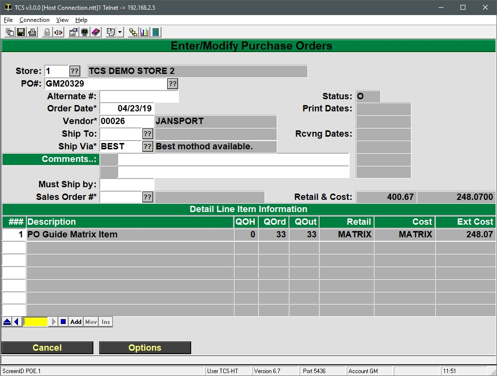

# Creating a Purchase Order with New Matrix Items

<PageHeader />

The steps below cover how to create matrix items while you are in the middle of creating a purchase order.

1. Start a new PO in GM-1-21
    1. Enter a PO# or enter a period "." to use the next system suggested number.
    2. Optional: Enter an Alternate # for any third party reference numbers.
    3. Enter the order date.
    4. Enter the vendor number, or do a vendor lookup by entering part of the vendors name.
    5. Optional: If you are a multi-store environment then you can use the Ship To: field to specify a store to ship the merchandise to.
    6. Enter a shipment method in the Ship Via field or select one with the ?? button.
        - Additional shipment methods can be added by clicking the ?? button and then clicking on the Maint button on the bottom left.
        - You will be returned to the PO screen after creating your any necessary shipment methods. Just press Enter at the empty Ship Via Code field.
    7. Optional: Enter any order comments.
    8. Optional: Enter any deadline date in the Must Sip by field.
        - The top section of the PO should now look something similar to this:
2. Start adding items to the PO
    1. After navigating past the Must Ship by field your focus will be moved to the line navigation tool.
        - This tool can be used to display additional lines not currently displayed on the screen. To add new lines to the bottom of the list, insert lines into the middle of the list, more move items in the list.
        - 
    2. Enter a 1 into the text field of the navigation tool to jump to line 1. You can also enter an “A” to add a new line to the PO to the end, if you are at the beginning then it will create the first line.
        - If there was already a line #1, you can enter the next field (2) and it would create a new line for line 2.
        - You can also click on the Add button on the navigation tool but keeping your hands on the keyboard is generally the most effect way to use the system.
    3. At the Item Entry screen you can add an existing item or create a new item and add it to the PO.
        1. To add an existing item, enter the SKU, barcode, vendor catalog ID or part of the items description into the SKU field.
        2. To create and add a new item:
            1. Enter a . into the SKU field
            2. Select MF Entry option.
                - The quick entry is a bare bone item creation screen. _**Matrix items cannot be added via the quick entry method.**_ Which falls outside the scope of this article.
                - The process is very straight forward however, simply populate the required fields in the Quick Entry screen, save your item, and then you will be taken back to the Item Entry screen where you can specify order quantities, cost, etc.
            3. The system should now be at the regular MF/Item screen to create the new item.
                1. Enter a description for the item
                2. Fill out the required fields: Status Code, Date, Class Code, Unit of Measure (UOM)
                    - Also fill out any necessary optional fields, notably any color/size fields, the selling price and any vendor information
            4. Enter the order parameters for the new item
                - None of these fields are required and can be skipped by pressing ESC and then Enter
                - The Buyer Code is used to restrict the purchase of this item to a specific employee.
                - Auto Order Code is used to specify the calculation type. Essentially a collection of parameters, calculations and criteria on when an item should be placed on order via the Auto Orders process.
                - Min and Max can be used to specify a minimum or maximum order quantity
                - Order comments will be added to the PO every time the item is placed on a PO
            5. After saving (pressing enter) at the end of the Order Parameters screen the system goes back to the MF item screen.
                
            6. Select the U=Matrix button or type U and press Enter
            7. Click on Continue at the notification that the item will be saved before proceeding to the Matrix screen.
            8. Create any child item(s) to add to this matrix set
                1. Select the A=Add option or type an A and press Enter
                2. Select the color and size codes for the first child item
                3. **Press Enter** at the SKU field.
                4. **DO NOT click past the sku field into another** **field.**
                5. **DO NOT change the SKU value.**
                6. Enter the selling price for the first child item
                7. Continue adding child items by entering their color, size and sell price of the child item(s) until done.
                8. To complete the process press Enter at an empty Color field. Then press Enter or use the =Save option to save the child items.
                9. Once back at the MF Entry screen enter a . into the SKU field and repeat the steps above to create any additional items until done.
                10. Press Enter at the MF Entry screen's SKU field to bring the system back to the PO Item Entry process
            9. Specify the quantity to order for each child item. The Vendor List and Vendor Cost can also be modified per child item.
                - Press Enter after the last child item. Then press Enter in the Line Item navigation tool to finish editing the child order data.
            10. Press Enter to save the quantities, prices, etc. specified for the child items.
                - M=Modify can be used to go back and change field values.
                - X=Cancel will cancel the ORDER information for this item. The new items will still exist in the system.
            11. The regular Item Entry screen will then be displayed with an overview of the matrix set on the PO.
                - The SKU is the Mother SKU of the matrix set
                - Order Qty is the combined quantity of the child items on order
                - The Vendor List is the list specified in the Mother SKU
                - The Selling Price is the Selling price of the Mother SKU
                - The Discount. % is the vendor list vs vendor cost percentage
                - the Cost is the average of the CHILD items ordered
            12. Add any order or receiving comments. The screen will then display the options to Save, Cancel, Modify Matrix or Cancel Order Qty. Press Enter to save.
            13. The screen will then go back to the PO overview with the items added into line 1. Focus is placed in the Line Navigation tool.
                - The QOrd (quantity ordered) is the total number of child items ordered.
                - The QOut (quantity outstanding) is the number of child items that have not been received and are still outstanding.
                - The Retail and Cost columns will always display MATRIX when a matrix set has been ordered.
                - The Ext Cost (extended cost) is the combined cost of all child items.
            14. Enter a 2 into the line navigation tool or click on the Add button to add another item to the order.
            15. Pressing enter in the line navigation tool will display the options at the bottom of the screen.
                - L=LineItems can be used to navigate to a line item and view the item details, change costs, quantities, etc. for the item on that line.
                    - It's recommended to Save the PO after adding the line items and then go back in to view, modify, etc. to ensure that any work isn't lost.
                - M=Modify will bring the focus to the top of the PO section to modify the vendor, shipment, comments, etc. fields at the top of the PO
                - C=Cancel Order will cancel the PO and the quantities on order for all items associated with the PO.

<PageFooter />
