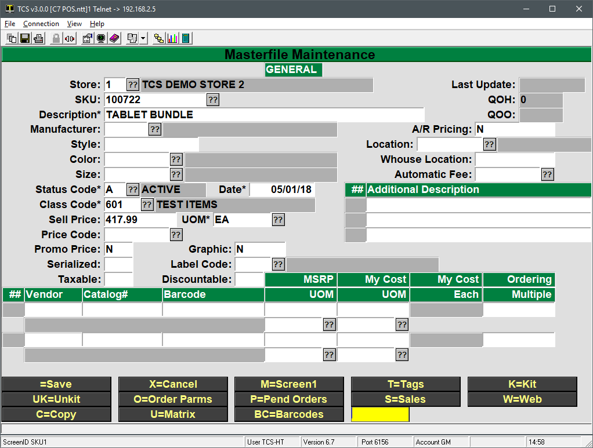
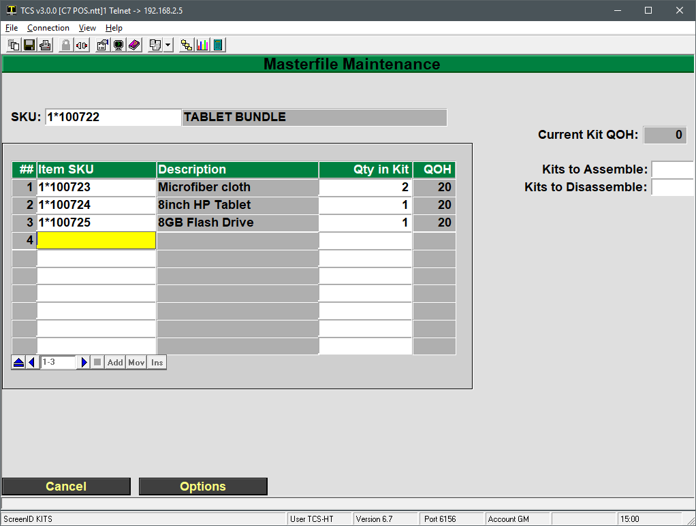

# Creating Kits (or Bundles)

<PageHeader />

## Overview

A kit in the TCS system is a bundle of items that are sold under one SKU. For example, if you wanted to sell a tablet, cleaning cloths and a USB flash drive all as one item then a kit would need to be created.

The main item that is sold (the bundle) along with each inventoried item needs to exist prior to creating a kit. Once all of the items exist, the kit quantity on hand is generated by pulling quantities from all of the items that make up the bundle.

In the following example all items have already been created in the GM, MF database. Instructions on how to create individual items can be found in the [General Merchandise Training](http://tcs-training-wp.azurewebsites.net/dwkb/general-merchandise-training/) page.

### Assign Items to the Kit

1. Bring up the MF record for the bundle that is going to be sold
    - 
2. Select the K=Kit option at the bottom of the screen
3. Select the M=Modify button to navigate to the item table
4. Add each SKU that makes up a part of this bundle
    - 
    - In this example there will 2 Microfiber cloths added when we generate quantities of this bundle to sell. There will be one each of an 8inch tablet and a 8GB flash drive.
5. Press Enter until you are at the Kits to Assemble
    - Enter the number of kits (bundles) you want to create. Notice that in this example we’re limited to 10, since there are only 20 cloths on hand and there will be 2 used per kit created.
    - If too many kits are created then the Kits to Disassemble field can be used to assign quantities back into the items that make up the kit. Simply enter how many of this kit you want to disassemble and proceed through step 6 to assign quantities back out to the kit items.
6. Press Enter until you are at the bottom of the screen with a =Save option and press Enter to return to the main item screen.
    - At this point the QoH for each kit item has been reduced
    - The QoH of the kit will not refresh until you leave the item screen and look it up again.
7. The kit can now be sold. All quantities sold will decrement the kit QoH since the items that make up the kit have already had their QoH reduced in step 5-6.

<PageFooter />
