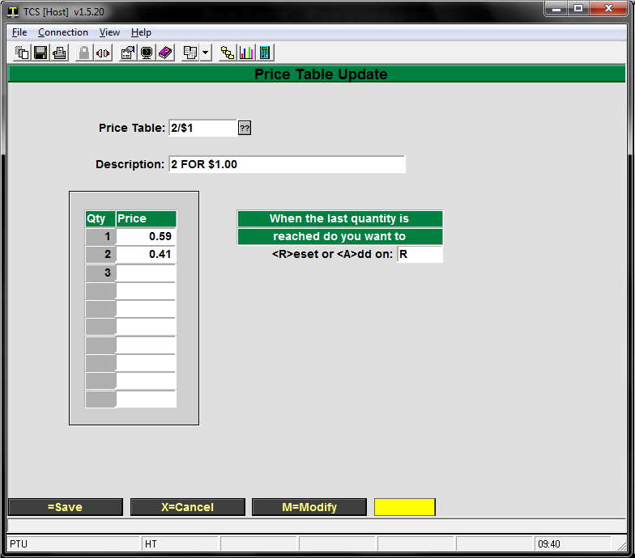

# General Merchandise Training

<PageHeader />

<!-- TOC -->

- [General Merchandise Training](#general-merchandise-training)
  - [Overview](#overview)
  - [Master File](#master-file)
  - [Creating a New MF Item](#creating-a-new-mf-item)
  - [Synonyms](#synonyms)
  - [Promo Pricing](#promo-pricing)
  - [Price Tables](#price-tables)
  - [Purchase Orders](#purchase-orders)
    - [Creating Pending Orders](#creating-pending-orders)
    - [Creating Purchase Orders from Pending](#creating-purchase-orders-from-pending)
    - [Creating Purchase Orders Manually](#creating-purchase-orders-manually)
    - [Modifying Purchase Orders](#modifying-purchase-orders)
    - [Printing Purchase Orders](#printing-purchase-orders)
  - [Receiving](#receiving)
  - [Returns](#returns)
  - [Performing a Physical Inventory](#performing-a-physical-inventory)
    - [PI Overview](#pi-overview)
    - [Initializing](#initializing)
  - [Counting & Verifying (Edit Cycle)](#counting--verifying-edit-cycle)
  - [Printing Reports](#printing-reports)
    - [Print non-committed sheets](#print-non-committed-sheets)
    - [Master file status report](#master-file-status-report)
    - [Print Adjustments / Valuation](#print-adjustments--valuation)
    - [Utilities](#utilities)
  - [Posting the Counts](#posting-the-counts)
  - [Corrections after Posting](#corrections-after-posting)
  - [Printing Barcode Labels](#printing-barcode-labels)

<!-- /TOC -->

## Overview

GM/Trade refers to the General Merchandise and Trade Books components of the TCS system. Since most of their functions are similar, they are combined here. All merchandise items are maintained in a master file (MF), referenced by SKU/ISBN. SKUs may be added or deleted as required. Synonyms allow one item to be referenced by more than one SKU. The module handles Purchase Orders, Receiving, Returns, and Physical Inventory. A perpetual inventory is maintained; each receiving adds to the inventory, each sale subtracts from it. You can print bar-coded labels for the merchandise and print various reports.

## Master File

## Creating a New MF Item

- At the ‘Enter your user id:’ prompt, type “GM” to log onto the General Merchandise account.
- From the GM master menu, type in “MF” for ‘Master File Maint”.
- At the ‘SKU:’ prompt, there are three (3) different ways of adding a new item (or assigning it a SKU number). Either way is acceptable.
    1. Let the system automatically assign a SKU number
        1. To let the system automatically assign a SKU number, enter a ‘period’ “.” and the system will assign the item the next sequential SKU number in the system.
        2. After entering a period “.”, your next prompt will be the ‘Description:’ field.
    2. To enter in your own SKU number
        1. Enter in the SKU number you have listed for this item.
        2. After entering your own SKU number, you will be presented with the prompt “Item not on file, Do you wish to add or copy? \[A\]=Add, \[C\]=Copy, \[X\]=Cancel”
            - Choose “A” to add the item
            - Note: You will only be presented with the ‘Item not on file’ prompt **if the SKU number is not found in the system**. If there is already an existing SKU number, the item that has that SKU number will be displayed. You will then either need to delete the old item, or assign the new item a different SKU number.
        3. Scan the manufacturer bar code to create the SKU number (if you have a scanner available at the workstation that you are at)
            1. Scan in the manufacturer bar code using the scanner.
            2. After scanning in the manufacturer bar code, you will be presented with the prompt “Item not on file, Do you wish to add or copy? \[A\]=Add, \[C\]=Copy, \[X\]=Cancel”
                - Choose “A” to add the item
                - Note: You will only be presented with the ‘Item not on file’ prompt **if the SKU number is not found in the system**. If there is already an existing SKU number, the item that has that SKU number will be displayed. You will then either need to delete the old item, or assign the new item a different SKU number.

- Enter the description of the item at the ‘Description:’ prompt.
    1. a) Make sure you use ‘meaningful’ descriptions, and try not to abbreviate. Most descriptions can be accomplished using 25 characters or less (including spaces), but you may use as many as 45 characters.
    2. Make sure you are consistent in describing like items. This field is a ‘cross-reference’ field, which means, you are able to do a search on various items by simply typing in a description of an item. For example:
        1. PEN will pick up PENcil, PEN, PENtal, PENdaflex
        2. CAN will pick up CANdy, CANvas, CANdle, CANary, CAN

- Enter the Vendor Number for the Manufacturer in the ‘Manufacturer:’ field.
    1. Presently, Manufacturer and Vendor are the same thing unless you have created Manufacturers in your Vendor Maintenance as well. In that case, enter in an appropriate Manufacturer number.
    2. You may also enter in a short description of the Vendor/Manufacturer such as “SUP” for ‘Supplies are Us’. Keep in mind that you will also pick up any other vendors having ‘SUP’ in their name.
- The ‘Style:’, ‘Color:’, and ‘Size:’ fields are optional fields.
- The ‘Status Code:’ field automatically defaults to “A” for Active.
- The ‘Date:’ field will automatically default to the current date.
- You must enter a valid Class Code in the ‘Class Code:’ field.
    1. You may enter a “??” or “//” to display a list box of valid class codes.
- Enter the Selling Price of the item in the ‘Sell Price:’ field.
    5. Entering “500” will be taken as $5.00. Only entering “5” will be taken as $0.05.
- The ‘UOM:’ field (Unit of Measurement) will normally default to “EA” for each.
- The ‘Price Code:’ field is optional and is used in special sale circumstances.
- The ‘Promo Price:’ field will default to “N” for No. Accept this default.
    1. This field is used in special sale circumstances.
- Enter “Y” in the ‘Print Label?:’ field.
- Enter the type of Bar Code Label Code you would normally use to print bar codes for this item in the ‘Label Code:’ field.
- Enter “Y” or “N” if the item is taxable or not in the ‘Taxable:’ field.
- Enter “Y” or “N” if the item is allowed to be discounted or not in the ‘Discountable:’ field.
- You must enter a valid Vendor for this item in the ‘Vendor’ field.
    1. You may do a “??” or “//” to display a list box of valid vendors, or you may enter in a brief description of a valid vendor such as “SUP” for ‘Supplies are Us’.
- The next two fields “Catalog #’ and ‘Barcode’ are both optional and can be left blank.
- You are required to enter in a Vendor List price in the ‘Vndr List’ field. Typically, the ‘Vendor List' and ‘Sell Price’ are the same prices.
- Enter “EA” in the ‘UOM’ field (Unit of Measurement)
- Enter in the Vendor Cost in the ‘Vndr Cost’ field.
    1. The Vendor Cost is what you pay for the item – not what you will sell it for.
- The ‘UOM’ field under vendor cost automatically defaults to ‘EA’.
- The ‘Min Order’ field defaults to “1” and can be left at that number.
- If you are able to receive this item from multiple vendors, enter in the second vendor on line 2, and repeat steps 18-24.
- Keep pressing the ‘Enter’ key until you come to another screen (the rest of the fields in the first screen are optional).
- All the fields in this second screen are optional as well, so you can press ‘Enter’ until you see the ‘Options’ at the bottom of your screen.
- Press ‘Enter’ to accept the default of ‘Save’ (< >=Save).

Every item you will use in the system must be set up in this manner. In some of the processes that you will encounter, you will be asked if you would like to create a new item. Regardless of where you are at in the system and whatever process you are in that is asking you if you want to create a new item, you will go through the steps listed above in creating that new item.

## Synonyms

Sometimes it's necessary to refer to the same item by more than one SKU. This is readily done by making the second (third, fourth, etc.) SKU a synonym, pointing to the original SKU. Go to Synonym Maintenance (GM-SU-01-21) and enter the new SKU as the Synonym ID. Then enter the name of the existing SKU; it's description will be displayed. Press Enter to save the synonym. When either value is entered as a SKU, the original record will be accessed.

To subsequently delete the synonym, go to Synonym Maintenance, enter the synonym and enter 'D' for delete.

## Promo Pricing

Special pricing can be applied in a 2 for 1 type of setting or a flat promo price. Each type of pricing can be applied over a range of dates or indefinitely.

## Price Tables

Price tables are built in GM-SU-3-22 and are the only method for setting up 2 for 1 type discounts.

The following example will cover how to create a 2 for 1 discount that resets on the last quantity.

1. Create a new table or pull up an existing one.
2. Make sure the description is acceptable
3. Use “M” to modify
    1. Qty1 is the original sale price of the item
    2. Qty2 is the price to be charged for the second item. The two prices added together should equal the desired discount price. In this example .59 + .41 = $1.00
4. Enter an A to add or an R to reset
    1. An A will continue pricing additional quantities of the item at the same price as the final Qty in the table. I.e. a 3rd item sold will ring up for .41 since .41 was the last price entered
    2. An R will reset the pricing of subsequent items to the top of the table. A 3rd item will sell for .59; a 4th will sell for .41.
5. Save the table, remember the table’s name for setting up the MF record.

## Purchase Orders

### Creating Pending Orders

Creating Pending Orders involves two steps, creating your pending orders, and then creating the purchase orders from pending. The purpose of Pending Orders is to group the items together that are going to the same vendor and putting them onto the same PO, This makes the process simpler for the vendor and yourself. Let’s get started with creating our pending orders.

1. At the _Enter your user id_: prompt, enter ‘GM’ to log onto the General Merchandise Account.
2. When you arrive at the GM main menu, Enter in a ‘1’ to take you to the Purchasing Menu.
3. You are now at the main purchasing Menu, Choose option number ‘1’ to enter/modify pending orders.
4. Next you will be prompted for a _ID or Option_ To create a new one enter in a period and press enter.
5. The next field you will be prompted for is the _SKU_ number, enter in the sku of the item you want to place an order for and hit the enter key.
6. Once you have hit enter it should automatically have filled in the _Description_, _Manufacturer_ and _Vendor_ Sometimes an item will have more than one particular vendor, if the one that was brought up is not the one you want to use, type in the correct vendor number and hit return.
7. After you have verified the vendor is correct and you have to hit the enter key. The _Store number_, _shipping code,_ and _prices_ are automatically filled in. If all the rest of the information is correct, you will only need to change the _quantity_ if it is greater than the default that is set to ‘1’.
8. Once you have entered the amount you want ordered, you will be prompted for the _UOM_ (Unit of Measure), Enter in the code for the ordering units here. These codes are set up using the following menu path: SU-Codes-Units of Measure.
9. Enter through the rest of the fields until you come to the options at the bottom of the screen. You now have the Option either to save it by pressing the enter key, or cancel the pending order by pressing X.

You have now created a pending order for that item. Once you have gone through and created pending orders for all the items you need, it is time to create your purchase orders.

### Creating Purchase Orders from Pending

1. Once you are finished creating all your pending orders, it’s time to create

Purchase Orders. From the main purchasing menu, choose option ‘4’ _Create_

_Purchase Orders (from pending)_ and enter.

2. Enter in the specific _vendor_ you want to create the purchase order for. Leave

vendor # blank to process pending orders for all vendors. If you only want to

process pending orders for specific vendors, enter the number or numbers

(separated by commas).

3. Leave the _release date_ field blank to process all pending orders regardless of

release date. If you specify a release date, all pending orders with a release date

equal to or earlier than that date will be processed.

4. Enter 'Y' to _include pending orders with no release date_ Enter 'N' to

exclude any pending orders without release dates assigned.

5. Choose ‘Y’ to _run procedure_ or ‘X’ to _cancel_.

You have now created a Purchase Order. After you have ran the procedure it should show you the First PO was #\_\_\_\_\_\_ and the Last PO was #\_\_\_\_\_\_. It should also send those numbers to the printer for you to keep as reference once you receive the items. Now that you have created a purchase order it is time to learn how to receive against a Purchase Order.

### Creating Purchase Orders Manually

1. From the GM Master Menu, choose option **1** for _Purchasing_.
2. Next choose option **21** to _Modify Purchase Orders_.
    1. Even though the option here says to ‘Modify’, this is the option to **create** a manual purchase order.
3. At the _PO #_ prompt, enter a ‘.’ to get the next system assigned PO number.
    1. Throughout the system, entering a period (.) in a _key_ field (the _key_ is the unique identifier of the item that you are creating – whether you are creating a new PO, receiving log, SKU….) will let the system assign the number.
4. A prompt will appear letting you know that the item you are creating is not on file. Choose the **Add** option to add the item.
5. If you need to adhere to certain PO numbers, enter in **your** PO number in the _Alternate #_
    1. The number (either numeric or alpha/numeric) entered in the _Alternate #_ field will print on the PO as the PO number. The _system assigned number_ will also be printed on the PO as a reference number.
6. The _Order Date_ will default to the current date, but can be changed to the date of your choosing.
7. Enter the _Vendor_ you will be creating the purchase order for.
    1. You can choose the vendor by either entering the _vendor number_ or by entering the _vendor name_.
        1. If you enter the _vendor number_, you must enter the entire number.
        2. If you enter the _vendor name_, you need to enter **at least 3** letters of the vendor name.
            - _American Vendors_ can be entered by full name, by _Ame_ (or more letters), by _Ven_ (or more letters), or by _Ame Ven_ (or more letters).
            - _Outstanding Office Supplies_ can be entered by full name, by _Out_ (or more letters), by _Off_ (or more letters), by _Sup_ (or more letters), by _Out Off_ (or more letters), by _Off Sup_ (or more letters), by _Out Sup_ (or more letters), or by _Out Off Sup_ (or more letters).
                1. Note that the order of the words does not matter. _Outstanding Office Supplies_ will be found if you enter _Supplies Office_, or _Sup Outstand Off_.

8. Enter your **store number** in the _Ship To_
9. Enter the preferred method of shipping in the _Ship Via_
    1. If you are unsure what to enter, you may choose from a list that will display by entering two question marks (??).
10. Entering _Comments_ is optional as well as the _Must Ship By_
11. To start adding items to the PO, choose the Add option when prompted as the line number is displayed.
    1. Choosing the **Add** option will display another _Order Entry_
12. Enter the **SKU** or **Description** of the item that you want to order.
    1. If you enter the SKU number, you must enter the entire SKU.
    2. If you enter by **Description**, you can enter part of the description as in the case of entering the vendor name.
13. Enter the **quantity** you wish to order in the _Order Qty_
14. The _Vendor List, Selling Price, Discount %,_ and _Cost_ fields will all default to the values assigned in the Master File for the item that you are ordering. You can change any of the values if you need to.
15. Both the _Order Comments_ and _Rcvng Comments_ fields are optional.
16. Choose the **Save** option to add the item to the PO.
17. Continue choosing the **Add** option for as many items that you want to place on the PO.
18. When you have completed entering the items for the PO, do not choose the Add option – instead, press the _Enter_ key to continue.
19. Choose the **Save** option to complete the Purchase Order process.
    1. Make sure you make note of the _system assigned_ PO number for printing and receiving purposes.

### Modifying Purchase Orders

1. From the GM Master Menu, choose option 1 for _Purchasing_.
2. Next choose option 21 to _Modify Purchase Orders_.
    1. Note, this is the same option used in creating Purchase Orders.
3. Enter in the PO number of the PO you wish to modify.
4. If you need to modify the _Alternate #, Order Date, Vendor, Ship To, Ship Via, Comments_ or _Must Ship By_ fields, use the modify option.
5. If you need to _Add_ new items or _Change_ existing items, choose the Line Items option.
    1. To _Add_ new items;
        1. Choose the Add option and add the new item using the same process as _creating a purchase order_.
    2. To _Change_ existing items;
        1. Enter the line number of the item you wish to change and modify the item.
    3. When you have completed any modifications to the PO, choose the Save option to save and update the PO.

### Printing Purchase Orders

1. From the GM Master Menu, choose option **1** for _Purchasing_.
2. Next choose option **22** to _Reprint Purchase Orders_.
3. Since you can print more than one PO at the same time, enter the **PO Number** of the first PO you wish to print in the _First Purchase Order #_
    1. If you are only printing one PO, you must still enter the PO Number in the _First Purchase Order #_
    2. If you are printing more than one PO, the PO Number entered in the _First Purchase Order #_ field must be **sequentially lower** than the next PO (keep the PO numbers in order).
4. Enter the **PO Number** of the last PO you wish to print in the _Last Purchase Order #_.
    1. If you are only printing one PO, you must still enter the PO Number in the _Last Purchase Order #_
    2. If you are printing more than one PO, the PO Number entered in the _Last Purchase Order #_ field must be the last PO **sequentially** of the group of PO’s you want to print.
5. Enter the **Printer Number** you wish to print to in the _Printer Assignment_
    1. Each printer used to print through the system has been assigned a printer number. **You must** enter the printer number as **F**_x_ with _x_ indicating the printer number.
        1. If printer number **2** was going to be used to print the PO, **F2** would be entered in the _Printer Assignment_ field.
    2. Choose the **Y = Run Procedure** option to print the PO.

## Receiving

1. From the GM Master Menu, choose option **2** for _Receiving_.
2. Next choose option 1 for _Receiving Log_.
3. Since the _Rcv Id_ is assigned by the system, enter a period (.) to get the next system assigned receiving ID number.
4. A prompt will display if you are creating a new receiving log letting you know that the item is not on file. Choose the **Add** option.
5. The _Rcv Clerk_ field will default to the user that is signed on to that port, and the _Rcv Date_ will default to the current date. Both may be modified if you wish.
6. Enter the PO Number you wish to receive against in the _PO Num_ field.
7. a) The PO Number you will need to enter is located on the PO as either the _Order Number_ or _Reference #_.
8. i) Use the _Order Number_ if you are using the system assigned PO Numbers to do all of your tracking for you.
9. ii) Use the _Reference #_ if you are using the _Alternate #_ field when creating the PO. The _Reference #_ will then be the system assigned PO Number.
10. At the prompt “_A new PO number will remove any existing Line Items_”, choose the **Accept PO Number** option.
11. Some of the fields will automatically fill in using information that is on the PO that you are receiving against. With the other fields (up to the _Inv Total_ field), they are all optional fields and do not need to be filled in. Below are brief descriptions of the optional fields if you do want to fill them in.
12. a) _Comments_ \- receiving log comments
13. b) _Shipped Via_ \- the method of shipment
14. c) _Cond Code_ \- what kind of condition did the shipment arrive to you in
15. i) The _condition codes_ are user defined codes and can be maintained at **GM-SU-03-23**
16. d) _Num Pallets_ \- how many pallets were used for this shipment
17. e) _Num Cartons_ \- how many cartons were in this shipment
18. f) _Inv Num_ \- what is the invoice number for this shipment (Leave at NOINV if you do not have a number at this time.)
19. g) _Inv Date_ \- the date of the invoice
20. The _Inv Total_ field is a required field and a figure needs to be entered.
21. a) If you have the invoice, enter the amount of the invoice.
22. b) If you do not have an invoice, **you still need to enter an amount**. Entering a zero (0) is a valid amount.
23. Entering an amount in the _Freight_ field is optional. If you have an invoice, enter the amount of freight if listed.
24. You will be prompted with a message to _Select a method for sorting the PO lines_. It is strongly suggested to choose the PO line numbers option.
25. a) Choosing the PO line numbers option will always keep your receiving log and purchase orders in the same order. This is extremely useful when receiving against multi-line PO’s.
26. Depending on how your system is setup, you may or may not be prompted with the option to choose your _method for entering received quantities_.
27. a) If you choose the **Exception** option, all of the _order quantities_ of the items that are on the PO **will be listed as the received quantities** as well. This is useful when receiving an order that the majority of the items ordered are accounted for EXCEPT for a few items – thus the term _Exception_. You can still modify the received quantities regardless of what figures have been entered.
28. b) If you choose the **Manual** option, you will need to go through each and every item listed on the Receiving Log and enter an amount – even if that amount is zero (0).
29. With the cursor in the _SKU_ field, press Enter to accept the SKU number.
30. Enter the **quantity received** in the _RQty_ field.
31. You then have the opportunity to change any of the price and cost information. Making changes here will affect the master file _if you choose to have your system automatically roll over receiving prices_.
32. a) To automatically roll receiving prices, see GM-UU-23-01-store number-screen 3.
33. If you want to print tags for the items you are receiving, enter a Y in the _Tags_ field.
34. Continue through the rest of the receiving log until you are finished.
35. The two main options at the bottom of the screen are **S = Save**, and **P = Post & Save**.
36. a) The **Save** option will allow you to save the receiving log and gives you the opportunity to modify the receiving log at a later date (by entering the Receiving Log Id number instead of a period at the _Rcv Id_ prompt). Using the **Save** option **will not post the received items to the inventory.**
37. b) The Post & Save option will save the receiving log and post the received items to the inventory. Using the **Post & Save** option **will not allow you to modify the receiving log at a later date.**
38. When choosing the Post & Save option, you may get a prompt letting you know that the _Line item total + freight does not match the invoice total_.
39. a) If you did not have an invoice to enter an invoice total from, your figures will not match. Choose the **Accept** option in this case.
40. b) If you entered an invoice total from an invoice, and the figures do not match, you may want to choose the **Re-enter** option and see if any of the line items had a price change.
41. c) You may also choose to ignore the prompt and just choose the **Accept**

## Returns

1. Manual Chargeback or Pending Return
2. a) It must first be decided whether to enter a chargeback or enter a suggested return.
3. Chargeback
4. a) Enter a chargeback if you know exactly what it is that you want to return.
5. Suggested Returns
6. a) This is to generate suggested returns or entering pending returns that can later be changed into a chargeback.
7. Clear Suggested Returns
8. a) Before you generate suggested returns, it is a good idea to run this procedure to clear out any suggested returns that may be lingering in the system.
9. Create Suggested Returns
10. a) This will create a number of pending returns with a status of ‘S’ for suggested. The initial selection is by the TR.MF or GM.MF file selecting with a quantity on hand greater than zero, checking also that purchase orders exist on file. The criteria on the returns are also different, than those in TEXT, in that the return is based on highest cost for the return with a secondary selection given based on the expiration date of the invoice.
11. Sales Cutoff Date
12. a) Anything that has not been sold since this date will be selected.
13. Vendor Number
14. a) You may limit this according to vendor.
15. Expire Days
16. a) To restrict it to items that will expire within a number of days, enter the number here. This is maintained in Vendor Maintenance (VM) with the vendor maximum months and the vendor minimum months.
17. Enter Pending Return
18. a) This allows you to enter the pending return yourself. It will remain as a pending return until made a chargeback or deleted.
19. Modify Pending Returns
20. a) You still may modify a pending return, before it becomes a chargeback.
21. Change the Return Status to “Release”
22. a) In order to change the pending return into a chargeback, you must first change the return status to release. This can be done individually, in Pending Return Maintenance, or you can change the status of the pending returns of a certain vendor all at once in Pend Returns Maint by Vendor.
23. Create Chargeback
24. Create from pending Returns
25. a) This is a batch process that will consolidate all of the pending returns of a certain vendor and create a chargeback. The return status of the pending return must be ‘R’ for release.
26. Manually Create a chargeback
27. Select the option “CHARGEBACK MAINTENANCE”
28. Make sure the correct Store # is selected.
29. Enter a ‘.’ to create a new chargeback or to edit an existing chargeback, select the ‘??’ to select the chargeback you wish to edit.
30. Enter the Vendor that the return is going to.
    1. Permission required information will only be prompted if the “Vendor” record is flagged that the vendor is permission required.
31. Credit Memo #/Credit Date - Enter in the Credit Memo # if you have already received it, otherwise leave this blank and enter the information when it is received.
32. AP Processed Date – This only needs to be entered if you are using the integrated AP module.
33. Comments: - Enter any comments for this return.
34. Enter “A” at the prompt to add an item to the return.
    1. SKU\* - Enter the SKU or look up the item by description.
    2. Quantity\* - Enter the Quantity that is to be returned.
    3. Reason\* - Enter the “Reason Code” for the return or select the “??” and choose one. (You can select the “Maint” option from the bottom left of the pop up window to add additional reason codes.)
    4. Select the PO/INVOICE # from the displayed popup window. If blank then you will be able to manually enter the information.
        1. Our PO – Enter in the PO the item was ordered on.
        2. Vendor Inv # - Enter in the invoice the item was received on and that you are getting credit on.

- Inv Date – The date of the Invoice

1. Qty – Quantity return on this invoice. (You could have multiple lines of invoices if the total returned is greater than the quantity ordered on a single invoice).
2. Retail – Should fill in automatically, this is what you are selling it for.
3. Inv Cost – The cost on the invoice.

- Extended – The Invoice cost extended out for the quantity.
- Select Enter until back at the prompt to “A” to add additional items.

1. Keeping selecting “A” until you have entered all items to include on this Chargeback, once done select “Enter” again to get to the bottom line prompt.
2. \=Save to save the document for later, L=LineItems to modify a line item, M=Modify to modify all/any information, F=Fees to add additional fees such as handling or shipping, P=Post & Print to post the chargeback to you inventory and print a copy. **_(Inventory will not get reduced until the Chargeback has been “Posted”.)_**

15. Return Permission
16. a) If the vendor requires permission to return something, you should now print the permission requests. Vendor maintenance is where it is specified whether a vendor requires permission.
17. Inventory Adjusted
18. a) To determine when the inventory will be adjusted, go to Returns Parameters (SU-2-6) and select ‘Consolidated’ or ‘Chargeback’. Consolidated will adjust the inventory when you create chargebacks from the pending returns. Chargeback will adjust the inventory when the chargebacks are printed.

## Performing a Physical Inventory

### PI Overview

Physical inventory consists of initializing the master file, recording quantities on hand (QOH) onto worksheets, checking the worksheets, and posting the counts to the master file.

Initializing the master file clears out any old worksheets and saves the current QOH values. Counts can be recorded on the worksheets manually or through a programmable scanner. Various reports are available to help check the worksheets. Posting updates the master file QOH counts.

_Posting assumes the worksheet count is the count at the time of initialization_. The new QOH counts are set to the worksheet counts minus any changes in the master file QOH since  initialization. This allows you to continue to sell and receive inventory between initialization and posting.

Worksheets are identified by store, date, and sheet number. (Ignore any references to a Location Code, keep its value blank.) This uniquely identifies each set of worksheets. The worksheets can be created three different ways: by pre-loading it from the master file, by pre-loading it from a portable Densei scanner, and by manually creating it. When old worksheets become a year old, they are automatically deleted at the next initialization.

Worksheets may be Open, Committed, or Posted. Open worksheets can have their counts modified. Only counts from committed worksheets will be included in the posting. Items from open worksheets will not be included.

The menus have three sections, separated with a blank line: initialization, edit cycle, and posting. Interlocks require completing one section before proceeding to the next.

### Initializing

Make sure you've set the correct Inventory Method: A, B, or C (GM-SU-02-03). Use method A if you want to initialize a set of worksheets from the master file, method B if you're going to create most of your worksheets from items scanned with the Densei scanner and method C if you're going to manually create all your worksheets. Methods A and B also allow manual creation of worksheets for any adjustments you may need to make for items already on other worksheets. Each method has slightly different menu options for the inventory.

Regardless of the method, current master file QOH counts are saved so any changes before posting can be used to adjust the worksheet count.

You must initialize (GM-24-01-01) before you can do anything else. Enter the date you want to use as the inventory date. This date identifies this inventory, so the same date must be used throughout the inventory.

## Counting & Verifying (Edit Cycle)

As explained above, method B allows counting items with a special Densei scanner. You then create worksheets from the scanned items. You can commit the worksheets as you create them, or leave them open and commit each one manually at a later time. Special reports help you monitor the status of all items scanned. Only items in the master file can be included in any worksheets; you'll be notified of any scanned items that are missing.

You can modify the count on any open worksheet, but once it's committed you can only change a count by entering an adjusting count for the same item on another open worksheet. _Do not try to make adjustments through the inventory adjustments menu between initialization and posting; they won't have any effect_.

Various reports help you monitor and confirm the counts before you perform the irreversible stop of posting. You can run the reports as often as you want to verify and refine the inventory count.

## Printing Reports

### Print non-committed sheets

Lets you see which worksheets won't be included in the posting if done at this time.

### Master file status report

The other reports look at the inventory from a worksheet viewpoint, but this one lets you look at the inventory status of items from the viewpoint of the master file. Various options help you check on the progress of the inventory.

### Print Adjustments / Valuation

This report shows you the cost/price valuation of the worksheet items, open and committed, at this point in time, along with the difference between the old master file QOH counts and what they'll be if you post the current worksheets.

### Utilities

You can add new worksheets at any time up to posting. The same item can be on more than one worksheet; the counts are added together. If you've committed a worksheet and discover an error in the count, you can manually create a worksheet and record a compensating count, positive or negative, for the item, so when they're added together they provide the correct count.

You can delete any worksheet at any time prior to posting.

You can print any worksheet at any time.

For inventory method B, you can also print status reports on the intermediate file holding the Densei scanned data before it goes to a worksheet.

## Posting the Counts

Once you've confirmed that you have the correct counts in committed worksheets for all the master file items you want updated, you can perform the irreversible posting step. This is where the master file QOH values are actually changed. For each item, the worksheet counts are added together and the difference between the QOH at initialization and the current QOH is subtracted for the new QOH value. For example, if the item count at initialization was 10, the worksheet counts total 8, and 3 items were sold between initialization and posting, the new QOH will be 5 (the counted 8 minus (the original 10 minus the current 7)).

## Corrections after Posting

Corrections during inventory, between initialization and posting, must be made on worksheets. Corrections between inventories are made through the inventory adjustments menu (GM-24-02). Enter the SKU, the adjustment amount, and the reason code for why the adjustment was made. An inventory adjustment report (RP-01-21) lets you review and monitor these adjustments.

## Printing Barcode Labels

You can print tags from the MF Maintenance menus, from Receiving, or from the TAG account's main menu. You can have as many different types of tags as you want; each will be identified by a unique _tag type_ (TAGS-25). Each tag type includes a _header tag_ format and a _detail tag_ format. When you print several sets of tags at once, the header tag helps you find the beginning of each set of tags. The detail tags are the ones you attach to the merchandise.

Each Tag Type specifies the type’s Code, the Header and Detail Tag formats (TAGS-24), how many Header Tags to print at the beginning of each run, and where to print the tags. An item’s tag type must be specified explicitly at the TAGS menus, while Receiving and MF Maintenance pick up the tag type according to the following priority.

The Label Code specified in the SKU definition (GM-MF, SKU) – or if it’s null, the Tag Default specified in the Class definition (GM-SU-01-02) – or if's null, the Tag Type used in the last print job.

Whenever you’re asked to enter a tag type, you can enter ?? to get a list of what types are available.

<PageFooter />
