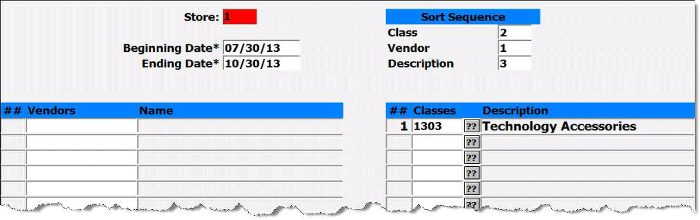
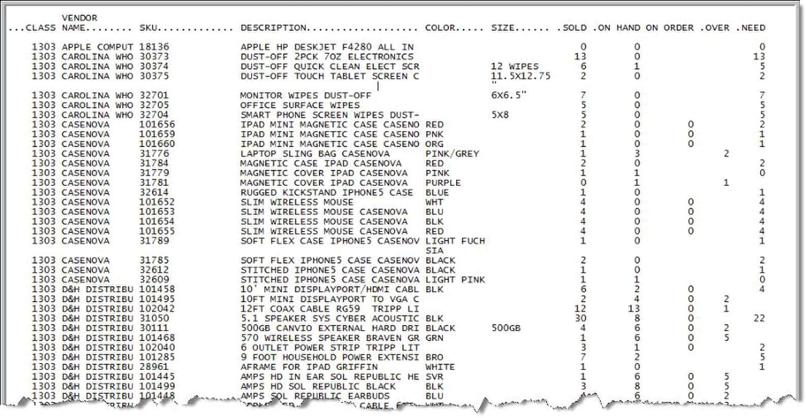

# Preparing For Rush

Preparing for rush can always be a challenge, especially for general merchandise. One of the reports that we have is the Pre-Order Worksheet (GM-01-28) report in GM. This report will look at the sales from a previous date range and show you how many you need to purchase to stock the quantity needed if you meet the same sale figures.

Enter the information; Beginning Date and Ending Date are the sales dates for the comparison. Enter the desired sort sequence. If you wish to limit the report to only certain vendors or for certain classes then enter in the filter criteria information as needed, enter as many vendors and/or classes as desired.

Select “R” to run. Keep in mind that you can run this report as many times as needed with different filter criteria to meet your needs.

The report will show the quantity sold during the dates entered, current quantity on hand, current quantity on order, quantity that you are over compared to the previous sales and the quantity that you need to order to meet the previous sales. Adjust your orders based on what you feel you will sell this term.

<PageFooter />
