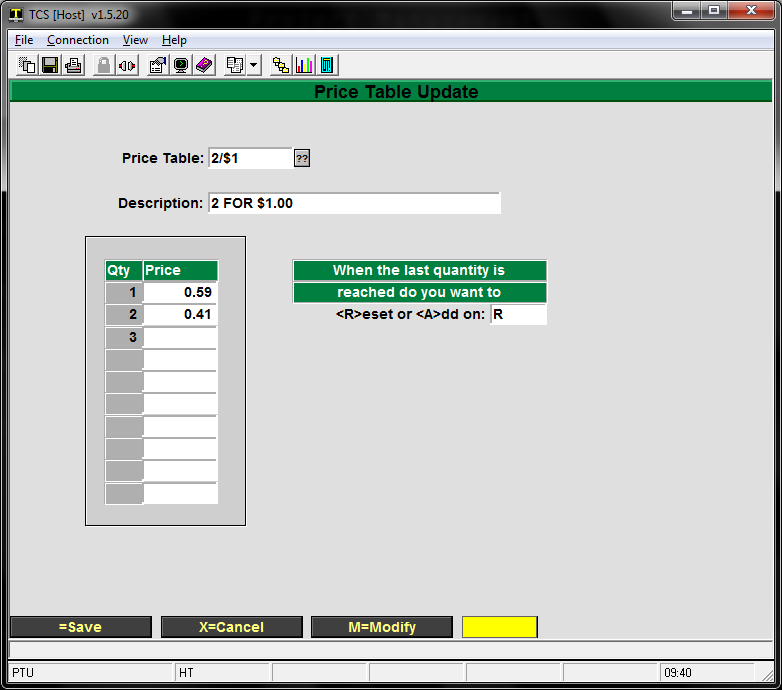
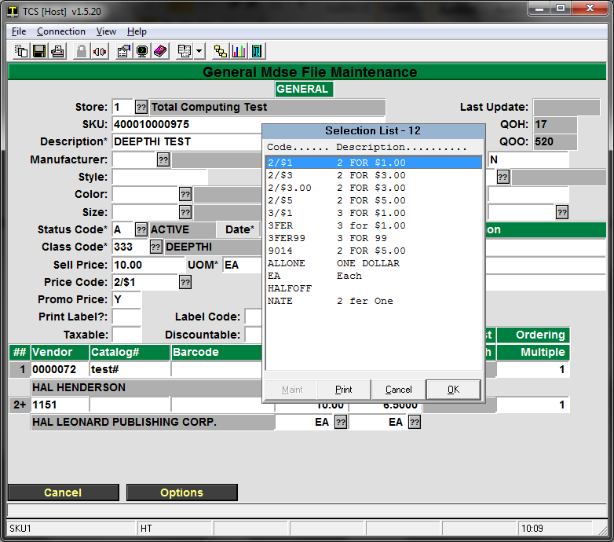
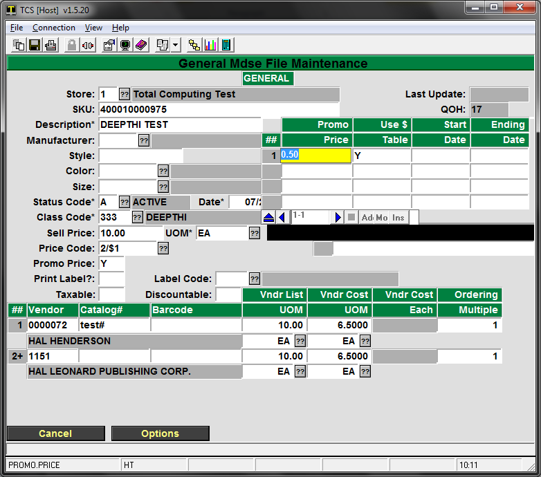

# Promo Pricing

<PageHeader />

Special pricing can be applied in a 2 for 1 type of setting or a flat promo price. Each type of pricing can be applied over a range of dates or indefinitely.

## Price Tables

Price tables are built in GM-SU-3-22 and are the only method for setting up 2 for 1 type discounts.

The following example will cover how to create a 2 for 1 discount that resets on the last quantity.

SU-3-22

“R” will reset the pricing to the top of the table once the bottom Qty has been reached. Since no price is set for the 3rd Qty, the system will start over at the top of the table, charging $.59 for the 3rd item. If a 4th is sold it will sell for .41

Enter the price to be charged for each QTY sold at the register. Qty1 + Qty2 price should equal the special 2for1 price.

1. Create a new table or pull up an existing one.
2. Make sure the description is acceptable
3. Use “M” to modify
    1. Qty1 is the original sale price of the item
    2. Qty2 is the price to be charged for the second item. The two prices added together should equal the desired discount price. In this example .59 + .41 = $1.00
4. Enter an A to add or an R to reset
    1. An A will continue pricing additional quantities of the item at the same price as the final Qty in the table. I.e. a 3rd item sold will ring up for .41 since .41 was the last price entered
    2. An R will reset the pricing of subsequent items to the top of the table. A 3rd item will sell for .59 and the 4th will sell for .41.
5. Save the table, remember the table’s name for setting up the MF record.

## Applying the Discount

1. To apply the discount, bring up the item’s MF record
2. Tell the system which table to use in the Price Code field. 
3. Press Enter, and put a Y in the Promo Price field
4. The next prompt is not used or applied if a table is being used, put whatever you’d like into the next Promo Price field.
    1. 
5. Enter a Y to use the table entered in the Price Code field
6. You may enter a Start and Ending date if you want this pricing to expire. If you don’t want it to expire, just leave those fields blank by entering through them.
7. Save the changes made to the MF record.

<PageFooter />