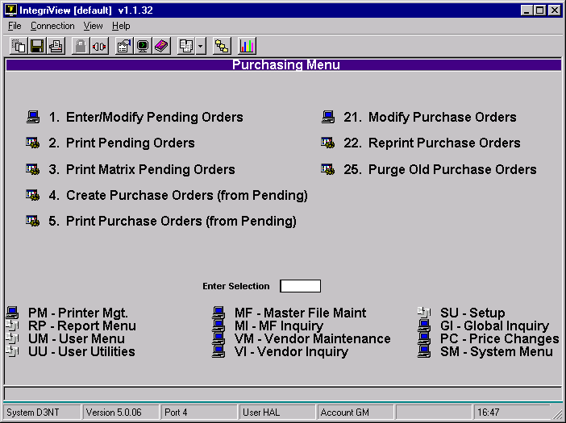

# GMPurchasing Guide

<PageHeader />

### GM Purchasing Menu

### Enter/Modify Pending Orders

This is menu option 1 in both the GM and Trade purchasing menus. This option allows you to create a pending purchase order for a single item in the masterfile. You can create them for as many items as you need to. This is an optional step that is preliminary to creating purchase orders. It allows you to establish a need for individual items without creating an actual purchase order. It is easy to make modifications to pending orders until the time that you decide to create purchase orders.

### Print Pending Orders

Menu option 2 in GM and Trade purchasing menus. This will print all the pending orders that exist, or if you prefer only those for specified vendors. In GM it will not print items that are part of a matrix. This is left to Print Matrix Pending Orders.

### Print Matrix Pending Orders

Menu option 3 in GM purchasing menu, not available in Trade. This will print the existing pending orders that contain items which are part of a color-size matrix. The matrix is setup in Masterfile Maintenance. You can also print only those matrix pending orders for certain vendors.

### Create Purchase Orders (From Pending)

Menu option 4 in GM and 3 in Trade. This will consolidate all pending orders with the same vendor and the same shipping code and create purchase orders from them. This can be limited to certain vendors.

### Print Purchase Orders (from Pending)

Menu option 5 in GM and 4 in Trade. In Trade “First Time” instead of “from Pending. This prints all of the purchase orders that have not been printed that were created from pending orders. You can print purchase orders for only certain vendors if you wish.

### Modify Purchase Orders

Menu option 21 in GM and Trade. Here you can modify any purchase order by typing in the purchase order number. Also you create purchase orders. This is done by pressing a “.” in the first field.

### Reprint Purchase Orders

Menu option 22 in GM and Trade. Here you can reprint and purchase order existing. If you created the purchase order using the “Modify Purchase Order” option, this is also where you should print your purchase order.

### Purge Old Purchase Orders

Menu option 25 in GM and Trade. This clears old purchase orders from the purchase order file. You choose how old the purchase orders are.

<PageFooter />
