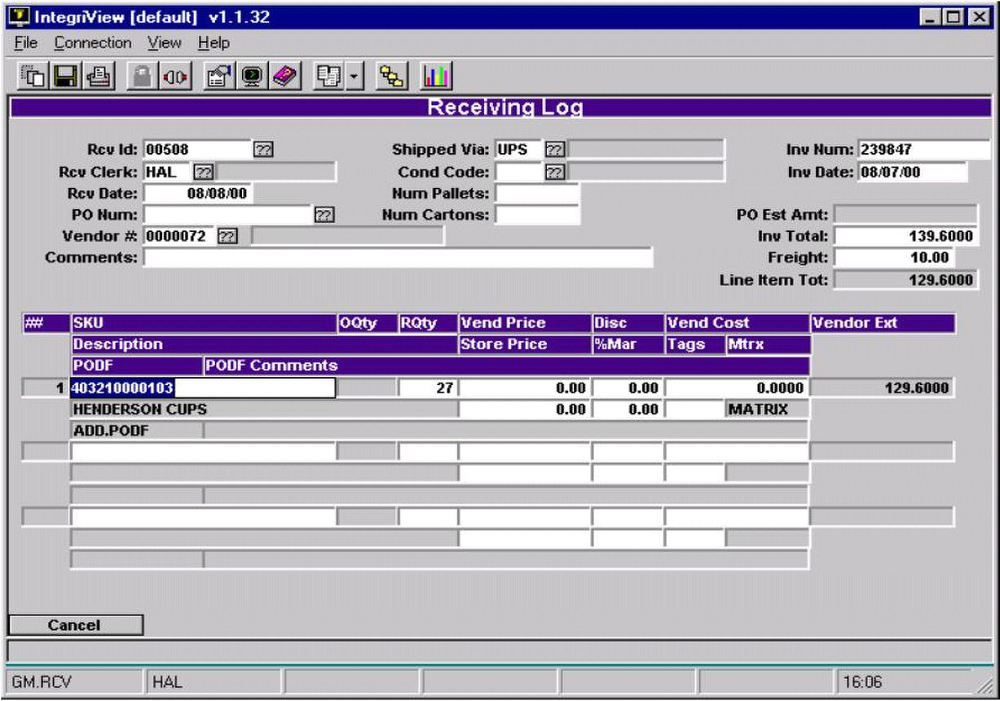
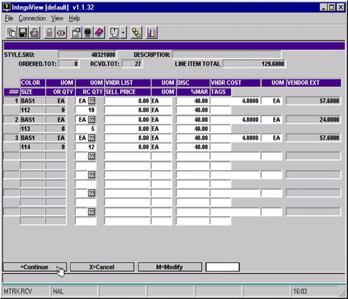

# Matrix Receiving

<PageHeader />

Matrix Receiving is essentially done the same way as receiving regular items. The Parent or Master SKU is what you will see in the line items of the main receiving screen. If you go to one of these Matrix Master SKUs and hit enter you will encounter an additional screen that is used for matrix members only.

Enter your receiving log as you normally would.

- When you get to a SKU that is a Parent SKU for a matrix, hit enter.

You will be taken to a new screen that looks like this:

- Enter unit of measure code in the UOM field, (EA is the default.)
- Enter the quantity received in the RC QTY field.
- The vendor list, sell price, and vendor cost will all be posted to the masterfile as they appear on this screen. Verify these to be correct.
- Save this information by hitting enter.

Now you finish the receiving log as you normally would. If you need to go back into this matrix screen, you must select the Parent SKU again from the first screen and hit enter. You will be taken back into this screen to make any further modifications needed until you post the receiving log.

<PageHeader />
