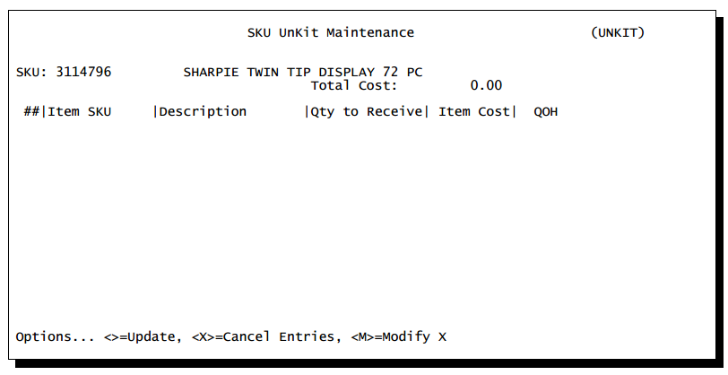

# Unkit

<PageHeader />

The “unkit” option in the GM (General Merchandise) module was designed to allow you to order items that contain many sub-items in it. An example of this is a display case containing highlighters of several colors.

## Setup & Maintenance

Step 1. Setup the UNKIT SKU. This is the SKU that defines the bulk order unit. Step 2. Assign the SKUs that will be received when he UNKIT SKU is received.

Enter each SKU that will be received/sold.

#### Field Definitions

**Distribution SKU** Enter the SKU or use the XREF look up to locate each individual item.

**Description** This is a display of the item.

**Qty to Receive** Enter the number of units to be received at time of receiving.

**Item Cost** Enter the Cost value that will be used when this item is received.

**Total Cost** This is a display of the total of the extended costs.

**QOH** This is a display of the current QOH of the SKU

### Receiving

When the UNKIT is received each SKU on the list will be updated based on the QRcv and the Cost specified in the UNKIT screen.

If 10 of the UNKIT SKU are received then the QRcv values will be multiplied by 10.

Each Distribution SKU will be updated with the receiving quantity and the costs will also be updated.

### Unpost Receiving

If you unpost a receiving then the distribution SKU will be updated appropriately.

### Auto Orders

Do not set up auto order/replenishment values for the UNKIT SKU. If you will be selling the UNKIT SKU then you are not using this feature how it was intended.

<PageHeader />
