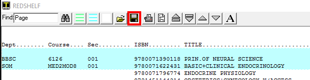
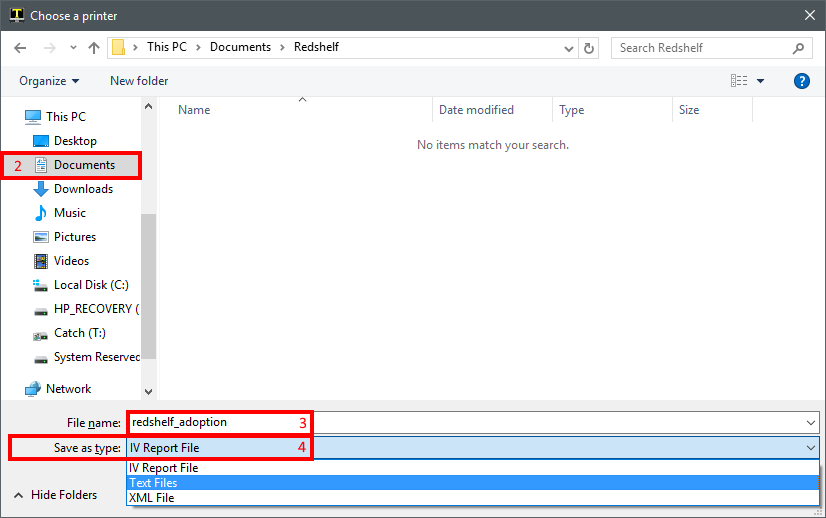
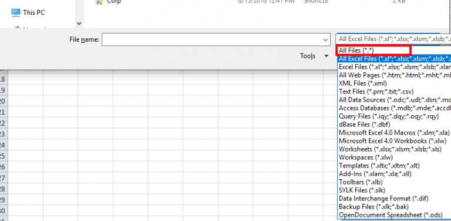
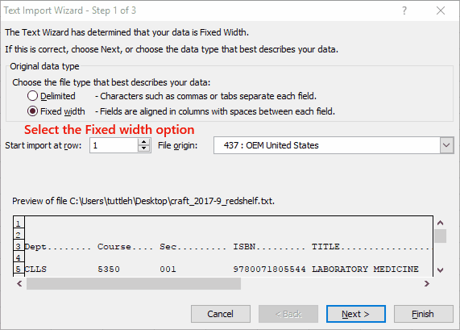

# Getting a Report Into Excel

<PageHeader />

These instructions cover how to save your reports as a text file and then import it into Excel. Most reports are formatted in a way that allows this but there are a few exceptions. Exceptions occur when the report data doesn't line up perfectly into columns, such as the Tender Register Summary report (POS-RP-2-21).

1. First, run your report as normal and send the output to Terminal.
2. Now we need to save the report as a text file on your computer to import into Excel.
    1. Click on the Save icon at the top of the Terminal Window
       - 
    2. Select where you want to save the file.
        - This can be anywhere on your computer. Typical locations will be Documents or Desktop
    3. Name the file
        - Keep it simple and preferably without spaces.
    4. Change the “Save as type” to “Text Files”
    5. Click on the Save button

## Importing Into Excel

This assumes that the steps above have been performed and you have a copy of the report on your computer as a .txt file. Things can get a little confusing but if you watch the animated image in step 6 it will cover most of the non-intuitive steps.

1. Open Excel
2. Go to File > Open
    - Or press and hold the Ctrl key and then press O bring up the Open dialogue.
3. Browse to where you saved the file in step 2.2 above
4. Change the All Excel Files drop down box to All Files
    - 
5. Select the .txt file saved in step 2.2 above
6. In the Text Import Wizard (step 1 of 3) Select the Fixed width option
    - 
7. In step 2 of 3, click and drag the arrows/lines to the edge of the text. These mark the columns to be used in the spreadsheet.
8. In step 3 of 3, click on each column and asign the Text data format in the top left
    - You can select the first column, move the slider all the way to the right, press and hold SHIFT and click on the last column. With all columns selected click on the Text data format option on the top left.
    - Click Finish
9. Now all of the data should be in the Excel document. The ISBN numbers **_should not_** look like a notation number (9.78129E+12) they should display as full ISBNs.
10. Save the document.
    1. If sending to another organization (e.g. Redshelf ebook list, third party inventory company, etc.)
        1. Go to File > Save As.
        2. Browse to where you would like to save the document
        3. Enter a name in the File name field
        4. Click on the Save as type: drop down and select "CSV (Comma delimited) (\*.csv)"
        5. Click on Save
        6. The file can now be sent as an attachment
    2. If saving for internal use
        1. Go to File > Save As.
        2. Browse to where you would like to save the document
        3. Enter a name in the File name field
        4. Choose whatever you would like as the file type. The default is typically .xlsx
        5. Click on Save

<PageFooter />
