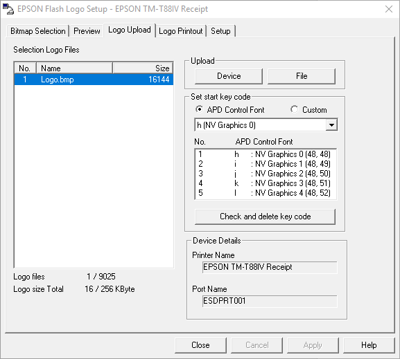
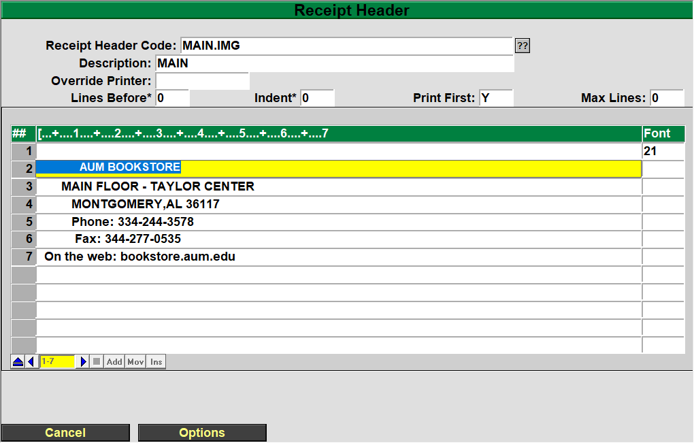

# Add logo to Receipt

<PageHeader />

## Logo Setup and Installation for Epson printers

Printer Software install

Image preparation and requirements

Loading Image onto printer

Configuring POS software to print images

## Printer Software install

1. Download the Advanced print driver from the Epson site
2. Start the install of the advanced print driver
3. On the first screen select next
4. Accept the terms of the license agreement
5. For the setup type select Standard
    - 
6. Click the add printer button
7. Select the correct driver for your printer and the port type (In this example I am using a T88IV on a COM port)
    - 
8. Configure the communication settings for your printer
    - 
9.  After you select next you are taken back to the printer configuration page. Select the next button and continue with the installation.
    - 
10. You will be prompted to select next on the next window
11. Once the install is finished select the finish button
    -  

## Image preparation and requirements

The source image can be either a jpeg or PNG or BMP

I have found that a max image width of 500px works best but the image can be of any size as you can run it through an optimizer.

The instructions below will be for a JPEG but can be applied to most images

1. Save your image to a folder or the desktop
2. In a web browser navigate to [http://www.imageoptimizer.net](http://www.imageoptimizer.net) (I use this site but almost any optimizer will work for this)
3. Upload the image to the site
4. Under the optimization options select the following (The Max height will auto adjust during the optimization)
    1. Quality: Minimum file size
    2. Max width: 500
    3. 
5. Select Optimize now
6. The next screen now shows the original width and height and the size on the left and the new width and height and size on the right
    - 
7. Select the download to your computer button and it will save your image to your device
8. Move and rename it to something that you will remember.
    - 
9. Right click the optimized image and select edit.(Works best if you do this in paint)
10. Select File then save as BMP Picture
    - 
11. Select the location you would like to save it to.
12. Rename it to something that will be easy to find(for example Logo)
13. Select the drop down and select Monochrome Bitmap
    - 
14. When prompted select Ok
    - 

## Loading Image onto printer

1. Open devices and printers and locate the printer that was installed in the first segment.
    - 
2. Right click your printer and select printer properties
3. Select the Utility tab then select the EPSON Flash Logo button
    - 
4. On the next window that opens select the Bitmap Selection
    - 
5. Select Open File and locate your image
6. In the file manager select okay and then you will be returned to the bitmap selection window
    - 
7. Repeat steps 5 and 6 if you have more images to load
8. Select the Logo Upload tab
    - 
9. Leave the settings as they are and select the Device button (The file option will generate a file that can upload the image. This option is very sporadic when uploading the images)
10. It will take a second or two but you will receive a prompt asking if you want to continue select yes
    - 
11. The upload process can take a some time and may lock up but it will show the following prompt when it is finished.
    - 
12. Select ok and then toggle the power on the printer off then on.
13. You can then close out of the flash logo setup and continue to the next section.

## Configuring POS software to print images

This section works best in a GUI connection

1. Open the TCS GUI and login to POS
2. Navigate to Hardware Configuration Codes (POS-3-2)
3. It is recommended to create a new Configuration ID but you don’t have to
   - For this example I am creating a copy of GUIE named GUIEI
4. Select your configuration code
    - 
5. Select Screen 2 by either typing S2 or selecting the button
    - 
6. Click the entry box next to User Font 1…. 21:

For TM 88 the current code that prints the first uploaded image is ( This may change to the proper ESC codes at some point)

HEX1d HEX28 HEX4c HEX06 HEX00 HEX30 HEX45 HEX30 HEX30 HEX01 HEX01

To print the second image use

HEX1d HEX28 HEX4c HEX06 HEX00 HEX30 HEX45 HEX30 HEX31 HEX01 HEX01

For any images following the first two replace the ## in the line below with a number above 31 ( 32- 3rd image , 33 – 4th image, 34 – 5th image)

HEX1d HEX28 HEX4c HEX06 HEX00 HEX30 HEX45 HEX30 HEX##HEX01 HEX01

7. Hit enter a few times until you are back at the Hardware parameters menu
8. Now select Receipt header  POS.3.3
9. Either create a new one or select your existing header(in this example I am using a copy of MAIN named MAIN.IMG
    - 
10. Select the last line of the header and hit enter until you get the insert option at the bottom
11. Select insert
12. When prompted type 1 and hit okay
13. You will now have the following view
    - 
14. Hit the spacebar 3 times and hit enter
15. When prompted with are you deleting this data select no
    - 
16. You will then be shifted to the font section
17. Here you will enter the font code you set above.
    - 
18. Hit enter until you are back and the Hardware Parameters Menu
19. Select option 1 Register Parameters
20. Enter your register number (In this example I am using register 404
21. Change the following options (If you changed your default header and configuration you can skip this step)
    1. Header Link
    2. Configuration Link
       - 
22. Once changed hit enter until you are back at the main POS screen
23. If you are making this change on the host or on the smartlane you can now select option 1 Cash Register and run a test transaction.

After running the transaction, you should now have an image on your

receipt. Below is an example

<PageFooter />
