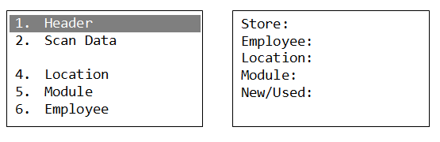
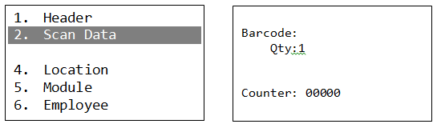
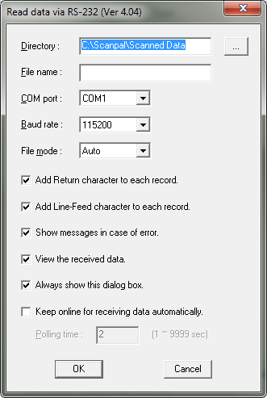
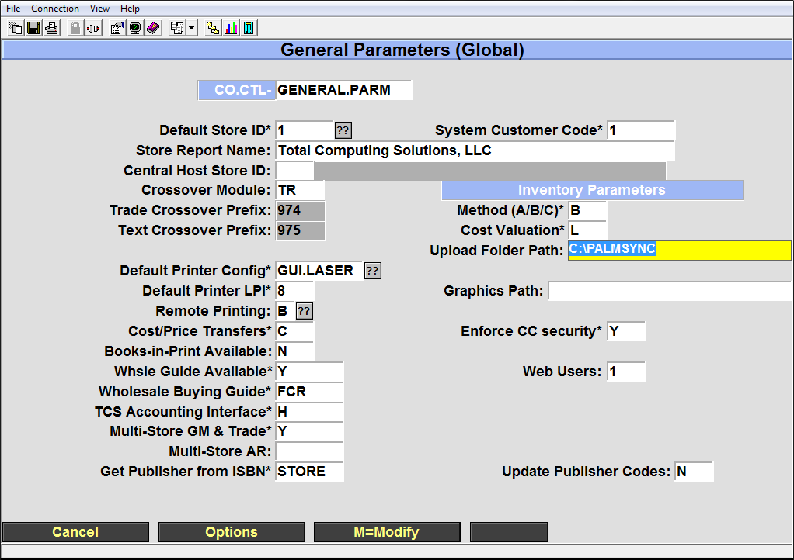
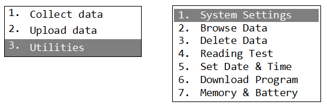

# Scanpal Usage Guide

<PageHeader />

## **Simple Overview**

The overall process is listed below with more details following.

1. Charge your scanners and verify that they will scan items. It's also a good idea to do a test upload of the scanned data to the PC it connects to.
2. You will follow the steps listed below once you start your inventory. Repeat them as necessary until it's time to post your counts.
    1. Collect data. Be sure to enter the correct header information
    2. Upload the scanned to the SmartLane register (hosted customers) or the correct directory on your host (self hosted customers)
    3. Create your worksheets
    4. Run your reports
    5. Repeat steps 1-4 until everything is counted and reports look good.
3. After everything appears to be correct you will post your inventory. This completes the inventory process and is irreversible.

### Using the ScanPal

Upon powering on the unit you will be greeted with this main screen.

- Collect Data is where all of the data collection settings and functions are located. You can specify stores, locations, the type of merchandise and many other settings here.
- Upload Data is used to sync the gathered information to your PC.
- System Utilities provides additional functions specific to the device itself as well as options on viewing or deleting data.

This guide will go through each screen step by step and explain all of the options and functions of that screen.

### Collect Data

Collect Data contains the primary settings and functions for performing the counting process.

- Header allows you to set the general settings to be used while scanning.
- Scan data will scan the barcode and prompt you for a quantity
- Location, Module, and Employee allow a temporary override of the settings specified in the header. You may quickly and temporarily change these for the next scan.

**Header**. These settings allow you to specify the store number, the name of the employee gathering the data, the location, module and class of the textbooks being scanned.

**Scan Data.** Scanning barcodes and quantities is done in this screen. The barcode may be scanned as well as manually entered. The default quantity is set to one, although this can be changed in the utilities section. The counter keeps track of the number of barcodes scanned, not the total inventory quantity.

If you need to check any data that was scanned you can go to Utilities, Browse Data to review and make changes.

# Upload data.

There are a number of items that need to be setup before data can be uploaded. Check through this list to make sure that everything is ready before attempting to upload any data.

## First Time Setup

1. Please contact TCS Support to set up the ScanPal environment.

**Transfer Steps**

1. Power on the scanner and from the main menu select “Upload Data”
2. Connect the scanner to the PC
3. Double click on the "Scanpal Upload – Shortcut" located on the desktop. If this shortcut does not exist then you will need to contact TCS support.
4. Review the program window that opens to make sure all settings are correct
5. Select “OK” to transfer the data to the PC****

- Directory: This is where the scanned text files are to be saved. This should be C:\\Scanpal\\Scanned Data but can be changed.
- File name: You may specify a name for the file. If you specify a name please select New Name or Overwrite in the “File mode” field. It is recommended that you leave this blank and use the “Auto” file mode.
- Enter the COM port the device is plugged into.
- Leave Baud rate alone
- File mode:
    - Overwrite will overwrite the previous file unless you specify a unique name
    - Append will merge all data
    - New Name is used when creating a new name
    - Auto will generate a sequential number for each file. _Recommended_
- **NEVER uncheck any check boxes unless directed by a TCS support technician to do so.**

 

**Transfer Data to the Data Collection File**

New and existing customers will need to check the upload location in the system.

1. Go to POS-UU-22 and verify that the Upload Folder Patch is:
    1. Typically C:\\Palmsync for self hosted users
    2. C:\\TCSDB\\CUST\\POS\\HOST.SCANNED.DATA for hosted customers

**Add Data to the DC File**

1. Minimize all windows until you are at the desktop
2. On the desktop, double click the “Upload to Server – Shortcut”. Leave this open.
3. On the desktop, double click on the “Scanner Data – Shortcut”.
    - There should be text documents containing your inventory counts in this folder
4. _Copy_ the text files in Scanner Data into the "Upload to Server" window.
    - These files will disappear once they have been added to the DC file on self hosted systems.
    - For hosted customers they will disappear once the SmartLane main menu option 7 - Send Inventory Scanned Data option is ran.
5. The inventory data is now ready to be added to a worksheet.

**Utilities**

Utilities allows you to change the device settings, browse and manipulate scanned data, run tests and view the status of the scanner.

- System Settings is a password protected section that should not be altered unless directed by a member of the TCS support team.
- Browse Data allows you to view the data scanned, edit it or delete it by individual record. Editing in this interface is not recommended, it is simpler to edit the data in notepad.
- Delete Data allows you to delete the last record scanned or all data. All data is automatically deleted when it is uploaded.
- Reading Test displays the barcode type and character length of a scanned barcode.
- Set Date & Time adjusts the date and time on the device.
- Download Program
- Memory & Battery displays the remaining free space and remaining battery power.

<PageFooter />