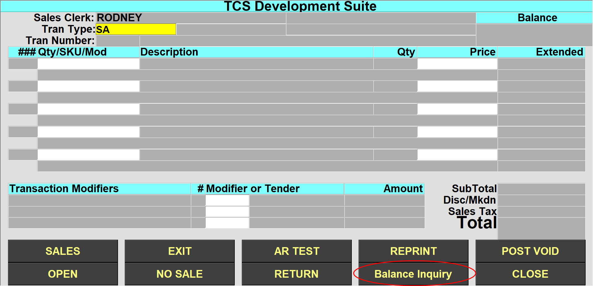
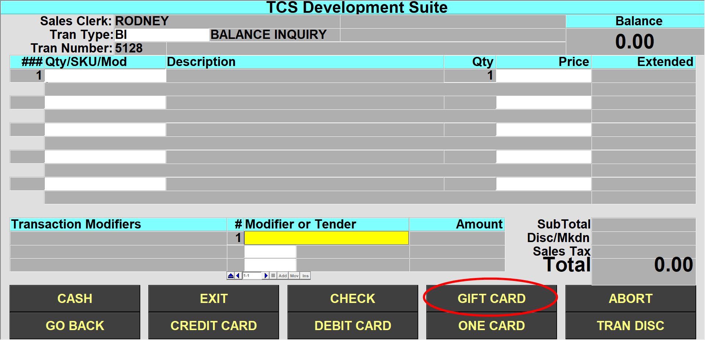
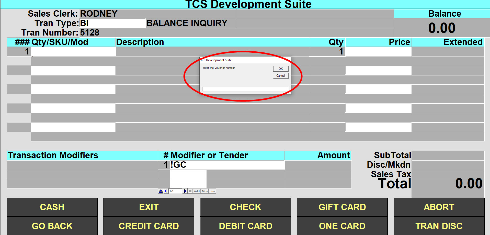

# Use the Balance Inquiry

<PageHeader />

It is recommended to add the BI Transaction Type to the keyboard layout or to the Screen buttons or you can manually type in the BI command in the Transaction Type field in the register.

In the Example below I have added the 'Balance Inquiry' button to the screen.

Select the 'Balance Inquiry' button, Select the 'Gift Card' option as a tender and then enter the gift card number or scan/swipe the card as per your normal options.

<PageFooter />
