# Card on File"

<PageHeader />

## Overview

The Card on File feature allows the store to create and hold on file one or more credit card numbers for any number of customers. Once a card has been stored it can be accessed at the register and used as a valid tender. It is fully compatible with split-tenders. The information in the COF database is used and the cashier does not have to enter any credit card information.

The COF feature was designed to also accommodate the COF functions with our e-commerce product. This will be implemented sometime in the future.

The COF feature has been tested and is compatible with both ICOMM and TotaLink. It was first release on patch 1141.

**Here is a sample of what the cashier will see and do**.

1. Choose the COF tender.
2. Enter the customer’s name.
3. Verify that it is the correct customer by following the verification instructions on the screen.
4. Review any purchase restrictions and validate that only authorized purchases have been entered.
5. If there is more than one card on file then the cashier will select the card indicated by the customer.
6. If everything was answered in the affirmative then the card will be processed and the cashier will see the familiar credit card interface.

Image 1 – Enter the tender code.

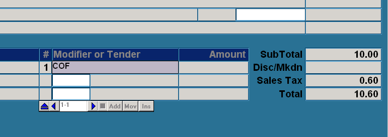

Image 2 – Enter customer name

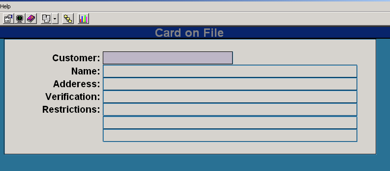

Image 3 – Selecting the right customer

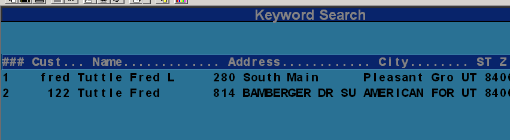

Image 4 – Verify customer.

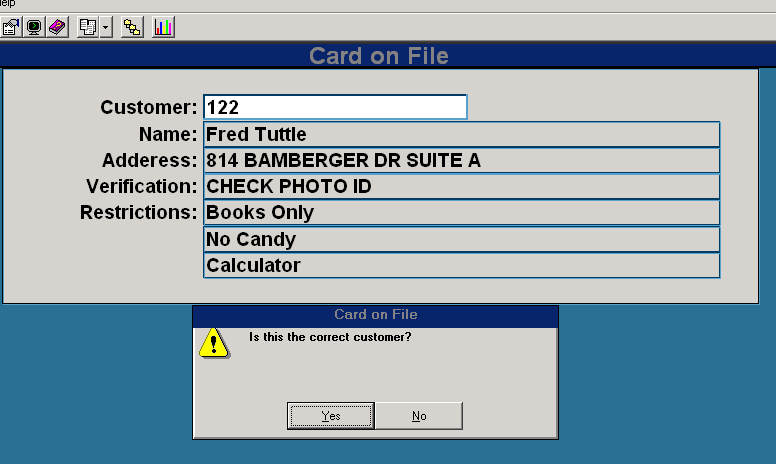

Image 5 – Review restrictions.

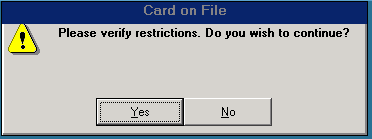

Image 6 – Select the correct card (this is not shown if there is only one card on file).

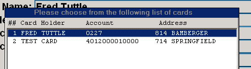

Image 7 – The card gets processed.

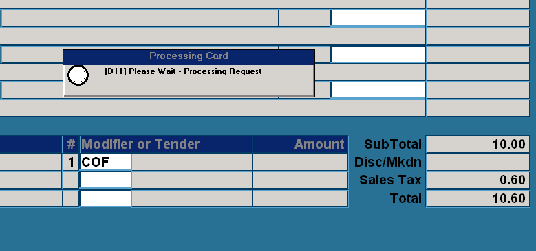

## Setup the COF file

1. Choose menu POS-26-21 (POS Main Menu, Mail Order, Customer Maintenance)
2. Add the customer.
3. Select “C” for card on file.
4. Add the card database.

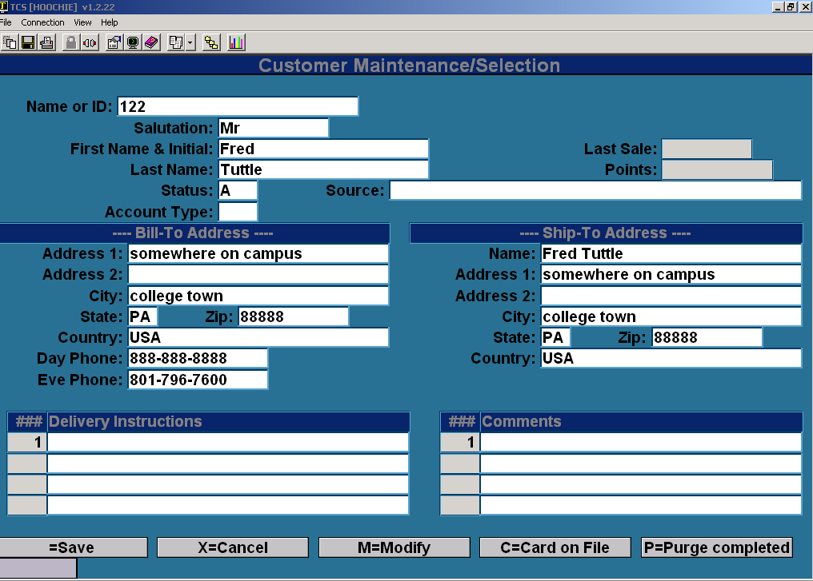

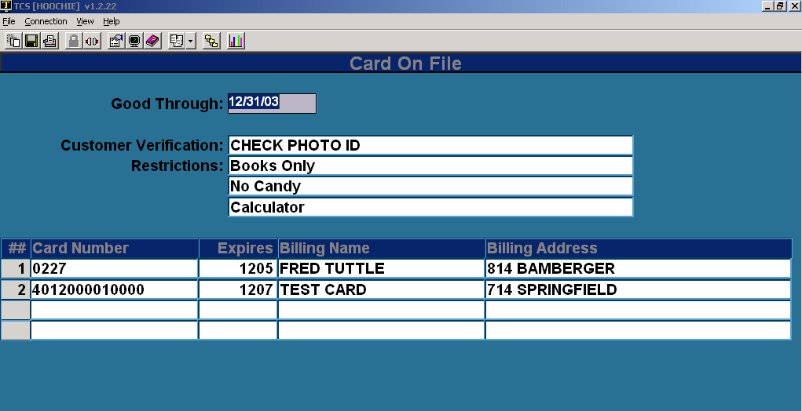

# Setup the Tender Code

1. Choose menu POS-02-04 (Main Menu, Parameters, Tender Codes)
2. Add a new tender by copying your existing credit card tender.
    1. This is done by entering the new tender code (COF) and when you get the prompt to “Add, Copy, or Exit” choose “C” to copy. Copy from your credit card tender code (usually CC).
3. Add POS.CARD.ON.FILE to the Inline Processing Subroutine field.

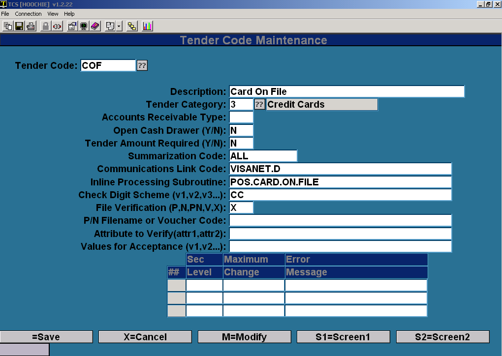

Only change this field. (Your tender codes could be different than this example.)

**If you are using TotaLink** then you will need to add the same tender code there also. Do the same thing there and just copy CC to COF. There are no additional fields to update.

1.Choose menu TL-05-03 (TotaLink Main Menu, Setup, Tender Codes)

2\. Enter COF and copy from CC.

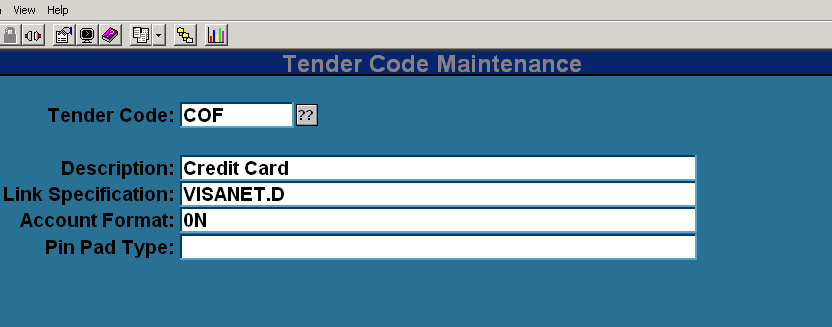

<PageFooter />
