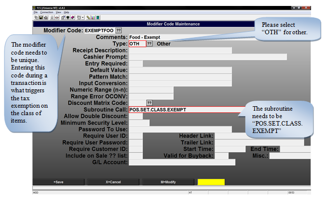
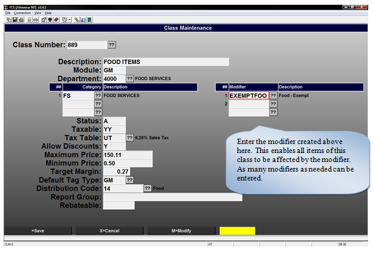

# Class Specific Exemptions

<PageHeader />

Scenario: Students at the university are tax exempt for food items but everyone else needs to be charged tax. The cashier does not wish to flag each individual line as tax exempt; this takes time and leaves more room for error. To simplify the transaction the cashier types in a modifier at the beginning of the transaction that will affect all items under a specific class to be sold as tax exempt. This applies only to transactions where the modifier is used.

To accomplish this two things need to be setup. A modifier needs to be created, and the class code needs to be changed so that all items of that class are sold as exempt when the modifier is implemented.

## Create the Modifier

The modifier needs to be setup in POS-2-2, since this is a new modifier type in the code you would like to use and select “Add” on the window that pops up and fill in the fields according to the following screenshot. You update additional fields to fit your needs.

This is all that is necessary for the modifier. Please remember the modifier code as it is required when updating the class code.

## Update the Class Code

To update the class code, go to POS-22-3-2 and enter the class you would like to update.

After the modifier has been entered and the changes saved all items under that class will ring up as tax exempt when the modifier is used at checkout. It’s recommended that users setup function keys to more easily use the new modifier.

<PageFooter />
