# Colleague Split Tender Checkout (FA)

<PageHeader />

## Setup

Please contact support to setup AR or POSCONNCECT Split Tender options.

## Web Customer View

The change that you will see on the web is, as a customer, they will shop as normal. When they select the option to go to the cart the first thing they see will be the cart details and asking if the will pay with Financial Aid.

If they select ‘No I will NOT use Financial Aid’ then they will continue as normal

If they select ‘Yes I’d like to use Financial Aid’ as seen below.

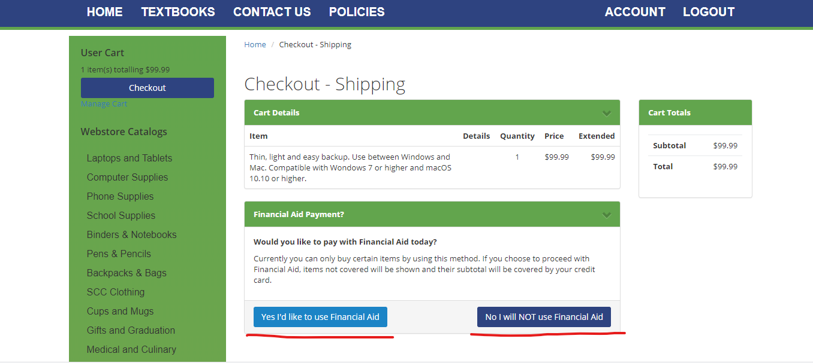

The customer will get presented with their address information to confirm/edit as needed and at the bottom of the screen they will need to enter in their student ID and then click on the ‘Show Shipping Options’.

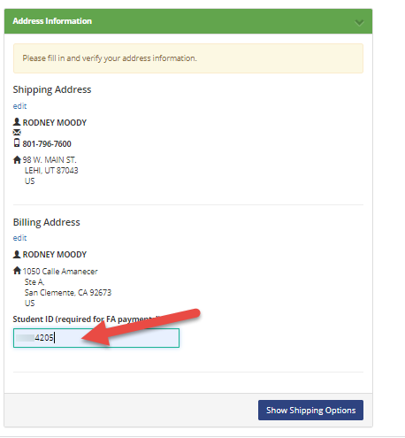

Now they will select their Shipping option from the list setup by the store.

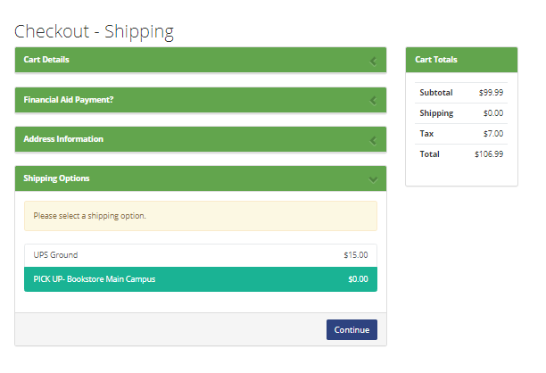

Enter in any Order Comments that are needed and then click/check the checkout policy box then ‘Proceed To Payment’.

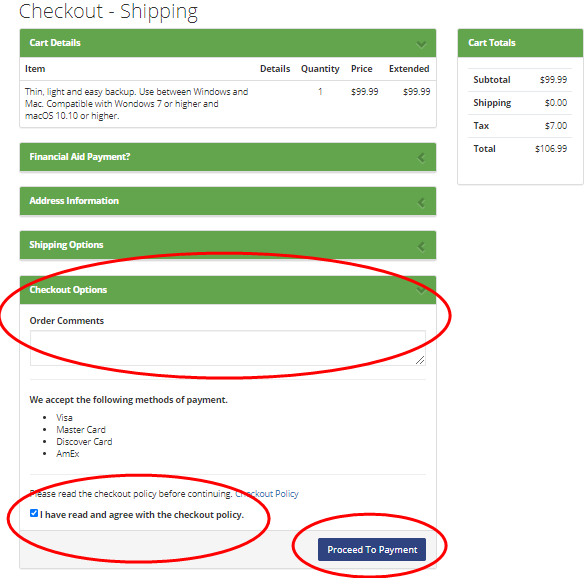

The customer will then need to enter in their credit card information, this will only be used if they order items that are not covered by the amount or type of aid the customer has.

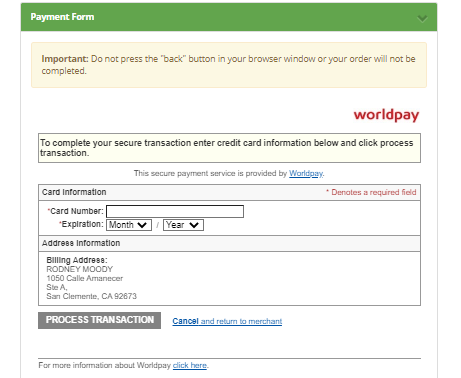

And finally, if the customer will see a message thanking them for their order and then receive an email with the order information confirming that the order has been received.

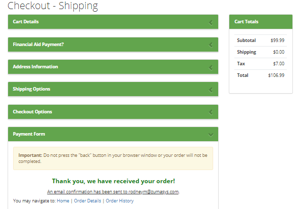

# Store processing of Split Tender

 

The order will come to the store as a suspended transaction, just like a normal CC transaction. The store personnel will be able to run the pick slip reports (POS.26.10 or 13) and pending order reports the same as they do regular web transactions.

Bring up the suspended transaction the same as other web transactions

Since this will be treated as a POS Connect or FA order, you will get prompted to look up the customer the same as your existing POSCONNECT/FA transaction (POS Connect is used in the example).

The Account ID will be brought in from the transaction where the customer entered it on the web site.

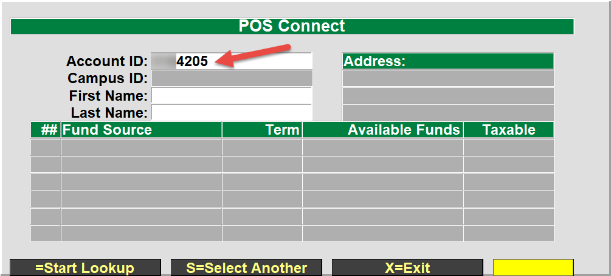

Select the fund source that you wish to use for this transaction

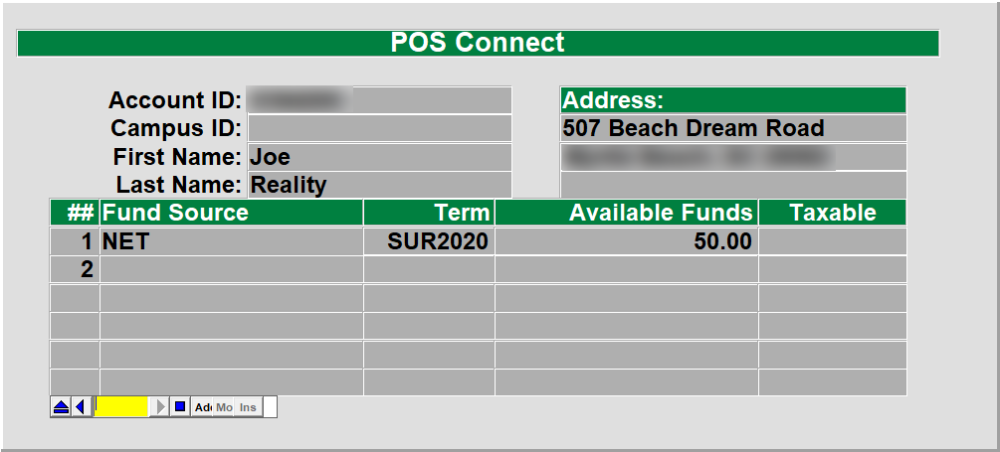

The transaction will load each item and validate the customer has the funds to cover each item that was ordered. If the customer goes over their limit or has purchased something that is not covered by their fund source then a message will display that the SubClass limit has been exceeded or that the limit has been reached. Click on the ‘Yes’ button to add the item to the cart and to proceed, if you select ‘No’ then the item will not be added to the cart.

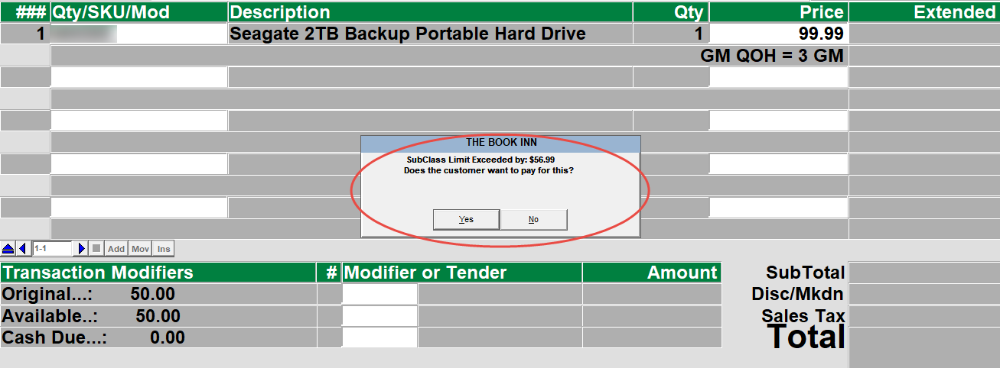

Once all of the items have been added to the transaction, the transaction will show the Total amount and also the Original fund amount, Available funds and the cash due that will be placed on to the credit card when the transaction is finalized.

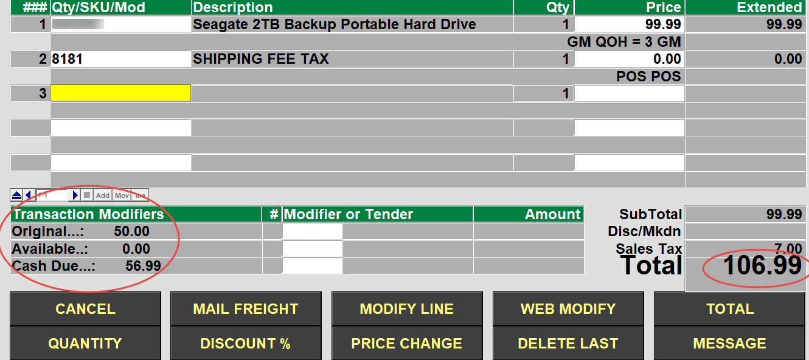

After selecting the ‘TOTAL’ button, the transaction will automatically enter the amount of funds to be used by the FA/POS Connect transaction tender, the cashier will just hit the ‘Enter’ key on the keyboard.

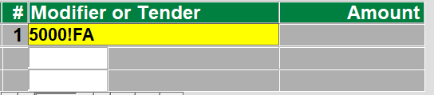

The transaction will then apply the financial aid funds to the customers fund source and report if there were any issues. Once the financial aid amount has been successfully applied then any additional amount will be applied to the credit card that was entered on the website.

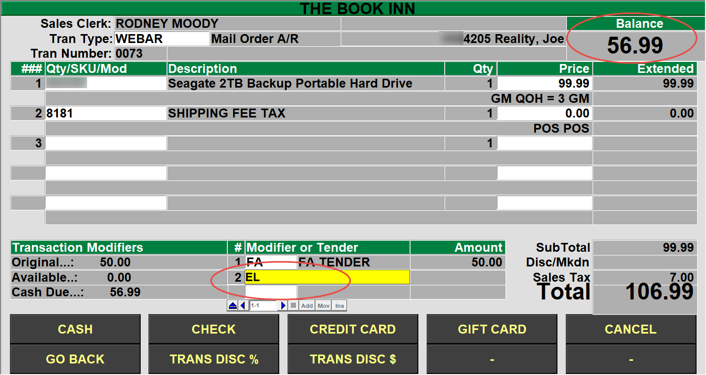

<PageFooter />
