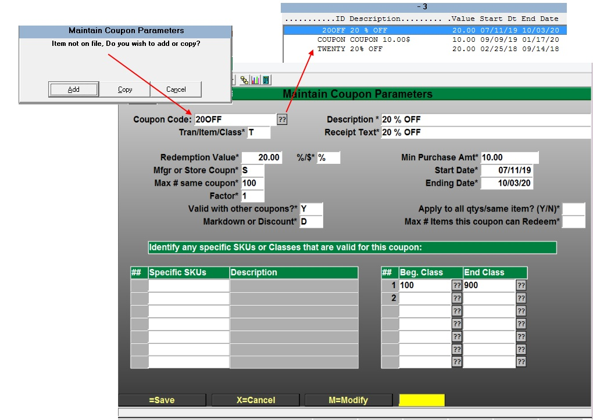
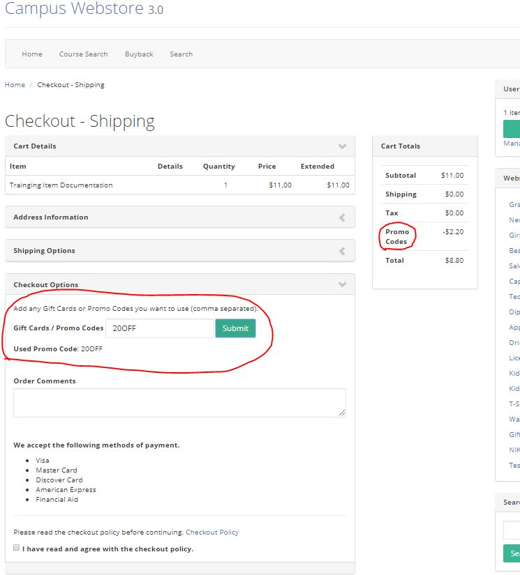
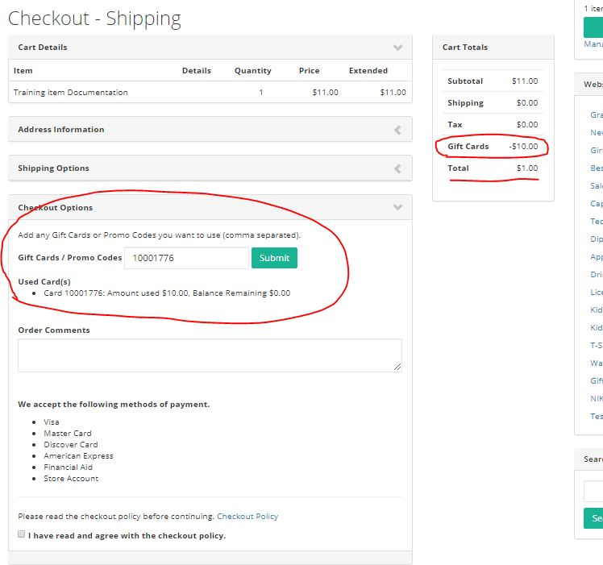
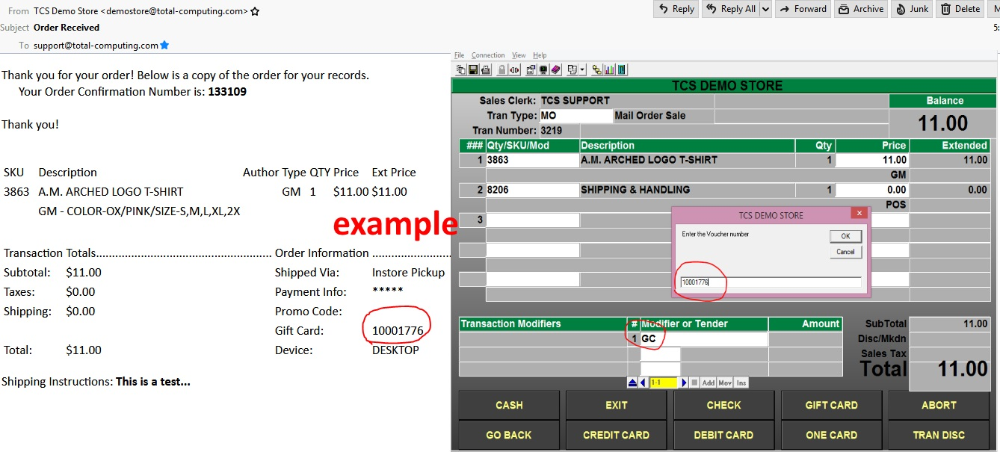

# Coupon, Promo, Voucher, Gift Certificate and Gift Card Setup - Online Redemption and Checkout

<PageHeader />

This training document will walk you through setting up your Coupon/Promo Code(s) Along with Gift Cards, Vouchers and Certificates for the purpose of online ordering and order fulfillment.

_\*You can mix and match different Promos, Coupons, Vouchers, Gift Cards and Certificates with any valid webstore Tender._

## Coupon & Promo Setup/Configuration

Menu Path POS-22-25-22

- You can add a new Coupon Code by either typing in and Select the “Add” or “Copy” Option. You can also modify any previous coupon. You can also use the standard period “.” for the next numeric sequence number. _\*If you modify coupons after a Web Order has been placed the modified coupon will not be applied to any suspended transactions only to new Orders._
- You will need to fill-in all of the required fields. For detailed field information input a single question mark for more help.
- Selecting the “Tran/Item/Class” type of discount will determine your choices throughout the setup. T=Tran type discounts will apply the discount to the whole order. I=Item type discounts will apply the discounts to the “Specific SKUs” you list for the discount. C=Class type discounts will use the table defined in the “Beg. Class – End Class”. _\*note if you are adding groupings of class codes you will need to make sure they are in sequential order, example: 100-200 600-700._
- Min Purchase Amt\* - The way this field is applied depends on the coupon type (Tran/Item/Class) you set up.
  - Transaction - The transaction Subtotal amount must meet the minimum, once the subtotal meets the minimum then the coupon will apply the coupon amount.
  - Item - The line item amount must meet the minimum before the discount will be applied. If the item sells for 10.00 and the minimum is 30.00 then the item will not apply unless the quantity is more than 3 to meet the 30.00 minimum. The coupon will only be applied 1 time regardless of how many items meet the minimum.
  - Class - The class must meet the minimum, the coupon will only be applied to the first item of the class. The total is not cumulative.
  - Class All - When the minimum is met by a cumulative of all the classes in the coupon then the discount will be applied to the total amount for the valid classes or the dollar amount will be applied 1 time.

## Applying Coupon(s) Promo(s)

During the Checkout process the online user will have the option to enter the Promo/Coupon Code that was setup. Users can add additional Codes using the instructions listed online.

 Selecting the "Submit" Button will apply the Codes to the users cart.

### Resuming Orders Promo/Coupon

- You will need to print Pick Slips or the email confirmation to see the type of Promo Code that your customer used at checkout.
- To enter a Promo/Coupon code, after selecting TOTAL, you need to select the 'coupon' key or int the 'Modifier or Tender' field enter CPN and press enter. You will then enter the promo/coupon code in the pop up box.
- Depending on the type of Promo/Coupon Code that was used on the online store will determine where the Code is applied in the transaction. [See Gift, Voucher and Card Setup.](../pos/../vouchers-setup/README.md) to see how to check the types of Codes that are being used. _example: T=Transaction I=Item C=Class_

### Adding and Maintaining Vouchers and Gift Certificates.

\*[See Gift, Voucher and Card Setup.](../pos/../vouchers-setup/README.md)

### Redeeming Voucher, Certificates and Cards at Online Checkout.

During checkout the user will have the option to Apply Gift Cards, Certificates and/or Promo Codes.

- When a valid Voucher is entered and applied using the "Submit" button the shopping cart will update and reflect the new total.
- The balance on the voucher will also be shown to the user on their checkout page.

_\*note that Vouchers, Gift Certificates and Cards follow the same rule as Credit Cards for Bookstore Clients. Funds are not changed until order fulfillment at the register._

### Resuming Orders Vouchers, Cards and Certificates

- You will need to print the order Pick Slip or the email confirmation to see the type of Voucher, Gift Certificate or Card that your customer used at checkout.
- To enter a Promo/Coupon code, after selecting TOTAL, you need to select the 'coupon' key or int the 'Modifier or Tender' field enter CPN and press enter. You will then enter the promo/coupon code in the pop up box.
- You can utilize the TCS standard types of Tender Codes and their rules e.g. Splitting Tenders between the Voucher, Gift Certificate or Card and other valid Tenders for web checkout.

_\*note you must be running webstore version 3.x.x or greater for these features to be available._

<PageFooter />
