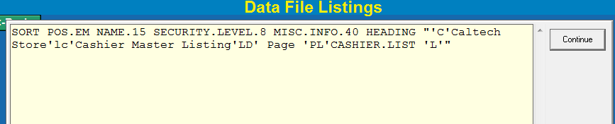
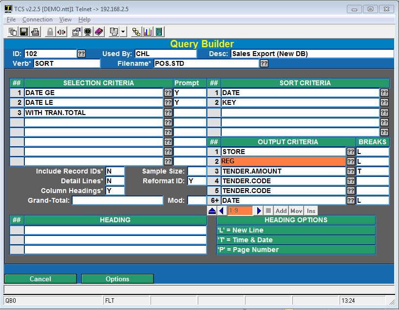
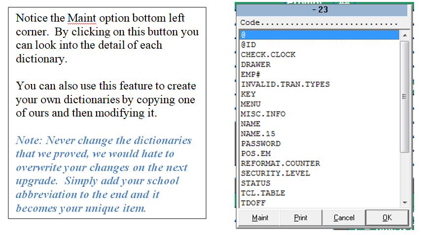
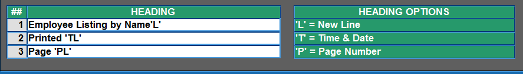

# Custom Reports Through Query Builder

<PageHeader />

The TCS Query Builder is a very powerful tool for users of SmartSuite to customize or create new reports that more specifically meet their needs.

## The Basics

<table class="alignleft" style="width: 100%; border-collapse: collapse;" border="0" cellpadding="0"><tbody><tr><td style="width: 19.4186%;"><strong>Verbs</strong></td><td style="width: 91.8605%;">Can be either SORT or LIST. List is random and SORT is ordered.</td></tr><tr><td style="width: 19.4186%;"><strong>Filename</strong></td><td style="width: 91.8605%;">The SmartSuite system is comprise of several data files unique to each module.</td></tr><tr><td style="width: 19.4186%;"><strong>Dictionaries</strong></td><td style="width: 91.8605%;">Each data file has its own unique set of dictionaries that define how data fields are represented.</td></tr><tr><td style="width: 19.4186%;"><strong>Selection</strong> <strong>Criteria</strong></td><td style="width: 91.8605%;">The rules you define to limit the volume of data to be included on a report.</td></tr><tr><td style="width: 19.4186%;"><strong>Sort Criteria</strong></td><td style="width: 91.8605%;">The rules you set to define how the data will be sorted.</td></tr><tr><td style="width: 19.4186%;"><strong>Output</strong> <strong>Criteria</strong></td><td style="width: 91.8605%;">The columns that will be included on a report.</td></tr></tbody></table>

 

Nearly 100% of the reports in SmartSuite utilize the same rules that the Query Builder does. We just add a more complex screen for your parameters and do a few more technical things.

The best way to create a query is to start from an existing one. If you don’t have an existing one then choose one of the system reports and see how we did it. Try to run a report that contains similar data to what you would like to create. For example, if you are going to create a report to display sale information, then use a Sales report as a reference. This way  you can see what filename we are pulling sales data from and can use that same filename in your query.

You can see our query string by running the report but instead of selecting terminal, or printer, etc. choose the option to show the Command String.

Here’s a simple command from POS-RP-04-21 (Cashier Listing).

This has a Verb (SORT), a Filename (POS.EM), and Output Criteria (NAME.15 SECURITY.LEVEL.8 MISC.INFO.40. There is also a HEADING.

### Screen Elements

Here’s an example of a query created by an end-user for doing a sales export.

<table class="alignleft" style="width: 100%; border-collapse: collapse;" border="0"><tbody><tr><td style="width: 18.9535%;"><strong>ID</strong></td><td style="width: 81.0465%;">This can be alpha or numeric. It is just the name you want associated with the report and is assigned by the user.</td></tr><tr><td style="width: 18.9535%;"><strong>Used By</strong></td><td style="width: 81.0465%;">Can be left blank or filled in with the name of the person who will be the primary user of the report. (When you enter “??” in the ID field the list is sorted by Used By and then by Desc.)</td></tr><tr><td style="width: 18.9535%;"><strong>Verb</strong></td><td style="width: 81.0465%;">Use either SORT or LIST</td></tr><tr><td style="width: 18.9535%;"><strong>Filename</strong></td><td style="width: 81.0465%;">Enter “??” to view a list of all of the files for the database you are logged into (POS, TEXT, GM, etc.) This is where it is easier to use the Command String to see what file to use. After some experience you become familier with our naming convention and the file names will make sense.</td></tr><tr><td style="width: 18.9535%;"><strong>Selection Criteria</strong></td><td style="width: 81.0465%;">Enter valid dictionary items. If you click on “??” you will see a complete list of the dictionaries for the file selected. Here is a list of the POS.EM file (employee master).</td></tr></tbody></table>

If you enter “Y” in the **Prompt** column then when you run the report you will be prompted for the value you want to use. Dates can be entered just like in our screens.

**The “??” works the same in each area, so the explanation will not be repeated.**

**The “?” provides most of the information provided in this document.**

**Sort Criteria** The report above is going to be sorted by DATE and then by KEY. Since it is using the SalesTransactionDetail file (POS.STD) the key is store\*date\*register\*transaction.

**Output Criteria** This varies in that the 2nd column is for BREAKS. A Break is usually used to provide subtotals. It can also be used to create a logical break on the report. Break options include:

**T** Total the column

**Y** Break with no total

**P** When breaking start a new Page

**D** Only show the detail lines

**U** Underline the total

**L** Suppress and blank lines following a total or other break

Breaks can be combined to cause multiple effects.

**Include Record IDs** Frequently the ID to a file is cryptic and the data you are viewing is redundant to the ID (just formatted better); in this case enter an “N”. If you want to see the record IDs then enter a “Y”.

**Detail Lines** If your primary interest is summary data then enter “N” for detail lines. The 1st time you run the report, or as you are developing, it leave this a “Y” to have a better feel for the data.

**Column Headings** This is almost always a “Y” but they can be turned off for exporting/importing.

**Sample Size** When developing the report you may not want to wait very long for you to see what you will get. Enter number here and as soon as that number of detail records is reached the report will print (or display). We usually start with 10 and move up to 100 if necessary.

**Grand Total** Enter any wording you want to appear on a grand total line. The Mod: field is used to Underline any totals.

**Heading** This optional field will cause a heading to print at the top of the report.

There are 3 primary modifiers that can be used in defining a heading. They include:

**L** Create a Line Break

**T** Insert the Time & Date

**P** Insert the Page Number

Here’s a sample:

 

When you choose the Run option you will be prompted for any of the inputs you specified and then you will select where to print the report using the same options as all other SmartSuite reports.

<PageFooter />
