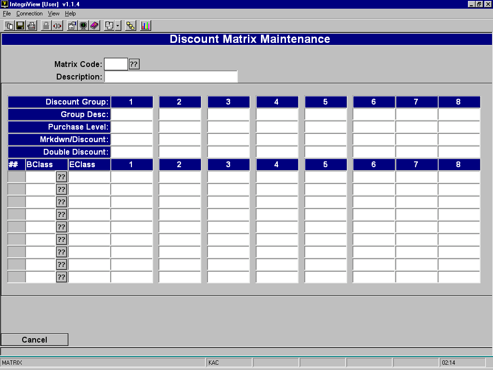
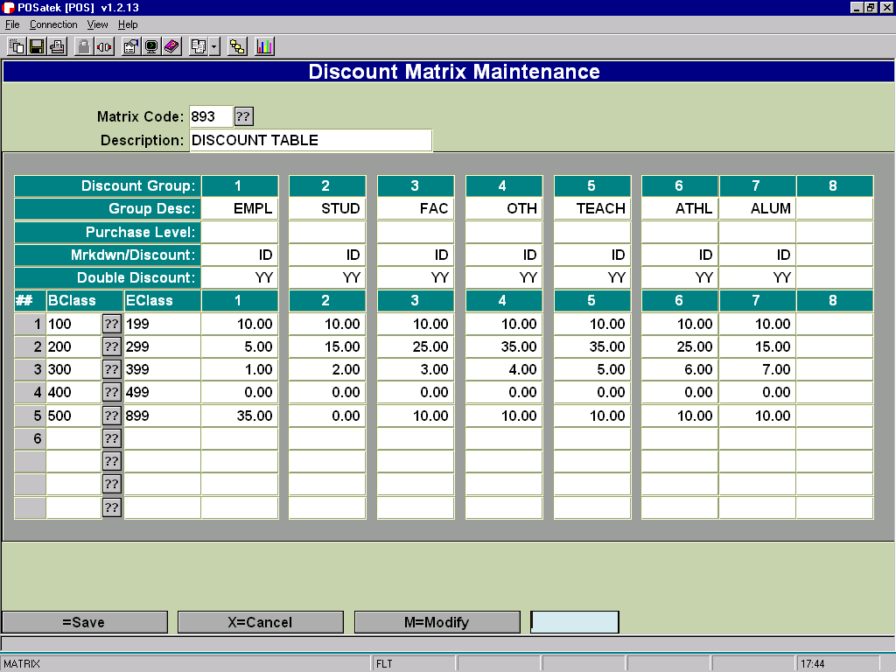
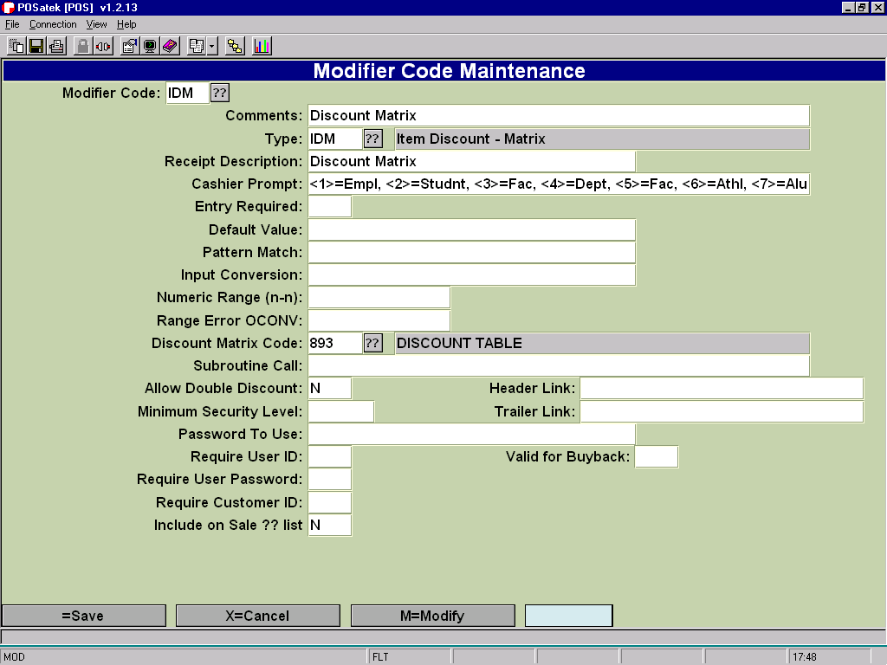
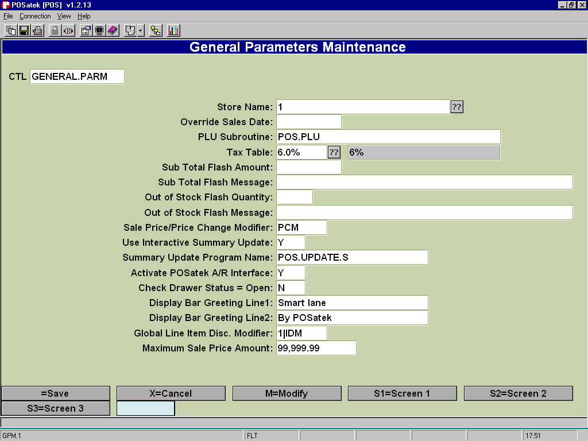

# Discount Matrix

<PageHeader />

Setting Up A Discount Matrix and Global Modifier

You can set up a discount matrix which will give discounts to specific groups of customers based upon specific percentages for specific class ranges. To set one up, follow these steps.

 From the POSiTrak Main Menu, select the **POS Parameters** option, followed by the **Discount Matrix** option to get to the Discount Matrix Maintenance screen _(POS-2-6)_.

Enter a code that you want to use to represent the new matrix. To modify an existing matrix, enter the code that represents that matrix.

Enter a description of the discount matrix.

In the **Group Desc** fields, enter descriptions of the groups for which you are setting up the discount matrix. If you don’t need to use all eight fields, leave the unused fields blank.

In the **Purchase Level** fields, enter the minimum amount that the customer must purchase for the discount to be applicable. You need to enter a value in these fields for every group you entered previously. **Optional**

In the **Mrkdwn/Discount** fields, enter “IM” if the matrix denotes a markdown on a specific item, “TM” if it denotes a markdown on the entire transaction, “ID” if it denotes a discount on a specific item, or “TD” if it denotes a discount on the entire transaction. You must enter a value in these fields for every group.

In the **Double Discount** fields, enter “YY” if you want to allow both transaction double discounting and line item double discounting. Enter “YN” if you want to allow only transaction double discounting. Enter “NY” if you want to allow only line item double discounting. Enter “NN” if you do not want to allow double discounting. Fill in this field for each group.

In the **BClass** field, enter the beginning class for which the discount is applicable. In the **EClass** field, enter the ending class.

Enter the percentage discount for each group. The format is “10.00” for 10%, “20.00” for 20%, etc.

Repeat steps 8 and 9 for each group of class discounts you want to set up.

Press \[ENTER\] to save the discount matrix.

**Sample Matrix** (You can have several different matrix records.)

Set up the modifier code that applies this discount matrix. The fields that you must fill in are the **Type** field, the **Cashier Prompt** field, and the **Discount Matrix Code** field. The **Type** field must contain either “IDM” or “TDM” for item discount matrix or transaction discount matrix. The **Cashier Prompt** field should list the groups in a format similar to “1-\[Group Name\] 2-\[Group Name\]” where the numbers correspond to the Discount Group numbers above the names. The **Discount Matrix Code** field should contain the code that you entered in step 2.

**Sample Modifier Screen for the discount matrix above.**

****

The next step is to assign this modifier/discount as a Global Modifier that will be invoked after each item is scanned. Choose menu path POS-2-1 - General Parameters. Add the modifier code and the discount column to the "Global Line Item Disc. Modifier field. The format is COLUMN|DISCOUNTCODE. (The "|" character is the pipe symbol.)

In the following example it is set to “1|IDM”. The “IDM” causes it to use the IDM modifier and the “1” causes it to choose column 1 from the discount matrix table. (See the screen on the following page.)

<PageFooter />
