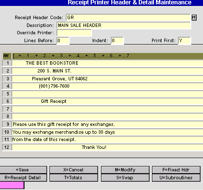
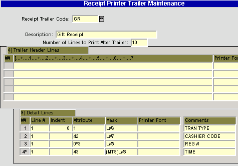
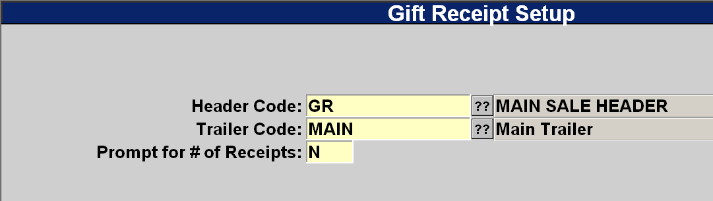
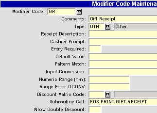
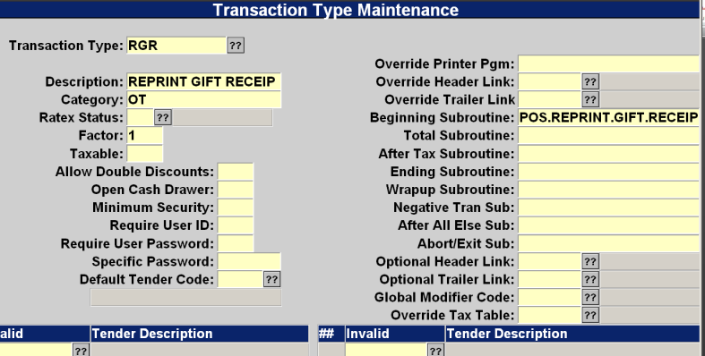
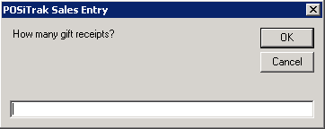

# Gift Receipt Setup

<PageHeader />

## Setup Steps

1. Create a Header.
2. Create a Trailer.
3. Assign the Header and Trailer to the Gift Receipt control record.
4. Create a Modifier.
5. Create a Transaction Type for Reprints.
6. Assign a Function Key for Gift Receipts.
7. Create a Header.
8. Select menu path POS-03-03.
9. Enter a new Header Code – something like GR for gift receipt.
10. It is easiest to copy this from your primary receipt header.

- Modify/create the heading and wording you want to appear on the gift receipt.
  - 

### Create a Trailer

1. Select menu path POS-03-04.
2. Enter a new Trailer Code – something like GR for gift receipt.
    1. It is easiest to copy this from your primary receipt trailer.
3. Leave the trailer message blank if you put specific terms in the heading.
4. Be sure to leave the Detail Lines.
   - 

### Assign Header and Trailer to Gift Receipt Control

Select menu path POS-03-05

### Create a Modifier

1. Select menu path POS-02-02
2. Enter a new Modifier Code.
    1. It is easiest to copy this from the FEED modifier.
    2. Change the description.
    3. Change the Subroutine to call to POS.PRINT.GIFT.RECEIPT.
       - 

### Set up a Reprint Gift Receipt Transaction Type

1. Select menu path POS-02-05
2. Enter a new Modifier Code.
    1. It is easiest to copy this from the RR (Reprint Receipt) transaction type.
    2. Change the description.
    3. Change the Beginning Subroutine to POS.REPRINT.GIFT.RECEIPT.
       - 

### Assigning a Function Key

1. Select menu path POS-03-2
2. Find a free button that you can use.
3. Enter |GR (pipe GR – if GR is the modifier you chose.)
4. You can also set up a key for RGR (this has not pipe in front of it).

## Printing a Gift Receipt

There are 4 possible ways to print a Gift Receipt.

1. “Reprint Gift Receipt” Transaction Type RGR.
2. If the Gift Receipt modifier function key is pressed in the Tran Type field then you can print gift receipts for the previous transaction.
3. If the Gift Receipt function key is pressed in the SKU or Tender fields then when the transaction is completed a gift receipt will print.
4. If the End of Sale prompt (defined in General Parameters) has a “<G>= Gift Receipt” prompt the cashier can enter a “G” at the end of the transaction to be prompted for the number of receipts to print. This can be changed in General Parameters. (_POS-02-01, S2)_

Possible prompts include: `<>=transaction complete, <V>=V_alidate, <R>=R_eprint, <G>=G_ift receipt.`

If the flag is set to prompt for the number of receipts then the following prompt will appear. Entering zero will result in no gift receipt being printed. Pressing the Enter key will cause one receipt to be printed.

<PageFooter />
