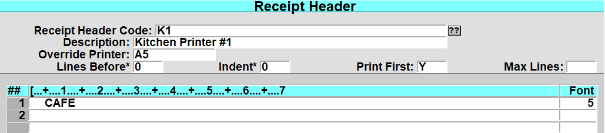
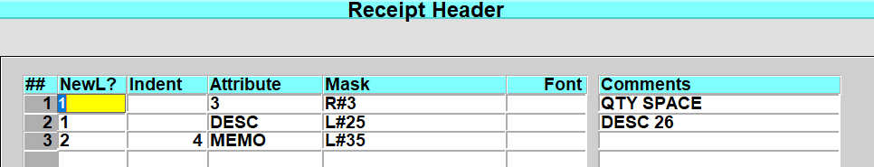
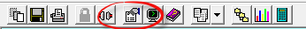
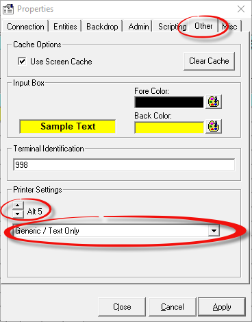
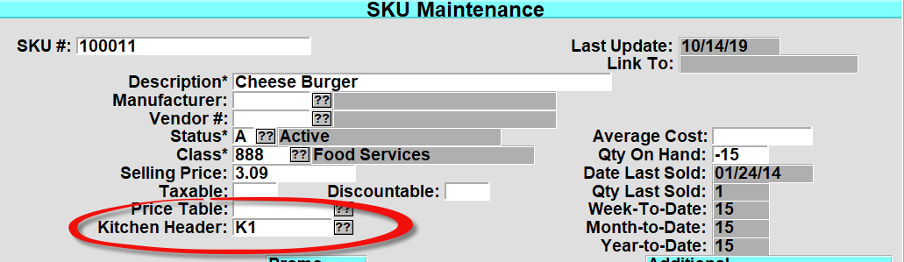

# Kitchen Printer Setup"

<PageHeader />

There are several steps to create and setup a kitchen printer. To view the complete in-depth documentation on receipt detail setup refer to the Main POS Training Documentation [here](http://tcs-training-wp.azurewebsites.net/dwkb/pos-training/). This article is meant for information training purposes and setup.

1. Create a “Kitchen Printer Receipt” header in POS.3.3

- Enter the ‘Receipt Header Code’.
- Enter a receipt ‘Description’.
- Enter the ‘Override Printer’ that will be used (A5, A6, etc.). This will be setup in the ‘GUI’ configuration section. You can setup multiple receipt headers that print to different printers for different food types (Burger station, Pizza station, etc.)
- Enter the ‘Lines Before’, ‘Indent’, ‘Print First’, ‘Max Lines’ for the receipt.
- Enter the receipt header information

- Enter the ‘R=Receipt Detail’ needed to print the information. (Contact support for assistance in setting up your receipt detail).
- On the register that will print to the kitchen printer, assign the printer in the GUI properties.
- Select the properties icon on the GUI toolbar. 

- Select the tab “Other”.
- Use the Printer Settings spinner to select the printer to use as the kitchen printer and then select the windows printer to print to. (In the example above we used ‘A5’).
- Set the register to use the kitchen printer
- Log to ‘Register Parameters’ POS.3.1 and enter in the register that will print to the system printer.
- Select ‘R=Restaurant’ from the bottom line
- In the ‘Use Kitchen Printer’ field enter in a “Y” and save the record.
- Setup which items will print to the kitchen printer. A hamburger or hotdog would print to the kitchen printer, but a candy bar or soda would not.

- Log to POS.25.2 (SKU Maintenance).
- Enter in a SKU that will print to a kitchen printer.
- In the ‘Kitchen Header’ field, enter or select the receipt header to use for that option. As stated above, different headers can print to various printers for items.

<PageFooter />
