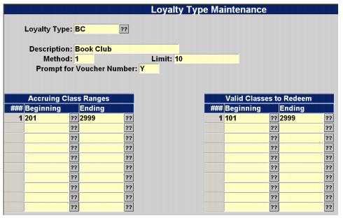
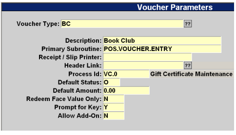
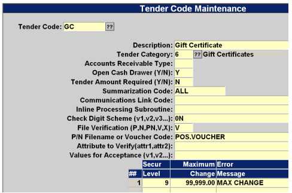
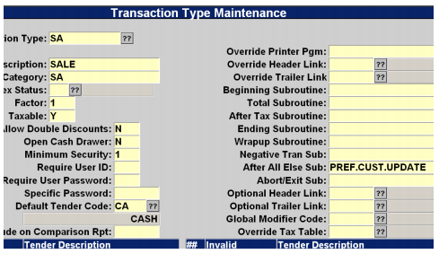

# Loyalty Rewards Setup

<PageHeader />

Our Loyalty Program is created to allow you the ability to track purchases of merchandise in specific inventory classes and then generate a voucher to be used for the purchase of in-store merchandise. You can also specify what type of merchandise can be purchased.

## Sample Program

For every 10 general books purchased the customer’s account balance is increased by the average value of the 10 books purchased.

1. A customer joins the club and is given a club card. This card is their member number and all purchases are accrued to that number. (A card is not required, you can use another identifier such as phone number, student id, state id, etc.) Balances are accrued in the Voucher file.
2. Each time a qualified book is purchased the number of books purchased is incremented and the total dollar value is incremented. The value is added to the preferred customer account.
3. When the level of 10 books is reached the average dollar value of the 10 books is calculated and the value is added to the customer’s voucher account.
4. The customer is now free to use their voucher balance to pay for qualified purchases.

## Setup Steps

1. Create a Loyalty Code
2. Create a Voucher Code
3. Create a Tender Code (optional)
4. Add the customer update program to all of your Sales transaction types that are valid for the rewards (e.g. SA, AR, FA)

### Create a Loyalty Code

1. Select menu path POS-22-26-21
2. Create a new code. E.g. BC for Book Club.
    1. This code is used in the voucher screen as well.
3. Set the parameters to meet your criteria:

- Limit is the level at which an award is given. 10 indicates that when the person buys the 10th item, the award level will be calculated.

### Create a Voucher Code

1. When a customer hits their award level a voucher (using the customer number) is updated.
2. Select menu path POS-22-25-21
3. Be sure to use the same code for both Loyalty and Voucher.

### Create a Tender Code

1. Any voucher tender code can be used. If you already have a Gift Certificate tender then you may skip this step.
2. Select menu path POS-2-4 and add a tender code with these parameters

### Modify Sale Transactions

1. Select menu path POS-2-5
2. For each transaction type in the SA category
    1. Add PREF.CUST.UPDATE in either:
        1. Ending Subroutine
        2. Wrapup Subroutine
        3. After All Else Sub

<PageFooter />
