# Mail Orders & eCommerce

<PageHeader />

Fluency in basic POS functions is required. This document will not attempt to train basic POS functions, except as they will apply to MO and eCommerce

_The primary difference between a Mail Order and an eCommerce order is that the eCommerce order is pre-loaded by the customer over the Internet and is stored in the Suspended Transactions File while awaiting store action._

From the POS_iTra_k Main Menu, choose 1 or _MO_ or choose option 26 (and then 1). Some logins can be designed to skip this step and automatically log the user onto the Mail Order Menu.

The menu is divided into four parts; Order Entry & General Parameters, Maintenance & Inquiry, Reports, and Freight.

Sales are entered the same way that a regular walk-in customer is handled with only a few exceptions. The Sales Screen is divided into three parts.

- The Upper portion of the Cash Register screen contains header information about the transaction. The **Sales Clerk** field defaults to the individual logging onto the register, the **Tran Type** field determines what type of transaction is being used and is either MO or MORT for Sales and Returns, the **Tran Number** field is a sequential counter for that specific register, the **Store** field defaults to the store number, the **Date** defaults to the current date, and the **Register** number is a unique identifying number for that register, Customer Name and Confirmation Number. All of these components are vital in identifying each individual transaction, and are printed on the Pick List and Invoice.
- Main Sales Entry – This is where all of the individual items are entered into the register. Items can be scanned in using the register scanner or entered manually using the keyboard. Many of the programmable function keys of the keyboard will be used in this area. eCommerce and Suspended transactions will have this portion preloaded with the merchandise purchased.
- Tender / Totals – This is where all your tenders will be entered. You will also see the sub-total, tax, and total amounts here.

### Exiting

Use the ‘EXIT’ key to exit out of the Cash Register screen.

You may exit out of and return to the cash register screen as many times as you wish. Exiting **does not** close out your register or zero out any totals. When you return to your register screen, you will be able to continue with your normal sequence of transactions.

To get back to the Cash Register screen, follow the directions for ‘Logging On’.

Make sure you use the EXIT key only while the cursor is at the ‘TRAN TYPE’ field. If you use the EXIT key while in the middle of a transaction, it will act like the ‘TRANSACTION ABORT’ key and will nullify any information you have entered during your present transaction.

If you do not have a preprogrammed keyboard you can type |Exit. (The "|" (pipe) symbol is usually above the enter key).

### Transaction Types

The following are available transaction types with a brief description.

Open

This will be used to _Open_ the register. Until the register has been opened, no transactions can be run on the register.

MO

This is used for most _Sale_ transactions. Since this is usually set as the default Tran Type there is no function key setup. At the end of each transaction, the cursor will default back to the _Tran Type_ field.

MORT

This is used for most _Return_ type transactions. To use this _Tran Type_, either type in the _MORT_ code or press the function key labeled _MO Return_. _AR Returns_ will not use this _Tran Type_

X

The _X_ is used to get an ‘X-REPORT’. This is used when you are ready to count and reconcile your drawer. The x-report will give you all totals for sales and tenders since the last time your drawer was set back to ‘zero’ through a z-close. The x-report **will not** zero out any amounts.

CLOSE

The _CLOSE_ key is used to do a ‘Z-CLOSE’ when you are ready to close out the register and do a final reconciliation of the drawer. The z-close will close out the register and zero out any totals. The z-close report will give you all the same information that the x-report does.

### Tender Codes

The Tender Code determines whether the transaction will be processed by credit card, debit card, cash, check or by other means. The most common tenders are listed below with a brief description. All of these tenders have a function key assigned to them.

Multiple tenders can be used until the total amount of the amount due is paid.

CHECK

Used in accepting either a personal or business check as a method of payment.

CREDIT CARD

Used in accepting credit cards as the method of payment. The system can be setup to accept Visa, Master Card, American Express, Diners Club, as well as others.

DEBIT CARD

Used in accepting debit cards as the method of payment. Unless a “Debit Card” system has been setup at the University, this will usually not be an option. Visa type debit cards will normally be processed as a credit card unless a ‘pin’ number is required. Special setup is required to accept cards using a pin number.

GIFT CERTIFICATE

Used in accepting system generated gift certificates as the method of payment.

ACCOUNTS RECEIVABLE

Used in most cases of Accounts Receivable / University Charge type transactions.

## Entering Transactions

From the POSiTrak Main Menu, select the **Cash Register** option to get to the POSiTrak Sales Entry screen _(POS-01)_. Some logins can be designed to skip this step and automatically logon to the Cash Register.

The **Sales Clerk** field is filled in automatically by the system with the name of the employee currently logged in.

In the **Tran Type** field, enter the transaction type that you would like to use. You can see a list of transaction types by entering “??”. Many of the registers will be defaulted to a transaction type of **Sale**. If you wish to close the register, enter the transaction type that is set up to close the register; if you wish to open it, enter the transaction type that is set up to do so. Upon first entering the register (anytime after the register has been closed), the transaction type of **OPEN** will automatically appear.

The **Tran Number** field is automatically filled in with a sequential transaction number. The **Store** field is automatically filled in with the store number from the register parameters. The **Date** field is automatically filled in with the register date. The **Register** field is automatically filled in with the register number from the register parameters.

In the **Qty/Sku/Mod** field, you can enter a SKU, an ISBN, or a modifier. To change the quantity, enter the new quantity then press the Quantity key. The **Qty** field should change to reflect the new quantity. You can select a SKU or ISBN by entering the item name, title, or other cross-reference term.

The **Description** field is filled in automatically. If the SKU or ISBN that you enter doesn’t have a price associated with it, you must fill in the **Price** field with the appropriate price. The **Extended** field is calculated by multiplying the value in the **Price** field with the value in the **Qty** field.

To move from the item entry section of the cash register screen to the tender entry section, press the Total key. When the Total modifier has been entered, the **Sub Total**, **Sales Tax**, and **TOTAL** fields are automatically filled in.

In the **Modifier or Tender** field, enter the tender amount followed by the tender code. For three dollars in cash, you would enter “3.00” and then press the key for the tender that you wish to use. You can also enter a modifier in this field to void an item or transaction, return to the item entry section, apply a discount to the transaction, and the like.

Once you have entered enough tenders to meet or exceed the total amount due, the system will tell you the amount of change that should be given to the customer. It then gives you the option to continue or reprint the receipt. Once you press \[ENTER\] to continue, you will be returned to the **Tran Type** field to begin a new transaction.

### Scanning Items

Scan in the item with the hand-held scanners. You may scan a manufacturer’s bar code, or a system generated bar code. To scan, press trigger on scanner while holding over bar code. Try not to move the scanner around too much while scanning for better scanning results.

### Manually Entering Items

By SKU

Enter in the item number. When you manually enter the number, the number must match **exactly** as it is in the Master File. The system **will not** accept only part of the number.

By Description

Enter in any part of the description of the item. The system will match exactly the description you tell it to. For example, if you type in “_SHAM_”, it will pick up ‘Shampoo’ as well as ‘Shamrock’, but will not pick up ‘Shmp’(as an abbreviation for Shampoo).

If a ‘List Box’ is displayed, you may scroll through the list until you find the item you are looking for. If you do not find the item, you may want to try under a different description. When you have located the item in a list box, choose the corresponding number to the left of the item.

## Modifying Items / Transactions

### Changing Quantities

Enter in the quantity amount of the item being purchased.

Press the ‘QUANTITY’ key to accept the amount entered.

Continue entering items or press Total to complete the transaction.

### Applying Discounts

There are several different keys defined to apply a percentage discount or a dollar amount discount.

### Changing Tax Status

Use the keys defined to modify the tax on an item or for the entire transaction.

### Price Changing

Press the ‘PRICE CHANGE’ key if the price displayed is incorrect, or if there is a special sell price for the item.

Enter in the new price of the item as indicated by the prompt in the bottom left hand corner of the screen. When the new prompt displays, it will show as a markdown at the line item level, but will reflect the correct pricing at the sub-total line.

Complete the transaction as you would any other transaction.

The ‘PRICE CHANGE’ key will only work for the line item most recently entered. If you need to change the price of a line item other than the one that you have just entered, you will not be able to use this key.

Precautions should be used to password or set security levels on this key to prevent unauthorized use.

## Canceling items

To cancel the last lined entered:

Press the ‘CANCEL LAST LINE’ key when you want to cancel the last line item entered in the sales entry screen.

Resume entering in items or press total to complete the transaction.

You may only cancel the last line item only once. Though you may use the ‘Cancel Last Line’ key multiple times throughout the transaction, you can only use it once per line.

To cancel any line:

Press the ‘CANCEL ANY LINE’ key.

Enter in the line number of the transaction you wish to cancel.

The ‘Cancel Any Line’ key may be used multiple times during any transaction.

## e-Commerce

(These options will also work for Mail Order transactions.)

## Resuming online Financial Aid Transactions

### Split Tenders FA Transactions.

PosConnect/AR Split Tender

See details [here](./../colleague-split-tender-checkout/README.md)

## Setup

Please contact support to setup AR or POSCONNCECT Split Tender options.

## Web Customer View

The change that you will see on the web is, as a customer, they will shop as normal. When they select the option to go to the cart the first thing they see will be the cart details and asking if the will pay with Financial Aid.

If they select ‘No I will NOT use Financial Aid’ then they will continue as normal

If they select ‘Yes I’d like to use Financial Aid’ as seen below.

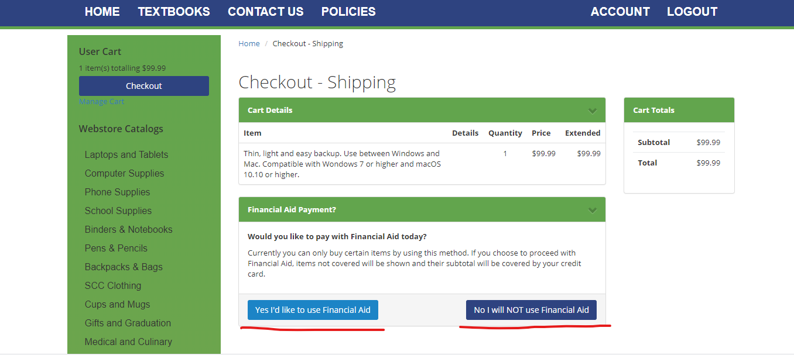

The customer will get presented with their address information to confirm/edit as needed and at the bottom of the screen they will need to enter in their student ID and then click on the ‘Show Shipping Options’.

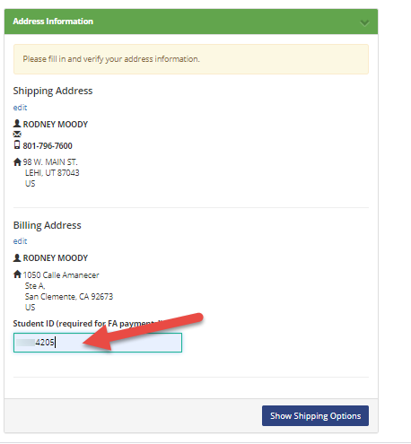

Now they will select their Shipping option from the list setup by the store.

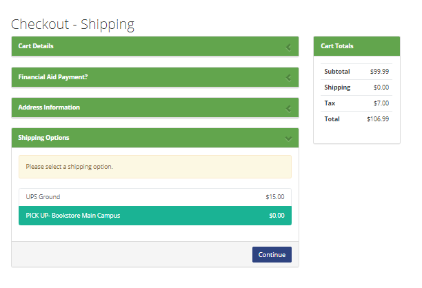

Enter in any Order Comments that are needed and then click/check the checkout policy box then ‘Proceed To Payment’.

The customer will then need to enter in their credit card information, this will only be used if they order items that are not covered by the amount or type of aid the customer has.

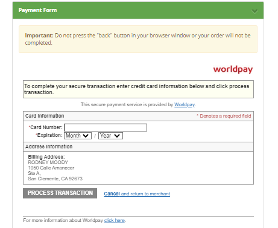

And finally, if the customer will see a message thanking them for their order and then receive an email with the order information confirming that the order has been received.

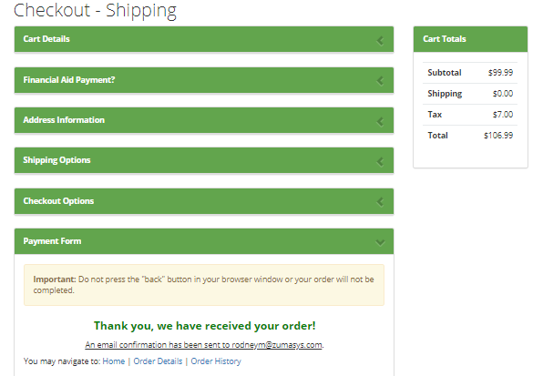

# Store processing of Split Tender

 

The order will come to the store as a suspended transaction, just like a normal CC transaction. The store personnel will be able to run the pick slip reports (POS.26.10 or 13) and pending order reports the same as they do regular web transactions.

Bring up the suspended transaction the same as other web transactions

Since this will be treated as a POS Connect or FA order, you will get prompted to look up the customer the same as your existing POSCONNECT/FA transaction (POS Connect is used in the example).

The Account ID will be brought in from the transaction where the customer entered it on the web site.

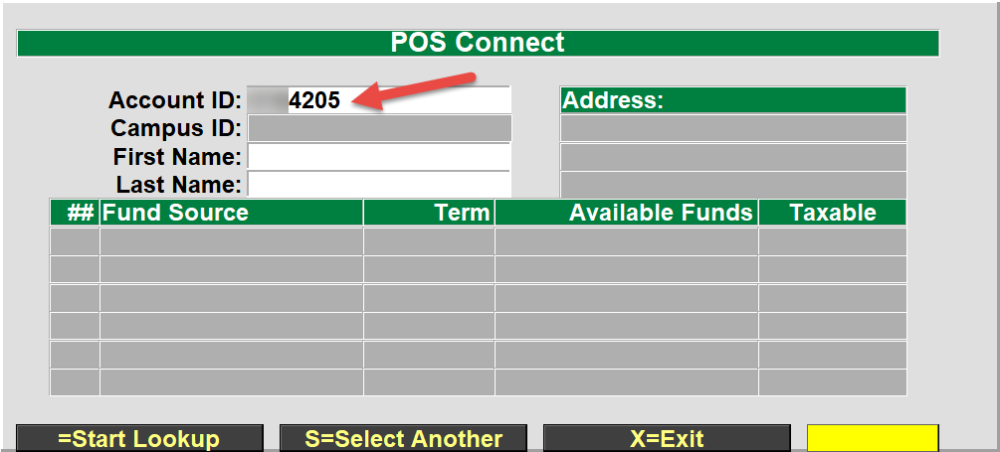

Select the fund source that you wish to use for this transaction

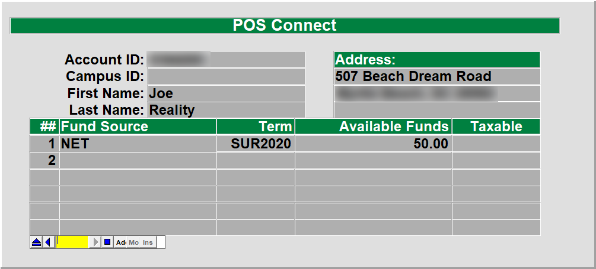

The transaction will load each item and validate the customer has the funds to cover each item that was ordered. If the customer goes over their limit or has purchased something that is not covered by their fund source then a message will display that the SubClass limit has been exceeded or that the limit has been reached. Click on the ‘Yes’ button to add the item to the cart and to proceed, if you select ‘No’ then the item will not be added to the cart.

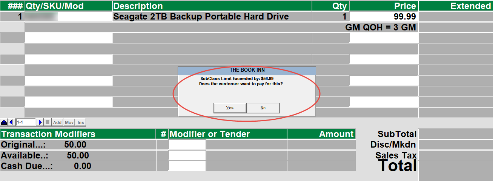

Once all of the items have been added to the transaction, the transaction will show the Total amount and also the Original fund amount, Available funds and the cash due that will be placed on to the credit card when the transaction is finalized.

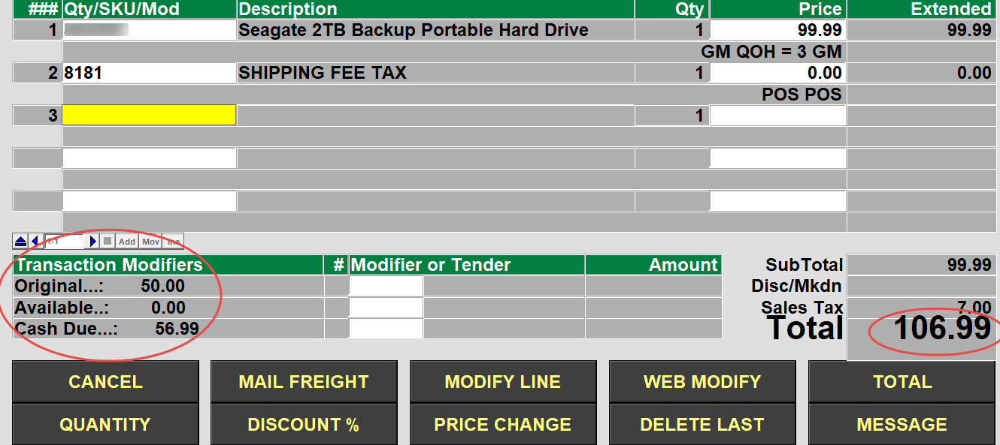

After selecting the ‘TOTAL’ button, the transaction will automatically enter the amount of funds to be used by the FA/POS Connect transaction tender, the cashier will just hit the ‘Enter’ key on the keyboard.

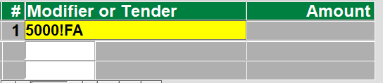

The transaction will then apply the financial aid funds to the customers fund source and report if there were any issues. Once the financial aid amount has been successfully applied then any additional amount will be applied to the credit card that was entered on the website.

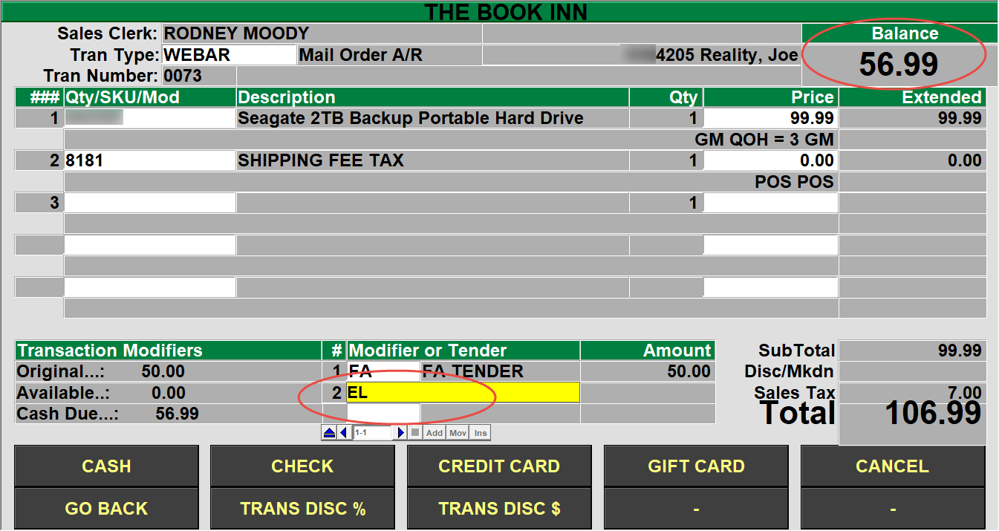

### Adding a Memo

Use the MEMO modifier to add a memo to a line.  If the memo is not for the current item that was entered/scanned then you can preface the command with the line number you want to add them memo to.  For example: to add a memo to the current line just press the MEMO key. If you want to add a memo to line 2 enter a 2 followed by the MEMO key.  If you don't have a MEMO key then enter |MEMO (to add a memo to line 2 enter 2|MEMO).

### Back Orders, Cancellations

To change the quantity of an item choose the MOModify key.  If you don't have one you can type |MOM.  You will be prompted for the line number to modify - enter the line number.  You will then be able to: 1) Change the Quantity Shipped, Change the item from New to Used (or Used to New), and specify a Back Order quantity, and you can add a memo to the line.

### Override Freight Amount

To change the freight amount choose the ModifyFreight key.  If you don't have one you can type |MOF.  This will allow you to modify the freight from the list of your freight options, enter a specific amount, or select a specific freight table.

### Printing a Picking List

To print a Pick List choose the PickList key.  If you don't have one then  you can type |PICK.  This will print a pick list to use for gathering the merchandise.  It is best to EXIT the e-Commerce transaction afterwards.

## Other Register Functions

### Global Inquiry

Press the ‘ITEM INQUIRY’ key to look up an item.

Scan or manually enter in the item in question.

Press enter to exit out of the item.

Press enter to return to the Cash Register screen.

The item inquiry key can be used at any time while in the cash register screen. When you return to the cash register screen, you will return to the point from where you left from. You may use the item inquiry key as many times during a transaction as you wish.

### Gift Certificates

#### Purchasing a Gift Certificate:

1. Press the ‘Gift Cert Purchase’ key.
2. In the window that displays, enter in the information you need. (all the fields are optional except the value field – enter in the value of the gift cert) (it is recommended that you fill in the “Purchased By” and “Purchased For” fields)
3. **When you fill in the amount of the gift certificate on the actual gift certificate, you must write down the voucher number on the gift certificate! The voucher number is automatically given to you when you press the ‘Purchase Gift Certificate’ key. The number is located towards the top left hand corner of your screen with the prompt of “Voucher Number:”**
4. After you have filled in all the necessary information for the gift certificate, and only after you have written the amount and voucher number on the gift certificate, press “_Enter_” to ‘Save’ the gift certificate to the system.
5. Continue on with your transaction as you would any other transaction.

_NOTE:_

You may purchase multiple gift certificates per transaction (if they are buying 2 $20.00 gift certificates, you will be processing two different gift certificates in the system and they will have two separate ‘voucher numbers’.

Only sell a gift certificate during a “SALE” transaction since that is what you are doing – you are ‘selling’ an item to them.

#### Redeeming a Gift Certificate:

1. After entering in the items the customer is purchasing and you have pressed the total key, press the “Gift Certificate” tender key.
2. At the prompt “Enter Voucher Number”, enter in the voucher number written on the gift certificate.
3. Validate the gift certificate through the receipt printer.
4. Complete the transaction as you normally would.

### Line Item Memo

After entering an item to purchase, you can press the “Memo” key to add a free form text message that pertains to that specific item. The text message will print on the receipt.

### Suspend

1. You can suspend **any SALE** transaction as long as you have not placed a _Tender_ (form of payment) towards the transaction.
    1. Process the _Sale_ transaction as you would any other transaction.
    2. After all items have been entered into the register, press the **Suspend** key.
        1. The **suspend** key can be pressed while either in the _sales entry_ screen or in the _tender_ area.
    3. At the prompt **Enter the customer’s name**, enter the name of the customer for whom you are suspending the transaction for.
        1. Once you enter the customer’s name and press enter, the system will move the transaction to a separate file and you will be returned to the Cash Register screen.
2. To get a **report** on your _suspended_ transactions;
    1. From the POS Master Menu, choose the **RP** option for the _Report Menu_.
    2. Next choose option number **6** for _Miscellaneous Reports_, then option number **5** for the _Suspended Transaction Report_.
3. You can choose to print the report to your screen (terminal) or to the printer.

### Resume

1. To resume a suspended transaction, press the **Resume** key **when the cursor is at the Tran Type** field.
2. Choose the transaction that you want to resume from the list of transactions.
3. Complete the transaction as you would any other transaction.

### Item Exchange

1. While in the ‘POSiTrak Sales Entry’ screen, press “_Enter_” to accept the default tender of “SA” for a sale transaction.
2. Enter items as you would a normal sale transaction.
3. To enter a ‘return’ item:
    1. Press the “_ITEM EXCHANGE_” button
        1. (if you have more than one of the same item being returned, enter in the amount being returned then press the item exchange button -- if two items are being returned, press “_2_” then “_ITEM EXCHANGE_”)
    2. Enter the item by scanning, manually entering the SKU number, or by description.
4. When you are through entering in items being sold or returned, press the “_TOTAL_” key.
5. Complete the transaction by entering the amount tendered

### Store Credit

_Issuing a Store Credit_

1. A store credit can be issued any time the balance owed (the total) is a negative balance (whether through a return or exchange). If you have a negative balance after you have pressed the ‘_Total_” key, press the “Store Credit” key.
2. A small window will display where you must fill in the name, address, and phone.
3. All the fields in the window are required fields. It is recommended that you enter their name, their ‘company’ or ‘squadron’ for the address, “WP” (for West Point) for City, ST Zip, and then a phone number (any phone number will do)
4. Press “_Enter_” to save the store credit to the system.
5. Make sure you give the customer the receipt. The receipt will have the voucher number on it, and they must provide the receipt in order to redeem their store credit.

_Redeeming a Store Credit_

1. After entering in the items the customer is purchasing and pressing the total key, press the “Redeem Credit” key.
2. At the prompt “Enter Voucher Number”, enter the voucher number that is on their original receipt.
3. Complete the transaction as you normally would.

### Aborting (Voiding) a Transaction

Press the ‘TRAN ABORT’ key when you want to **cancel** any transaction.

The Tran Abort key can be used any time during the transaction to cancel it out. A transaction is not completed until a Tender amount and Key have been entered. Once a Tender Key has been pressed you must complete the transaction you are on. You must then use the ‘Post Void’ key to cancel out the transaction.

### Special Orders

#### Overview

Special Orders are used when an item that is not in stock is placed on order by a customer. The order can then be added to another PO going to the same vendor, or created specifically for that customer. When the order arrives, the customer will then be notified to pick up the item. The following document shows how Special Orders work with the _TCS Retail_ software.

Special Orders are used for items not in stock. Three major processes are involved: _Placing the Special Order_, _Receiving the Special Order_, and _Picking up the Special Order_ by the customer.

#### Placing Special Orders

1. In Cash Register Screen in POS, enter a regular Sale transaction type.
2. Hit the Special Orders function key you have set up.
3. Enter the information to go on the Special Order. If a deposit is entered, this amount will be added to the Balance Due.

#### Special Order Maintenance

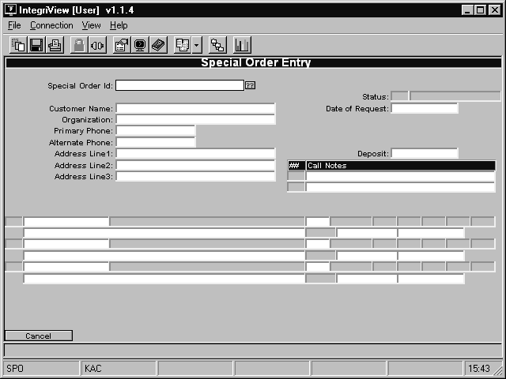 There are two ways to get to the Special Order Entry screen _(POS-24-1)_. If you wish to enter a new special order, you must access the screen by selecting the **Cash Register** option from the POSiTrak Main Menu and then entering “SPO” as the transaction type. For more information on the cash register, see page XYZ. If you are going to modify an existing special order, you can access the screen from the POSiTrak Main Menu by selecting the **Special Orders** option followed by the **Maintenance** option.

In the **Special Order ID** field, enter a period to assign the next available ID number to the new special order. If you are modifying an existing order, enter the ID number assigned to that order, the name of the customer, or enter “??” to see a list of existing orders.

In the **Customer Name** field, enter the name of the customer who is placing the order. If the customer is representing an organization, enter the name of that organization in the **Organization** field.

In the **Primary Phone** field, enter the primary phone number where the customer can be reached.

In the **Secondary Phone** field, enter any other phone number where the customer might be reached.

In the **Address** fields, enter the customer’s address.

The **Date of Request** field is automatically filled in with the current date. If the customer requested the items earlier, you can modify it.

In the **Deposit Field**, enter any deposit amount that the customer will pay on the items.

You can enter up to three lines of notes in the **Call Notes** field.

In the **SKU** field, enter the SKU of the item that is being ordered. The **Description** field is filled in automatically.

In the **QTY** field, enter the quantity that the customer wishes to order.

In the **Special Instructions** field, enter any special instructions on the handling of the item.

If the customer picks up the items, enter the number of items picked up in the **Picked Up** field. The **Date Picked Up** field is automatically filled in with the current date, but it can be modified.

Repeat steps 10 through 13 for each item you would like to order.

Press \[ENTER\] twice to save the order.

If you want to create Pending Orders for the items, enter “Y.” Otherwise, enter “N.”

Optional Step:: For GM or TRADE create a Pending Order. For Text items, add them to a Manual PO.

Finish the Sales transaction.

Print off a copy of the receipt for the customer and a copy for ordering personnel.

Log to the module where the item exists (GM, TRADE or TEXT).

Place the Order. (Cancel if you discover an order is not necessary).

#### Receiving Special Orders

1. Enter a receiving log as normal.
2. If there are any outstanding Special Orders in the master file, a comment will be automatically be added to each line item with special order quantities.
3. Optional: Print special order tags to tag items with person’s
4. Optional Step: For GM or TRADE name, phone, address, title, author, special order number, date. You must have a Special Order tag code setup (SPO tag type).
5. Optional: Place special order tags on items.
6. Notify customer that item has arrived.

#### Picking up Special Orders

1. Customer picks up special order items.
2. Customer takes items to the cashier.
3. Do a regular Sale transaction.
4. For the line items enter the Special Order Pickup Modifier. (To set this up go to _Special Order Pickup Modifier_.
5. This will take you into Special Order maintenance. Put in the quantity being picked up.
6. The program will automatically add these items to the current transaction.
7. Total the transaction.
8. At the tender code entry, if a deposit was made on the special order, enter the amount of the deposit. For the tender type use the Special Order tender.
9. You will be prompted once more for the special order id, enter it.
10. Use any other tender type to pay for the remaining portion of the sales transaction. When all items are picked up, the special order will be flagged with a “P” status as “Picked up”.

<PageFooter />
